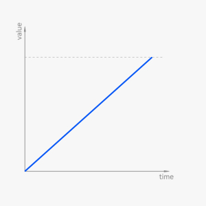
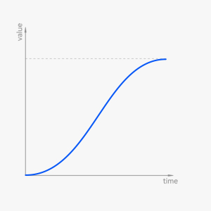
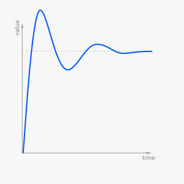
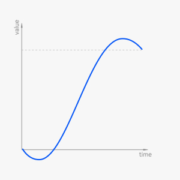
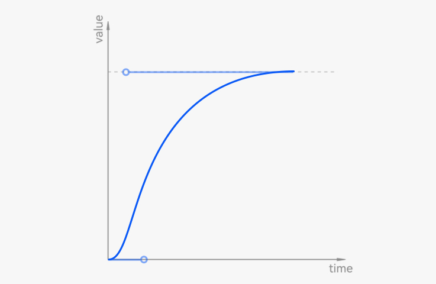
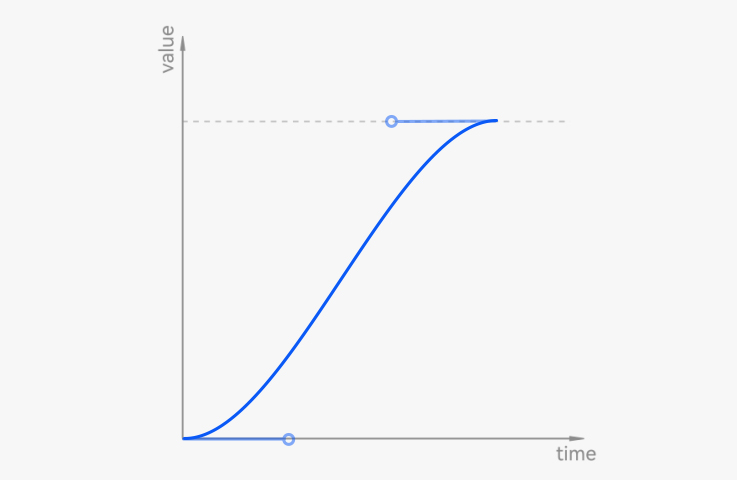
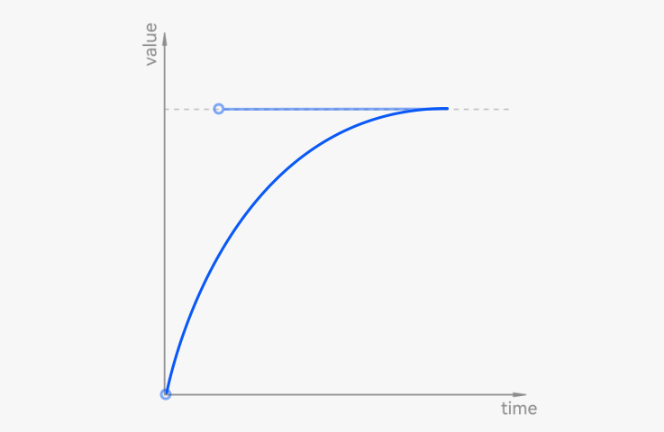
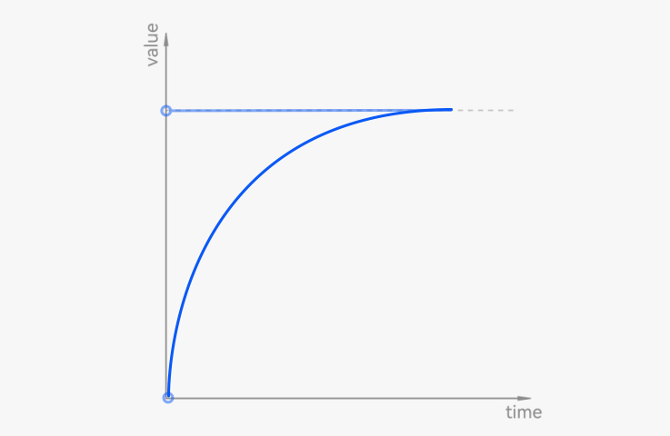
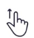
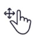

# 动效属性

更新时间：2026-03-11 06:16:00

来源：https://developer.huawei.com/consumer/cn/doc/design-guides/animation-attributes-0000001797117229

任何类型的动效都包含三大基本的动效属性：时长、曲线、帧率。这些基本属性形成了动效不可缺少的基本要素。通过组合这些基本的动效属性，可以塑造产品动效的不同风格特点，例如稳重、活泼、轻盈、舒缓等。

## 时长

时间是产生动效的基本要素，不同类型的元素、场景适用不同的时长，过短或太长都会让用户不适。以下因素详细说明了时长应如何设计以适应不同类型的动效。

### 单位

动效设计的时长单位一般使用毫秒（ms）表示，1秒=1000毫秒。在帧率（FPS）60帧的环境下，1帧=16.67毫秒。

### 复杂程度

复杂的动画比简单的动画需要更多的时间来表达，基于图形的特点来进行动画设计。

|  |  |
| --- | --- |
| 简单动画         前后状态只通过颜色动效来实现 时长：100ms | 复杂动画         旋转动画需要合适的时间来保证 时长：300ms |

### 区域范围

动效运动在一定的范围内进行，小范围内比全屏幕运动所用的时间相对更短。

|  |  |  |
| --- | --- | --- |
| 小范围内运动          开关图标动效 时长：150ms | 局部范围内运动          删除一条列表 时长：200ms | 全屏范围的运动          打开一张图片 时长：350ms |

## 曲线

曲线与时长相互配合产生运动的韵律感。调整曲线能使物体实现加速和减速，而不是以恒定的速率运动。在自然定律下，物体不会突然开始或停止移动，它们需要一定的时间来加速和减速。

没有缓和曲线的过渡看起来僵硬和机械。

### 动效曲线概况

动效曲线也被称为动效插值器，本质上是调整运动对象在时间线上速度的一种手法。

|  |  |  |  |
| --- | --- | --- | --- |
| linear | easing | spring | others |

### 贝塞尔曲线

贝塞尔曲线(Bézier curve)是一种数学曲线，在动效设计中广泛使用。从曲线形态的类型上可以分为这几类：标准曲线、减速曲线、加速曲线。

- **标准曲线**

最常用的曲线类型，开始和结束处静止，速度峰值在中段，加速阶段相对于减速阶段用时更少。

使用原则：运动前后始终在用户视线范围内的物体，符合物体启动和停止的真实规律。

应用场景：图片缩放，Tab切换，Switch开关等。

cubic-bezier(0.40,0.00,0.20,1.00)

标准曲线的其他类型

|  |  |
| --- | --- |
| cubic-bezier(0.20,0.00,0.10,1.00) | cubic-bezier(0.33, 0.00, 0.67, 1.00) |

- **减速曲线**

开始处物体运动速度最快，初始即达到峰值速度，渐渐变缓，在结束处完全静止。

使用原则：适用从视线中新出现的物体，结束时通过相对较长的缓冲让人眼适应运动变化。

应用场景： 弹框出现等。

cubic-bezier(0.00, 0.00, 0.40, 1.00)

减速曲线的其他类型

|  |  |
| --- | --- |
| cubic-bezier(0.00, 0.00, 0.20, 1.00) | cubic-bezier(0.00, 0.00, 0.00, 1.00) |

- **加速曲线**

从静止启动，逐渐加速，在达到峰值速度时结束（出场）。

使用原则：适用原本在视线中的物体，需要消失或出场，逐渐加速符合退场行为特征。

应用场景：窗口出场、卡片删除等。

### 弹性曲线

弹性曲线(Spring curve)是一种物理曲线，它可以将速度值作为参数输入到曲线公式里，因此同一组参数在不同速度下可以产生差异化的曲线表现；同时弹性曲线通过刚性和阻尼等物理属性参数，产生自然的弹簧效果。

- **interpolatingSpring 曲线**

interpolatingSpring曲线由刚性、阻尼、质量、速度四个物理属性决定。

| 名称 | 含义 |
| --- | --- |
| Stiffness 刚性 | 单位形变量所需弹力的大小 |
| Damping 阻尼 | 弹簧在振动过程中的减震力，使得弹簧振幅逐渐减小直至停止在平衡位置 |
| Mass 质量 | 附着在弹簧上的对象的质量 |
| Velocity 速度 | 附着在弹簧上的对象的初始速度 |

- **springMotion 和 responsiveSpringMotion 曲线**

springMotion 和 responsiveSpringMotion曲线由响应、阻尼比、重叠时长决定。

| 名称 | 含义 |
| --- | --- |
| Response 响应 | 无阻尼自然振荡周期 |
| DampingFraction 阻尼比 | 应用于动画值的阻尼力 |
| overlapDuration 重叠时长 | 两段弹性动画衔接时长 |

interpolatingSpring 曲线类型与 springMotion 和 responsiveSpringMotion 曲线类型可以通过换算相互转换，达到相同的动画效果。

interpolatingSpring：Stiffness:128，Damping:12 ，Msss:1，Velocity:0

springMotion：Response:0.555，DampingFraction:0.53

- **临界阻尼**

当阻尼使对象刚好能不产生振动，又以最短时间到达稳定平衡状态的情况。

- **欠阻尼**

阻尼较弱，对象会通过振荡运动来消耗刚性能量，最后达到稳定平衡的状态。

- **过阻尼**

阻尼较临界状态过大，对象运动的动画曲线呈现衰减更慢的现象，最后达到稳定平衡状态。

- **弹性曲线的特点**

1.支持可打断时长自动匹配

a. 打断即更新了目标点的状态，新动效继承上一段动效的速度，过渡自然

b. 打断的时机不固定，打断后动画运动时长自然匹配；非弹性曲线需要指定时长

2.继承速度

a. 在同一组弹性曲线参数下，速度入参不同，产生一定程度地改变曲线形态，让操作对象的运动从体验上更加跟手。

3.自然时长

a. 时长受弹性参数、属性变化、入参速度、精度算法共同影响

b. 弹性曲线是物理模型，运动时长的自动计算更符合自然规律

- **设计原则**

使用原则：适用于进行跟手运动的对象，或是需要表现弹簧特性的对象。

应用场景：列表上下滚动、桌面左右翻页、手势上滑退出应用等。

1.手势动效

|  |  |
| --- | --- |
| 继承手速（动能） | 不继承手速（势能） |
| 抛滑Fling(快/慢) | 长按LongPress 触发事件 |
|    | 拖拽Drag 松手事件 |
|    | 点击Click 按下抬起 |

2.转场动效

|  |  |
| --- | --- |
| 层级切换转场动效 | 提示性的事件入场动效 |

3.微动效

产生多次振荡的效果适用于小面积的元素上，实现小而精致灵动的体验，不担心因面积大产生干扰（需要联合人因进行研究）。

|  |  |
| --- | --- |
| 图标微动效示例1 | 图标微动效示例2 |

弹性曲线相关的开发文档，请参阅弹簧曲线。

## 帧率

每秒钟显示的帧数即帧率（FPS）。由于人眼的特殊生理结构，所看画面帧率一般高于每秒约10~12帧，就会认为是连贯的，该现象为视觉暂留。但连贯不代表感知流畅，运动较快的动画需要更高的帧率来保障流畅度。

相同时间和位移距离情况下，不同帧率效果对比（90FPS和120FPS受浏览器播放器的限制，可能无法看出差异）。

### 交互类动效帧率

移动设备的屏幕一般使用60赫兹刷新率，动画帧率与其保持一致能让动效呈现最好状态。与观看类动画不同，交互型动效需要更严苛的帧率稳定性，否则易造成体验上的卡顿感受。

|  |  |
| --- | --- |
| 60FPS | 30FPS |

### 纯动画帧率

纯动画（如操作引导动画）的帧率要求没有交互类动效那么严苛，早期迪士尼的手绘动画基本帧率是24FPS，也能满足观看流畅的程度。高帧率的动画则拥有更细腻的视觉体验，特别是针对快速类的动作，细腻度尤为明显。有些动画创作会选择8FPS，这更多的是动画风格上的需要。

|  |  |
| --- | --- |
| 60FPS 动画过程细腻而流畅 | 12FPS 低帧率导致元素两帧之间变化过大，中间状态缺失导致眼跳感 |

## 风格

通过调整时长、曲线的参数，在转场、特征等动效设计上的差异来表达品牌的动效设计语言。例如较多地使用弹性动画会让产品的动效风格显得更加灵动和活泼。
