# 布局基础

更新时间：2026-05-07 09:02:30

来源：https://developer.huawei.com/consumer/cn/doc/design-guides/design-layout-basics-0000001795579413

布局不是静态固定的，当显示环境发生变化时，如横竖屏切换、调节字体大小、应用分屏，要及时调整内容的布局方式以适应变化。

通过调用断点系统、栅格系统、媒体查询、自适应布局和响应式布局能力就可以让内容更好地适配显示环境的变化。综合运用布局基础能力，可实现常用页面结构的多设备适配。

随着终端设备形态日益多样化，应用设计需要考虑界面安全区及避让区的属性，适配不同的屏幕尺寸、屏幕方向和设备类型。HarmonyOS在设计之初就面向全场景、全设备进行定义。系统整合了手势、基础交互、视效等维度的基础能力，确保不同终端（手机、平板、手表、IoT 设备等）的交互逻辑和视觉风格高度统一，用户无需重复学习，保证体验最优解。

**布局完整**。设备在折叠/展开或横竖屏切换时，应用窗口的组件、图片、视频等元素应避免出现错位、截断、变形、模糊等问题。

**响应式设计。**避免使用固定像素来作为界面布局或元素尺寸的定义，对于留白空间可以使用弹性布局或增加 Blank 等组件来实现动态伸缩。配合媒体查询、宽度及高度断点来进行动态判断，尽量使用流式排版来进行布局定义。

**移动优先**。将应用需要适配的设备类型或断点区间进行汇总，按照最小到最大的比例进行优先级适配，先保证最小屏幕的内容、功能及界面布局完整性后，再逐步向更大比例设备进行延展和功能适配。极端情况下，需要牺牲部分功能体验，确保最小集的完整呈现。

#### 窗口状态

在 UX 设计中需要针对不同类型设备，或同一类型设备的不同状态来改变布局样式等。状态感知 (媒体查询能力) 提供了丰富的媒体特征监听能力，可以监听应用显示区域变化、横竖屏、深浅色、设备类型等等，状态感知为系统底层能力， UX 设计时只需定义在不同场景下对应的设计表现。

根据响应式布局的场景需要，支持以下四种查询类型：

#### 设备类型

支持手机、平板、电脑、智慧屏、手表多设备类型查询。

在进行多端设计时需要对于一些特殊设备的布局和控件特殊定义，例如智慧屏上的按钮和平板按钮的视觉样式不同，利用设备查询能力能判断当前处于什么设备，以调用对应样式的组件。

#### 窗口宽度/高度

支持设备屏幕宽高查询，对于应用窗口支持自由缩放的设备，也支持应用窗口宽高的实时变换监听。

屏幕、窗口的宽高查询能力将帮助应用判断当前处于什么断点和栅格，从而判断应用架构和界面布局响应何种变化。

#### 折叠屏窗口状态

支持以下折叠屏窗口状态的查询：

 - 折叠方式 (内外折/上下折)
 - 折痕位置
 - 折叠状态 (折叠/开合)
 - 悬停状态 (内折悬停/外折悬停)

#### 横竖屏状态

支持横竖屏切换查询。

#### 虚拟像素单位：vp

虚拟像素 (virtual pixel) 是一台设备针对应用而言所具有的虚拟尺寸 (区别于屏幕硬件本身的像素单位)。vp 是灵活的单位，它可在任何屏幕上缩放以具有统一的尺寸体量。它提供了一种灵活的方式来适应不同屏幕密度的显示效果。

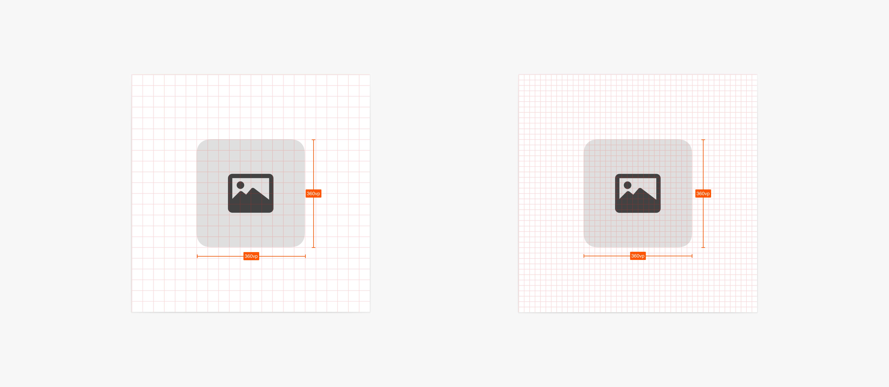

使用虚拟像素，使 UI 元素在不同密度的设备上具有一致性大小视觉感受

#### 字体像素单位：fp

字体像素 (font pixel)默认情况下与 vp 相同，即默认情况下 1 fp = 1vp。如果用户在设置中选择了更大的字体，字体的实际显示大小就会在 vp 的基础上乘以 scale 系数，即 1 fp = 1 vp * scale。

#### 8vp 网格系统

基于 8vp 为网格的基本单位可以对 UI 界面上元素的大小，位置，对齐方式进行更好的规划，可以构建更有层次感、秩序感，以及多设备上一致的布局效果。一些更小的控件，例如图标大小也可以对齐 4vp 的网格大小。

#### 断点系统

断点以应用窗口宽度和宽高比信息为参照，在宽度和宽高比的维度上分成了几个不同区间 (即不同的断点)。当窗口宽度和宽高比从一个断点变化到另一个断点时，可根据 UX 设计方案实现不同的页面布局效果 (如将页面内容从单列排布调整为双列排布甚至三列排布等) ，以获得更好的显示效果。

在应用进入分屏或多窗模式时，窗口尺寸应为分屏或多窗后的窗口尺寸。

**断点的设计原理**

提升全场景体验，需考虑多种窗口变化连续性。应用页面布局设计时推荐遵循以下原则：

 - 原则一：两个宽度相近的窗口，页面布局应相同。
 - 原则二：高度相对宽度较小的窗口，可根据宽高比信息来进行横向窗口或类方形窗口的页面布局差异化设计。

因此，系统设计了横向和纵向断点分别代表窗口的不同特征，作为判断页面布局和交互体验的条件：

 - 横向断点以窗口宽度值区分，代表窗口宽度实际大小，会影响用户使用和观看的物理尺寸。
 - 纵向断点以窗口宽高比区分，代表窗口相对高度，表示横向比例、方形或纵向比例窗口。

**窗口断点**

根据断点系统划分了几种不同的窗口形态范围。通过窗口的宽度及宽高比可以判断当前在哪个断点区间，并切换相对应的应用架构或布局以符合当前窗口交互特征。

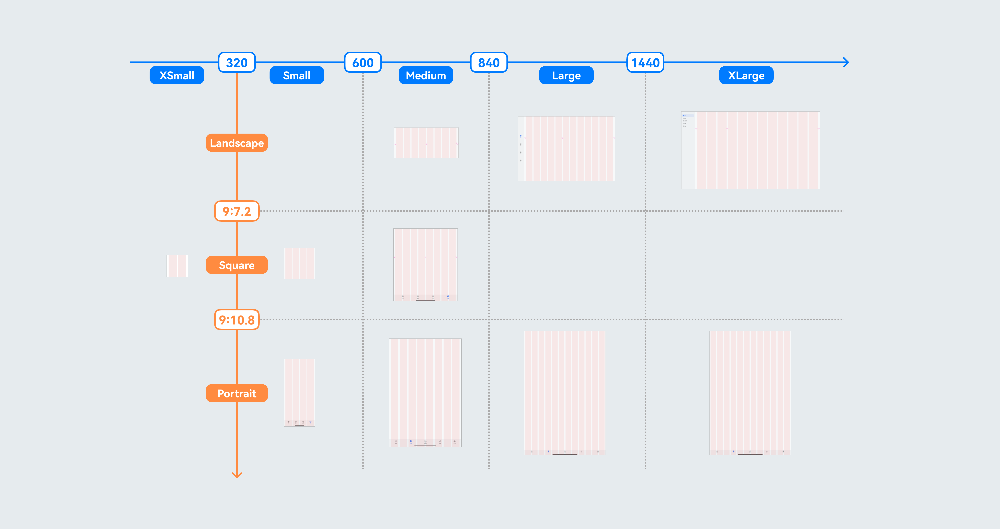

#### 栅格系统

栅格系统是一个多设备下通用的辅助定位系统，栅格给布局提供一种可循的规律，解决多尺寸多设备的动态布局问题。保证各模块各设备的布局一致性。栅格会跟随屏幕尺寸、窗口尺寸、子容器尺寸的变化而动态变化。

**栅格构成**

栅格系统有 Margins (边距) ，Gutters (间距) ， Columns (栅格) 三个属性。

**Margins (边距)：**

Margin 是元素相对窗口左右边缘的距离，决定了内容可展示的整体宽度，是用来控制元素距离屏幕最边缘的距离关系，可以根据不同的窗口容器尺寸定义不同的 Margin 值。

**Gutters (间距)：**

Gutter 是每个 Column 的间距，控制元素和元素之间的距离关系，决定内容间的紧密程度，可以根据不同的窗口容器尺寸定义不同的 Gutters 值，为了保证较好的视觉效果，Gutters 通常的取值不会大于 Margins 的取值。

**Columns (栅格)：**

Column 是内容的占位元素，其数量决定了内容的布局复杂度，Columns 的宽度在保证 Margins 和 Gutters 符合规范的情况下，根据实际窗口的宽度和 Columns 数量自动计算每一个 Columns 的宽度。不同的窗口容器尺寸匹配不同的 Columns 数量来辅助布局定位。

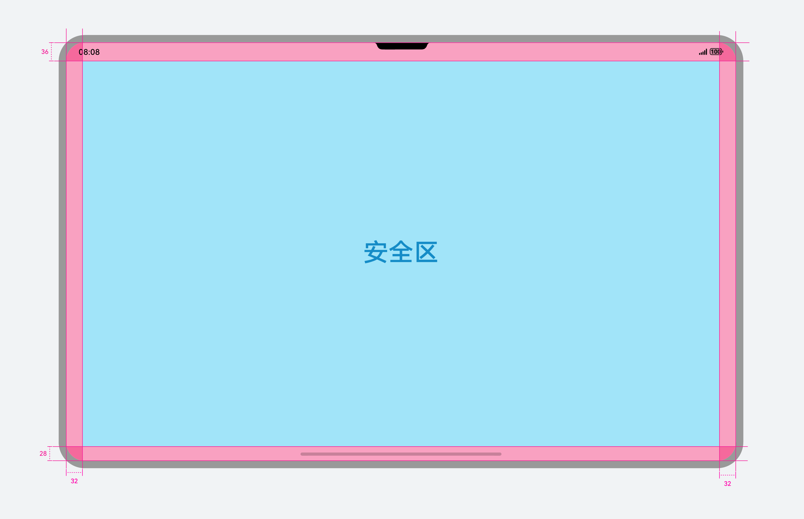

**窗口栅格**

窗口栅格系统是系统提供的一种面向多设备高效适配的辅助布局的定位工具。系统将根据窗口容器的水平宽度自动匹配最佳的栅格数量，以达到内容布局的最佳适应。

0 <= 水平 vp < 600 时：4 Columns 栅格；

600 <= 水平 vp < 840 时：8 Columns 栅格；

840 <= 水平 vp 时：12 Columns 栅格；

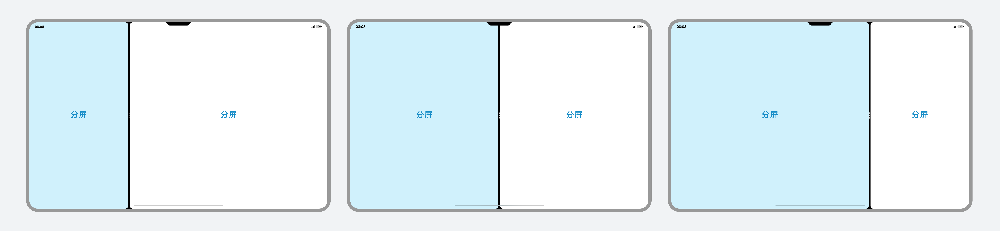

栅格定义：
1. 通用型：margin= 16vp，gutter=8vp，column=4 ；宽松型：margin= 16vp，gutter=16vp，column=4
2. margin=24vp，gutter=12vp，column=8
3. margin=32vp，gutter=16vp，column=12
4. margin=32vp，gutter=20vp，column=12

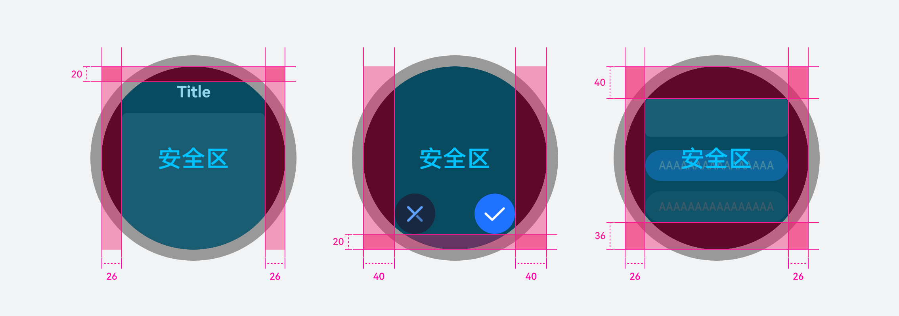

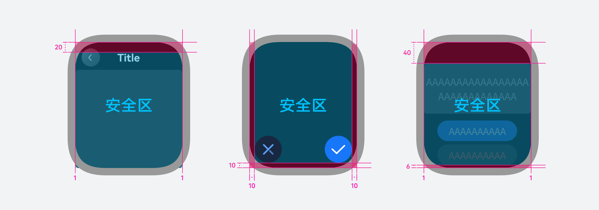

栅格最大使用宽度：

最大使用宽度为 2220vp，当窗口不断拉宽大于 2220vp 时，栅格内的内容区范围不再变化，多出的区域左右留白。

#### 系统安全区

安全区定义了界面可完整显示的区域，确保在安全区内的内容不会被硬件挖孔、圆角等因素截断或遮盖。

#### 手机

基于默认布局规则，手机上需避让顶部信号栏、底部导航条安全区、与两侧margin，有需要时预留键盘占据的空间，考虑安全区的嵌入后能最大化信息的展示效率，使用户感知到应用界面为一个整体。

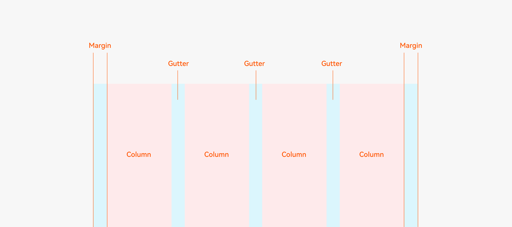

当屏幕中包含多个窗口时，如图示窗口高度比例2:1、1:1、与存在悬浮窗的场景，用户难以看清靠近边缘的内容，应考虑在窗口内居中放置主要内容，并避免过于紧凑的界面布局。

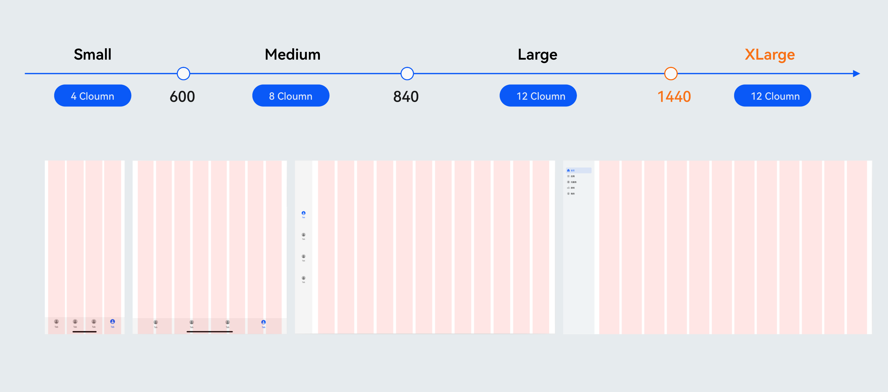

#### 折叠设备

除顶部信号栏与底部导航条以外，需避免将关键信息放置在折叠设备的转轴区（即折痕处），便于悬停态适配，详情请参阅[悬停态](https://developer.huawei.com/consumer/cn/doc/design-guides/foldable-0000002352875141#section183378919119)。

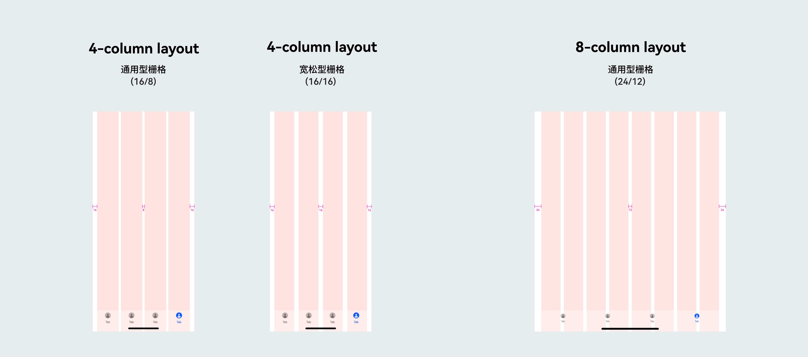

折叠设备呈展开态并存在多个窗口时，需考虑分屏布局，使关键信息易识别，核心操作易于使用。

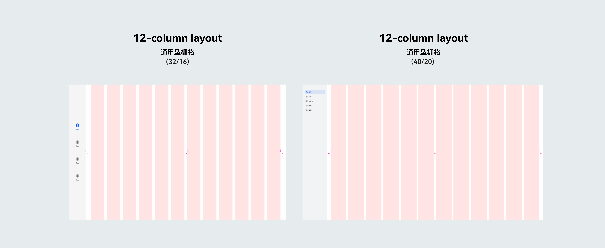

#### 平板

平板基础布局需避让顶部信号栏、底部导航条安全区、与两侧margin（根据断点规则计算）。

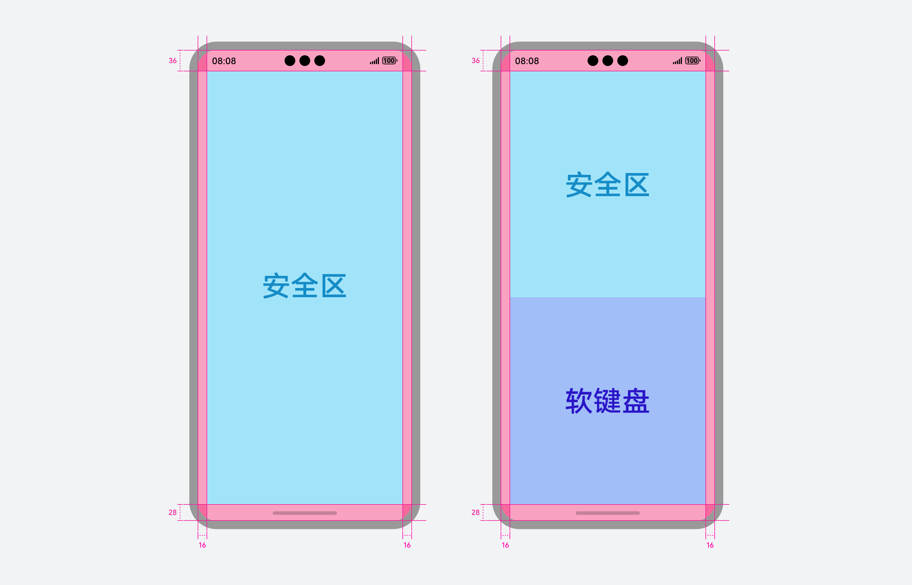

平板布局应额外考虑横排状态下窗口宽度比例1:2，1:1，与2:1分屏浏览的情况。

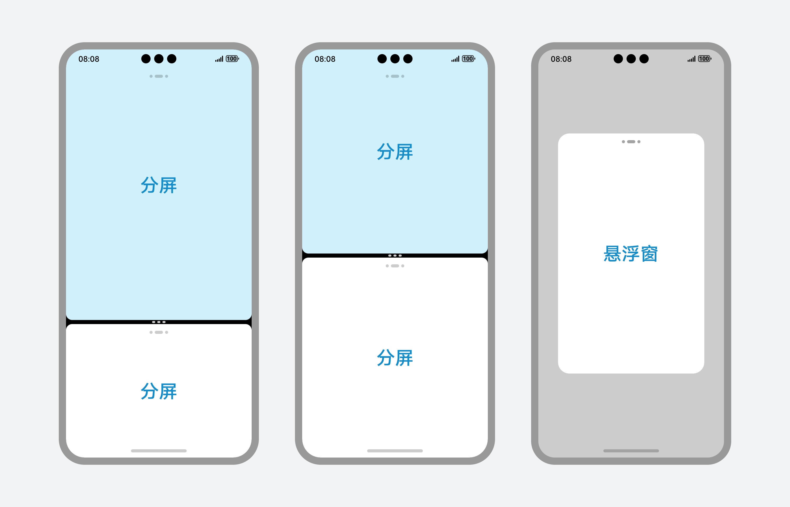

#### 智能穿戴

智能穿戴产品的信息布局需要根据设备为圆表或方表，以及当前应用的实际内容进行设计。避让水平屏幕边缘间距的同时，在不同的界面架构中，需要考量垂直布局额外进行避让，详情请见[间隔参数](https://developer.huawei.com/consumer/cn/doc/design-guides/spacing-parameters-0000002202912577)。

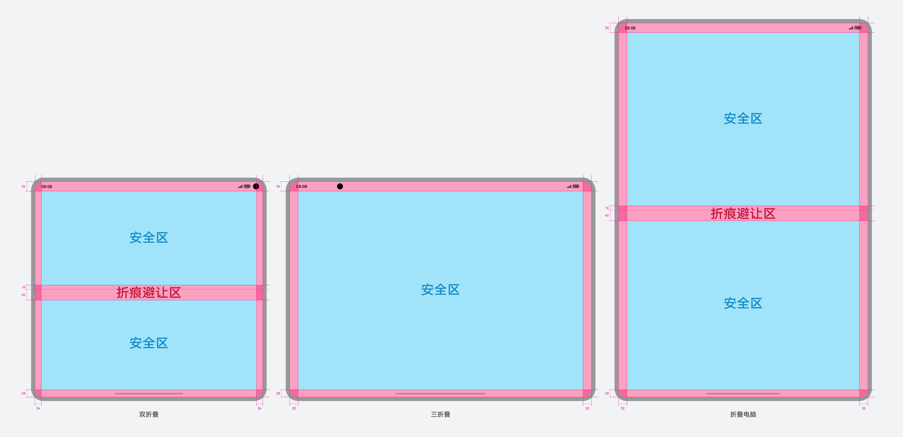

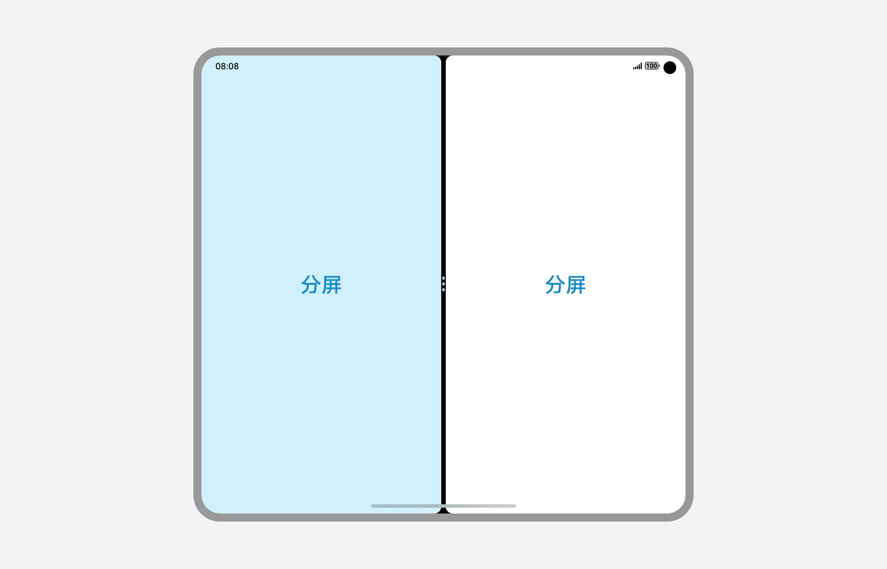

#### HarmonyOS 设备屏幕尺寸

**手机**

| 机型 | 尺寸px | 尺寸vp |
| Mate 60 | 1216x2688 | 374x826 |
| Mate 60 Pro | 1260x2720 | 388x836 |
| Mate 70 | 1216x2688 | 374x826 |
| Mate 70 Pro | 1316x2832 | 376x810 |
| Pura 60 | 1220x2700 | 376x830 |
| Pura 60 Pro | 1220x2700 | 376x830 |
| Pura 70 | 1256x2760 | 358x788 |
| Pura 70 Pro | 1260x2844 | 360x812 |

**折叠屏**

| 机型 | 尺寸px | 尺寸vp |
| Mate X5 | 1080x2504 | 346x802 |
| Mate X5-展开 | 2224x2496 | 712x798 |
| Mate XT | 1008x2232 | 350x776 |
| Mate XT-双折展开 | 2048x2232 | 712x776 |
| Mate XT-三折展开 | 3184x2232 | 1108x776 |

**阔折叠**

| 机型 | 尺寸px | 尺寸vp |
| Pura X | 980x980 | 326x326 |
| Pura X-展开 | 1320x2120 | 440x706 |

**平板**

| 机型 | 尺寸px | 尺寸vp |
| MatePad | 2560*1600 | 1280x800 |
| MatePad Pro | 2880*1920 | 1440x960 |

**PC**

| 机型 | 尺寸px | 尺寸vp |
| MateBook Pro | 2080x3120 | 1094x1642 |
| MateBook Fold | 1648x2472 | 916x1374 |
| MateBook Fold-展开 | 3296x2472 | 1832x1374 |

**穿戴**

| 机型 | 尺寸px | 尺寸vp |
| 圆表 | 466x466 | 233x233 |
| 方表 | 408x480 | 204x240 |
