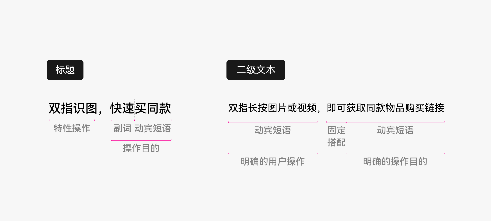
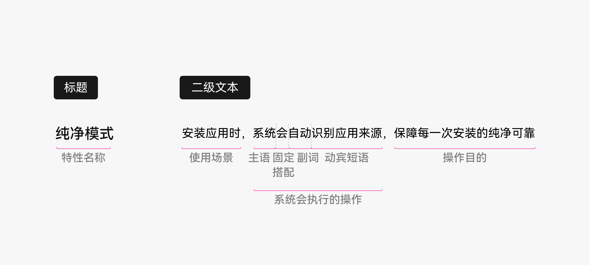
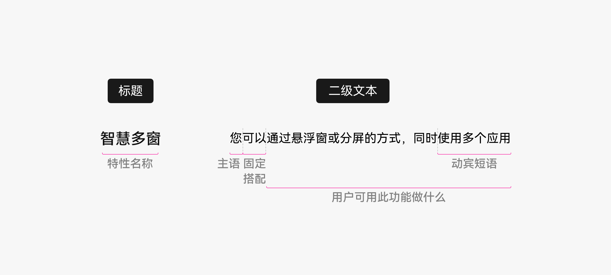

# 界面用语

更新时间：

来源：https://developer.huawei.com/consumer/cn/doc/design-guides/design-ui-language-0000001795698453

##### 写作原则

**使用友好、尊重的语气与用户交谈**
 
- 使用让用户感到舒适、被理解、被尊重的表达方式。避免过于正式、机械、或傲慢的表达。
- 使用“您”、“您的” 直接称呼用户，像界面直接和用户交谈一样。让用户感受到与他相关，而不是在阅读枯燥的系统说明文。
- 注意不要完全按照说话的方式写作，以免过于口语化和冗长。

 

 
**提供支撑用户目标的必要信息**
 
- 用户只关注自己的实际需要，并不想了解产品的全部细节。因此，要少谈产品的“卖点” ，多谈用户的“买点”。
- 在正确的位置，正确的时机，提供支撑用户目标的必要信息——不多不少，抓住用户最关心、最疑惑的点，支撑用户自信做决策。
- 将重要的信息先说，次要的信息后说，不重要的信息不说。更多信息，可根据用户需求在其他信息触点逐步呈现。

 

 
**使用简洁明了的短句**
 
- 冗长的文本会让用户失去耐心。通过上下文可知的内容，不必重复呈现给用户。相邻的句子、段落，避免相互信息重复。
- 保持界面文案清晰简洁，删减每一个多余的字，字字有用意，有的放矢。

 

 
**使用清晰易懂的词语**
 
根据对用户的了解，斟酌每个词语是否易于用户理解。尽量选用清晰易懂的常用词汇，避免生僻、过于技术化的词语。
 

 
**鼓励用户，避免负向用语**
 
- 希望用户尝试新功能，但要明白新技术常常会让人感到陌生而不敢轻易尝试。使用自信的语气，告诉用户他可以做什么。让用户放心，他们有能力掌握任何功能。
- 适当使用“只需”、“简单”、“轻松”、“即可”等词语来鼓励用户。
- 少用“失败”、“错误”等负向色彩浓厚的词语。避免使用双重否定、道歉的语气。

 

 
**逻辑连贯，表达统一**
 
- 标题与其下的说明文字应相互呼应，避免“文不对题”。
- 同一界面、同一场景的内容，应做到用词统一、风格统一、视角统一。

 
 

##### 内容设计指导

在开始写作界面文案之前，请思考以下几个问题，有助于理清文案目标、内容概要。
 

 
**1.你的目标用户是谁？**
 
明确定义目标用户，有助于在写作前做合理的内容规划。思考文案的目标读者——是普通大众，还是软件开发者？是游戏玩家，还是音乐发烧友？是全职开发人员，还是业余编程爱好者？根据目标用户不同，设计合理的内容和语言表达。
 

 
**2.用户在什么场景下要用此功能？**
 
用户不会仅仅为了学习一个功能而阅读文案，他们更关心在什么场景下，需要用到此功能。站在用户角度，思考他们使用此功能的 TOP 场景。
 
**3.此功能为用户带来的核心价值是什么？**
 
挖掘用户的 TOP 痛点/诉求，并思考功能是如何解决的。
 

 
**4.此功能的不足点是什么？**
 
用户如何做可以规避或减少功能的缺点？文案是否应提前给予建议？
 
你提供此内容的商业目标是什么？
 
用户目标固然重要，但每一次通过文案和用户的“交谈” 也有其商业目标。目标是提升功能使用率？还是提升特性美誉度？亦或是希望用户谨慎选择？根据商业目标不同，文案的内容设计也会有差异。
 

 
**5.内容如何呈现可以更好地达成用户目标和商业目标？**
 
是使用简短的界面融合式文本？还是嵌入式帮助文档链接？亦或是指导视频？围绕用户目标和商业目标，思考信息的最佳呈现方式。
 

 
**6.将如何衡量内容是否成功？**
 
在文案设计阶段，就需要思考最终如何度量文案的成功，以便基于用户数据对内容设计进行持续调优。
 
 

##### 语气语调

我们通过界面文案与用户“交谈”，并与用户产生情感上的连接。文案的内容是“我们说什么”，文案的语气语调则是“我们怎么说”。
 
如同人与人之间的沟通一样，同样一段话，会根据不同的交流对象、不同的对话场景、不同的读者心情，使用不同的语气和语调，以达成最佳的沟通目的。
 
整体上，界面文案“听”起来要像一位“知识渊博的朋友”，以一种友好、尊重的语气在与用户对话。他了解用户想做什么，知道用户需要哪些恰到好处的信息，知道什么时候该轻松交谈、什么时候该严肃谨慎、什么时候该给予安抚。
 

 
**应避免**
 
- 流行语
- 太可爱
- 太轻浮
- 太技术化
- 华丽的修辞
- 感叹号，除了在极少数需表达兴奋的场景
- 诋毁任何群体、包括竞争对手的措辞

 

 
**应考虑**
 
- 尝试反复大声朗读文案的内容，判断它是否听起来自然而友好。虽然书面用语并非每句话都要听起来自然，但是，如果在朗读的过程中觉得表达生硬拗口，则需将其优化得更具对话性。
- 如果对措辞或语气不确定，可以请身边的同事看看。
- 无论语气语调如何优化，最重要的仍然是以清晰而直接的方式，传达对用户有用的信息。

 

 
**示例**
  
| 轻松 | 尽情发现服务卡片，无需安装，即用即走，感受原子化服务的妙趣体验 |
| 平和 | 您可通过悬浮窗或分屏的方式同时使用多个应用 |
| 安抚 | 您还没有播放记录，快去看看精彩内容吧上传时间稍长，请耐心等待您当前处于禁食期，减脂不易，请继续坚持 |
| 严肃 | 本服务需联网，调用存储权限，并获取设备、网络及有关您使用本应用的信息。点击“同意”，即表示您同意上述内容及关于华为文件管理与隐私的声明、权限使用说明。删除后将无法恢复。确定删除？ |
 
 
 

##### 场景写作指导

 

##### 删除

**场景一：删除操作不会造成较大影响**
 

 
**内容结构**
 
“是否删除” + 【删除对象】
 

 
**参考句式**
 
- 句式 1：删除文件有具体数量

 
“是否删除 X 个XXX？”
 
- 句式 2：删除文件无具体数量

 
“是否删除所选XXX？”
 
- 句式 3：删除全部文件

 
“是否删除全部XXX？”
 
- 句式 4：删除全部文件及其相关数据

 
“是否删除XXX及其全部相关数据？”
 

 
**范例**
  
| 正例 | 反例 |
| --- | --- |
| 是否删除 3 个文件？ | 是否确定删除 3 个文件？ |
| 是否删除所选应用数据？ | 确定删除所选应用数据？ |
| 是否删除全部通话记录？ | 是否确定删除全部通话记录？ |
| 是否删除当前用户及其全部相关数据？ | 是否确定删除当前用户及其全部相关数据？ |
 
 

 
**场景二：删除操作会造成较大影响**
 

 
**内容结构**
 
【删除的负面影响】 + “确定删除？”
 

 
**参考句式**
 
“删除后，XXX。确定删除？”
 

 
**范例**
  
| 正例 | 反例 |
| --- | --- |
| 删除后，订单将无法恢复。确定删除？ | 将删除全部家庭共享内容，删除后无法恢复。 |
 
 
 

##### 确定弹出框

**场景一：操作不会带来负面影响**
 

 
**内容结构**
 
【操作原因】+【二次确定】
 

 
**参考句式**
 
“XXX。是否XXX？”
 

 
**范例**
  
| 正例 | 反例 |
| --- | --- |
| “相机”需要开启定位服务为您拍摄的照片或录制的视频添加位置信息。是否允许？ 取消 允许 | “相机”需要开启定位服务为您拍摄的照片或录制的视频添加位置信息。确定允许？ |
| 为了更好的音乐体验，建议升级至最新版本。是否升级？ 取消 升级 | 为了更好的音乐体验，建议升级至最新版本。确定升级？ |
 
 

 
**场景二：操作会带来负面影响**
 

 
**内容结构**
 
【操作影响】+【二次确定】
 

 
**参考句式**
 
“XXX。确定XXX？”
 

 
**范例**
  
| 正例 | 反例 |
| --- | --- |
| 当前非 WLAN 网络，使用移动数据会影响视频质量并消耗流量。确定播放？ 取消 播放 | 当前非 WLAN 网络，使用移动数据会影响视频质量并消耗流量。是否播放？ |
| 此操作将终止本机的畅连服务，并永久清除服务器端关联数据。确定解除？ 取消 解除 | 此操作将终止本机的畅连服务，并永久清除服务器端关联数据。是否解除？ |
 
 
 

##### 异常提示

**网络异常**
 

 
**内容结构**
 
【异常描述】+【解决方案】
 

 
**参考句式**
 
- 句式 1：用户无法通过检查网络设置解决

 
“XXX，请稍后再试”
 
- 句式 2：用户可通过检查网络设置解决

 
“XXX，请检查网络设置”
 

 
**范例**
  
| 正例 | 反例 |
| --- | --- |
| 服务器忙，请稍后再试 | 网络服务器繁忙，请稍后重试 |
| 服务器请求超时，请稍后再试 | 请求超时，请检查网络设置后重试 |
| 无法连接服务器，请稍后再试 | 无法连接至服务器 |
| 网络连接不稳定，请稍后再试 | 网络连接不稳定，请检查网络设置 |
| 服务器异常，请稍后再试 | 服务器异常，请检查后重试 |
| 网络未连接，请检查网络设置 | 网络未连接，请连接后重试 |
| 网络连接已中断，请检查网络设置 | 网络连接已中断，请重试 |
| 网络连接失败，请检查网络设置 | 网络连接失败，请连接后重试 |
| 网络异常，请检查网络设置 | 网络异常，请稍后重试 |
 
 

 
**登录异常**
 

 
**内容结构**
 
【异常描述】+【解决方案】
 

 
**范例**
  
| 正例 | 反例 |
| --- | --- |
| 用户名或密码错误，请重新输入 | 用户名或密码错误，请重输 |
| 登录已失效，请重新登录 | 登录已失效 |
| 账号验证失败，请重新登录 | 账号验证失败 |
| 密码错误。还可输入 X 次 | 密码错误，请重新输入。还可输入 X 次 |
| 密码输入错误超过 X 次，请 X 分钟后重试 | 密码输入错误超过 X 次，请稍后再试 |
| 输入错误次数过多，请 X 小时后重试 | 输入错误次数过多，已禁止登录 |
| 请至少包含 1 个大写字母 | / |
| 密码由 8-32 位字符组成，需至少包含一个大写字母、一个小写字母和一个数字，建议不与其他密码相同 | / |
 
 

 
**失败提示**
 

 
**场景一：失败原因不明确**
 

 
**内容结构**
 
【失败结果】+【解决方案】
 

 
**参考句式**
 
“XXX失败，请XXX”
 

 
**范例**
  
| 正例 | 反例 |
| --- | --- |
| 查询数据失败，请稍后再试 | 查询数据失败 |
| 网络连接已中断，请检查网络设置 | 网络连接已中断 |
 
 

 
**场景二：失败原因明确，解决方案可根据失败原因排查**
 

 
**内容结构**
 
【失败原因】+【失败结果】
 

 
**参考句式**
 
“XXX，XXX失败”
 

 
**范例**
  
| 正例 | 反例 |
| --- | --- |
| 云空间不足，文件上传失败 | 文件上传失败 |
 
 

 
**场景三：失败原因、解决方案均明确**
 

 
**内容结构**
 
【失败结果】+【失败原因】+【解决方案】
 

 
**参考句式**
 
“XXX失败。XXX，请XXX”
 

 
**范例**
  
| 正例 | 反例 |
| --- | --- |
| 下载失败。华为账号登录状态已失效，请重新登录 | / |
 
 

 
**超限异常**
 

 
**参考句式**
 
“XXX已达上限”
 

 
**范例**
  
| 正例 | 反例 |
| --- | --- |
| 输入次数已达上限 | 您的输入已经达到最大次数限制 |
| 输入字数已达上限 | 您输入的内容已经达到字数上限 |
| 今日游戏时长已达上限 | 今日游戏时长已超过限制 |
| 群成员数量已达上限 | 群成员数量已满 |
 
 
 

##### 内容加载

**范例**
  
| 正例 | 反例 |
| --- | --- |
| 正在加载，请稍候… | 加载中 |
| 正在发送，请稍候… | 发送中 |
 
 
 

##### 检查更新

**范例**
  
| 正例 | 反例 |
| --- | --- |
| 有新版本 | 检测到系统有新版本 |
| 已是最新版本 | 您当前使用的已经是最新版本 |
| WLAN 下自动更新 | WLAN网络环境下自动更新 |
| 立即更新 | 就马上更新 |
 
 
 

##### 更多帮助

**范例**
  
| 正例 | 反例 |
| --- | --- |
| 有关XXX的更多信息，请参阅XXX | 如果您想了解更多关于XXX 的详细信息，请阅读XXX |
| 了解更多 | 获取更多帮助 |
 
 
 

##### 帮助引导

**全屏引导型 (OnBoarding、OOBE 亮点推荐)**
 
向用户介绍新特性时，可根据特性及目标不同，选取以下类型表达：
 

 
**场景一：教用户如何使用**
 

 
**内容结构**
 
标题：【特性操作】+【操作目的】
 
二级文本：【明确的用户操作】+【明确的操作目的】
 

 
**参考句式**
 

 
补充说明：
 
1. 二级文本可省略主语“您”，即完整表达为：(您只需) XXX，即可XXX。
 
2. 固定句式“…，即可…”
 

 
**范例**
  
| 正例 | 反例 |
| --- | --- |
| 扫描物品，轻松查百科 扫描花草、汽车、宠物等，即可查询对应的百科知识 | 识物 支持识别花草、汽车、宠物等，获取相关百科信息。更多类别的物体识别将陆续开放 |
 
 
**业界参考**
  
| 正例 |
| --- |
| 在相簿中双指开合来缩放 放大或缩小任意网格，以快速找到照片或视频或者查看更多详细信息。 |
| 给照片添加说明 向上轻扫任意照片或视频，即可添加值得纪念的说明。 |
 
 
**Checklist**
 1. 标题不超过 10 字符；辅助文本 22 字符以内为佳，不超过 44 字符。
2. 体现此功能的独特亮点，避免泛泛而谈。
3. 简明扼要。提供的内容正好满足用户在首次使用前的信息诉求，不会过多，也不会过少。
4. 选择目标用户熟悉的清晰易懂的词语，轻松、友好地与用户交谈。避免技术化、生僻词、夸大营销。
 

 

 
**场景二：告知系统会做什么事**
 

 
**内容结构**
 
标题：【特性名称】
 
二级文本：【使用场景】+【系统会执行的操作】+【操作目的】
 

 
**参考句式**
 

 
补充说明：
 
1. 主语为“系统”或“特性”。当不影响句意表达时，可省略主语 。
 
2. 无使用场景限制时，可省略“使用场景”。操作目的明确时，可省略“操作目的”。
 

 
**范例**
  
| 正例 | 反例 |
| --- | --- |
| 纯净模式 安装应用时，系统会自动识别应用来源，保障每一次安装的纯净可靠 | 纯净模式 应用来源受管控，用户权益有保障 |
 
 
**业界参考**
  
| 正例 |
| --- |
| 智能自动化操作 “家庭”App 会建议实用的自动化操作，让配件更好地为您工作。 |
| 原彩显示 iPhone 会根据环境光线条件自动调整，以在不同环境下保持色彩显示一致。 |
 
 
**Checklist**
 1. 标题不超过 10 字符；辅助文本 22 字符以内为佳，不超过 44 字符。
2. 体现此功能的独特亮点，避免泛泛而谈。
3. 简明扼要。提供的内容正好满足用户在首次使用前的信息诉求，不会过多，也不会过少。
4. 选择目标用户熟悉的清晰易懂的词语，轻松、友好地与用户交谈。避免技术化、生僻词、夸大营销。
 

 

 
**场景三：告知用户可利用此功能做什么事**
 

 
**内容结构**
 
标题：【特性名称】
 
二级文本：【用户可用此功能做什么】
 

 
**参考句式**
 

 
补充说明：
 
1. 主语“您”。
 
2. 固定句式“您可以…”。
 

 
**范例**
  
| 正例 | 反例 |
| --- | --- |
| 智慧多窗 您可以通过悬浮窗或分屏的方式同时使用多个应用 | 智慧多窗 以悬浮窗或分屏浏览的方式智能打开多个窗口 |
 
 
**业界参考**
  
| 正例 |
| --- |
| 经期跟踪 您现在可以跟踪月经周期，并预测下次月经来潮时间。 |
| 屏幕使用时间 获取屏幕使用时间的周报，并为需要管理的 App 设定时间限额。您还可以在子女的设备上使用屏幕使用时间并设置家长控制。 |
 
 
**Checklist**
 
标题不超过 10 字符；辅助文本 22 字符以内为佳，不超过 44 字符。
 
体现此功能的独特亮点，避免泛泛而谈。
 
简明扼要。提供的内容正好满足了用户在首次使用前的信息诉求，不会过多，也不会过少。
 
选择目标用户熟悉的清晰易懂的词语，轻松、友好地与用户交谈。避免技术化、生僻词、夸大营销。
 
 

##### 编辑规范

 

##### 标点规范

**句号**
 
**以下场景句末不使用句号**
 
- 短语级别的列举
- 句末是网址
- 设置项二级文本
- OnBoarding 二级文本
- 及时反馈 (Toast)

  
| 正例 | 反例 |
| --- | --- |
| 可以查看的项目包括： – 名称 – 网络地址 | 可以查看的项目包括： – 名称。 – 网络地址。 |
| 更多信息，请访问 https://www.huawei.com/ru/ | 更多信息，请访问 https://www.huawei.com/ru/。 |
| 蓝牙 当前可被附近的蓝牙设备发现 | 蓝牙 当前可被附近的蓝牙设备发现。 |
| 通话转移 可快速将通话转移至附近同账号的智慧屏，继续轻松畅聊 | 通话转移 可快速将通话转移至附近同账号的智慧屏，继续轻松畅聊。 |
 
 

 
**以下场景句末使用句号**
 
- 操作步骤
- 句子级别的列举

  
| 正例 | 反例 |
| --- | --- |
| 取出 SIM、USIM 或 UIM 卡 1. 将卡针插入卡托上的小孔弹出卡托。 2. 将卡托轻轻地从卡托插槽中拉出。 3. 移除 SIM、USIM 或 UIM 卡。 4. 将卡托重新插入卡托插槽。 | 取出 SIM、USIM 或 UIM 卡 1. 将卡针插入卡托上的小孔弹出卡托； 2. 将卡托轻轻地从卡托插槽中拉出； 3. 移除 SIM、USIM 或 UIM 卡； 4. 将卡托重新插入卡托插槽。 |
| · 低电量模式：可提升续航时间，但会关闭 5G、熄屏显示、自动同步等功能。 · 性能模式：可提高系统性能，但是会增加耗电和发热。 | · 低电量模式：可提升续航时间，但会关闭 5G、熄屏显示、自动同步等功能； · 性能模式：可提高系统性能，但是会增加耗电和发热； |
 
 

 
**顿号**
 
并列的词或词组之间，使用顿号表示短暂的语气停顿。
  
| 正例 | 反例 |
| --- | --- |
| 无需流量，与附近的华为设备极速分享图片、视频、应用、文件等。 | 无需流量，与附近的华为设备极速分享图片，视频，应用，文件等。 |
 
 

 
**分号**
 
并列的句子之间，使用分号分隔。
  
| 正例 | 反例 |
| --- | --- |
| 放大或缩小：轻点两下或张开双指以放大；轻点两下或捏合双指以缩小。 | 放大或缩小：轻点两下或张开双指以放大。轻点两下或捏合双指以缩小。 |
 
 

 
**感叹号**
 
感叹号语气过强，尽量少用。仅在非常重要的警告或提示，以及恭喜、鼓励的场景中使用。
  
| 正例 | 反例 |
| --- | --- |
| 还需几步，即可完成所有操作！ | 还需几步，即可完成所有操作。 |
 
 

 
**问号**
 
仅在表达询问时使用问号。避免反问和感叹号连用，导致语气过于强烈。
  
| 正例 | 反例 |
| --- | --- |
| 删除后将无法恢复。确定删除？ | 想找全网商品最低价？长按图片，马上查！ |
 
 

 
**冒号**
 
由“以下”、“如下”等词语引出列举内容时， 句末需使用冒号。
  
| 正例 | 反例 |
| --- | --- |
| 本应用使用过程中，需获取以下权限： - 存储 - 位置 | 本应用使用过程中，需获取以下权限。 - 存储 - 位置 |
 
 

 
**引号**
 
**引用以下内容时使用引号**
 
- 应用名
- 功能名
- 按键名

  
| 正例 | 反例 |
| --- | --- |
| “时钟”应用 | 时钟应用 |
| 使用“缩放”功能 | 使用缩放功能 |
| “清除”键 | 清除键 |
 
 
**引用以下内容时不使用引号**
 
- 图标

  
|  |  |
 
 

 
**括号**
 
使用半角括号。括号外与文字间有半角空格；括号内与文字间无空格。
  
| 正例 | 反例 |
| --- | --- |
| 请描述问题 (必填) | 请描述问题( 必填 ) |
 
 

 
**书名号**
 
引用手册、指南时，使用书名号。书名号内使用手册、指南的全称。
  
| 正例 | 反例 |
| --- | --- |
| 更多信息，请参阅《XXXX 使用手册》 | 更多信息，请参阅XXX手册 |
 
 

 
**省略号**
 
使用半角三点表示省略或等待。三点位于文字水平线下方。
  
| 正例 | 反例 |
| --- | --- |
| 正在连接… | 正在连接…… |
 
 

 
**连接号**
 
**以下场景使用短横线 “-” 连接，前后无空格。**
 
- 表格、插图的编号
- 连接号码，包括电话号码、门牌号码，以及用阿拉伯数字表示年月日等

  
| 正例 | 反例 |
| --- | --- |
| 参见下页表 2-8、表 2-9 | 参见下页表 2 - 8、表 2 - 9 |
| 联系电话：010-88842603 | 联系电话：010 – 88842603 |
| 2021-08-08 | 2021 - 08 – 08 |
 
 
**以下场景使用全角波浪线 “～” 连接，前后无空格**
 
- 数值范围 (由阿拉伯数字或汉字数字构成) 的起止
- 相关项目 (如时间、地域等) 的起止

  
| 正例 | 反例 |
| --- | --- |
| 48 km/h～90 km/h | 48 km/h-90 km/h |
| 正常值为 60～100 次/小时，您的脉搏过快。若有不适，请及时就医。 | 正常值为 60-120 次/分钟，您的脉搏过快。若有不适，请及时就医。 |
| 请长按蓝色键 5～8 秒，夜灯将进入睡眠模式 | 请长按蓝色键 5-8 秒，夜灯将进入睡眠模式 |
| 8月8日～8月15日 | 8月8日-8月15日 |
 
 

 
**操作路径规范**
 
**参考句式**
 
句式 1：前往“XX”>“XX”>“XX”，开启/关闭/删除/清空/设置/反馈XXX。
 
句式 2：在XXX进入“XX”>“XX”>“XX”，开启/关闭/删除/清空/设置/反馈XXX。
 
补充说明：
 
1.每个引号中的路径名必须为确定的功能名或者页签名
 
2.每个引号中只可写一个路径名。
  
| 正例 | 反例 |
| --- | --- |
| 本服务启动时需申请以下 2 个权限，可前往“设置”>“应用”>“应用管理”撤销。 | 本服务启动时需申请以下 2 个权限，可以在“设置>应用>应用管理”界面撤销。 |
| 若需恢复使用，请前往“设置”>“畅连助手管理”>“北斗卫星消息”启用。 | 若需恢复使用，请到“设置-畅连助手管理-北斗卫星消息”中启用。 |
| 在中控屏进入“设置”>“车辆控制”>“更多”，开启或关闭“座椅迎宾”开关。 | 在中控屏依次点击设置 > 车辆控制 > 更多，开启或关闭“座椅迎宾”开关。 |
 
 
 

##### 空格规范

**以下场景需加半角空格**
 
- 英文字符前后
- 数字前后
- 度量单位前
- 版权所有符号 © 前后
- 用于组合的 + 号前后
- 序号与其后的文字之间

  
| 正例 | 反例 |
| --- | --- |
| 卸载 USB 存储设备 | 卸载USB存储设备 |
| 最多 32 个字符 | 最多32个字符 |
| 1 MB、1024 KB、92.3 MHz | 1MB、1024KB、92.3MHz |
| 版权所有 © 2002-2021 华为技术有限公司 保留一切权利 | 版权所有©2002-2021 华为技术有限公司 保留一切权利 |
| 按 Ctrl + S 打开“设置” | 按Ctrl+S打开“设置” |
| 1. 在对话中，轻点两下信息气泡。 2. 轻点图标来选取回复。 | 1.在对话中，轻点两下信息气泡。 2.轻点图标来选取回复。 |
 
 

 
**以下场景无需加半角空格**
 
- 百分号与数值之间
- 数学符号与数值之间
- 货币符号与数值之间
- 连接号短横线“-”前后
- 操作路径指示符“>”前后
- 斜杠“/”前后

  
| 正例 | 反例 |
| --- | --- |
| 20% | 20 % |
| 2+3 | 2 + 3 |
| ¥100 | ¥ 100 |
| 测量将持续 2-3 分钟 | 测量将持续 2 - 3 分钟 |
| 前往“设置”>“移动网络” | 前往“设置” > “移动网络” |
| 国家/地区 | 国家 / 地区 |
 
 
 

##### 通用词语规范

**代词“您”**
 
- 统一使用“您”、“您的”直接称呼用户，以示对用户的友好与尊重。
- 避免在一个句子中，连续使用“您”。
- 若行为主体明确，可省略“您”。

 
说明：极少数带有广告和哲理色彩的短句，以及语音交互中，可用“你”。
  
| 正例 | 反例 |
| --- | --- |
| 点击“同意”，即表示您同意以上内容 | 点击“同意”，即表示你同意以上内容 |
| 为向您提供所订购的服务 | 为向您提供您所订购的服务 |
| 无网络连接，请检查网络设置 | 无网络连接，请您检查网络设置 |
 
 

 
**数词**
 
- 统一使用阿拉伯数字。
- 数字前后使用半角空格 (少数情况如百分号前不加空格，详情请参考空格规范)。
- 前后两个数值的计量单位相同时，在不造成歧义的情况下，前一个数值的计量单位可省略。造成歧义时，则不可省略。

  
| 正例 | 反例 |
| --- | --- |
| 20 厘米 | 二十厘米 |
| 20% | 百分之二十 |
| 可观看 13-15 集 | 可观看 13 集-15 集 |
| 15％~30％ | 15~30％ |
 
 

 
**动词“请”**
 
- 具体的某次行为，可用“请”。
- 列举时，不宜连续出现“请”。

  
| 正例 | 反例 |
| --- | --- |
| 存储空间已满，请删除不用的文件以释放空间。 | 存储空间已满，删除不用的文件以释放空间。 |
| 建议： – 保持设备使用最新版本的软件。 – 不使用 WLAN、GPS 和蓝牙功能时将它们禁用。 | 建议： – 请保持设备使用最新版本的软件。 – 请不要使用 WLAN、GPS 和蓝牙功能时将它们禁用。 |
 
 

 
**助词“的”、“地”、“得”**
 
- “的”后接名词，表示形容或所属关系。
- “地”后接动词，修饰动作。
- “得”后接形容词，表示状态。
- 避免在一个句子中，连续使用“的”。
- 标题中不宜出现“的”。

  
| 正例 | 反例 |
| --- | --- |
| 更新您孩子的手机系统 | 更新您的孩子的手机系统 |
| 连续快速地拍摄多张照片 | 连续快速的拍摄多张照片 |
| 跑得快 | 跑的快 |
 
 

 
 

##### 中文中常用英语词语规范

- 第一个字母需大写。
- 英文单词和中文间需使用半角空格。

  
| 正例 | 反例 |
| --- | --- |
| Opera 浏览器、Firefox 浏览器、Safari 浏览器 | opera浏览器、firefox浏览器、safari浏览器 |
| App | APP |
