# 字体排印

更新时间：2026-01-23 02:11:00

来源：https://developer.huawei.com/consumer/cn/doc/design-guides/font-0000001828772001

字体排印指的是在操作系统中对文字的布局和呈现方式的定义。在 UI 设计中，字体排印起着关键的作用，包括字体的大小、样式、行间距等，这些因素直接影响用户界面的可读性和整体美观性。通过合适的字体排印，设计师可以确保用户能够轻松阅读和理解应用程序的内容，提升用户体验。除了确保文本清晰易读外，其所选字体排印方式还可协助你阐明信息层级结构、传达重要内容并宣传你的品牌。

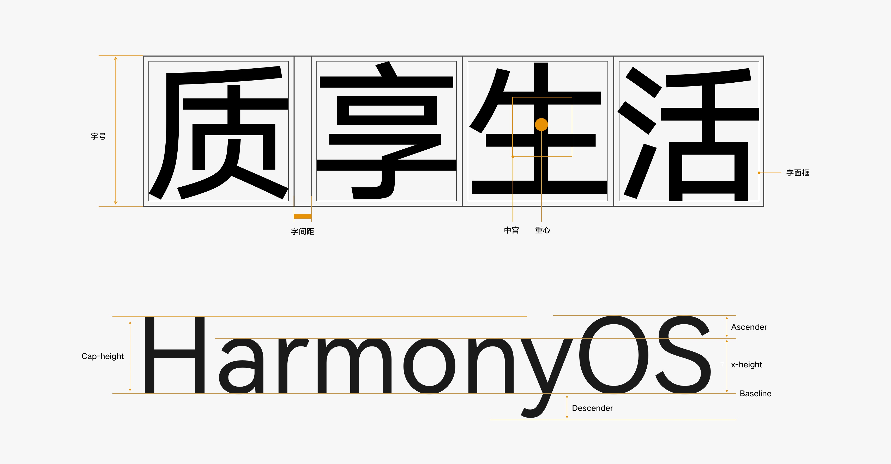

## 排版体验要求

最小可读字号：UI 排版中使用的字号应大于用户可阅读的最小字号，以确保在各种设备上都能提供清晰可读的文本。

色彩和对比度：选择适当的颜色并确保足够的对比度，以确保文本在各种背景下清晰可辨，提升可读性。

一致的字体风格：保持字体的一致性，包括字重和字体风格，以创造整体协调的用户界面，增强品牌一致性。

简洁的样式表达信息：避免过度使用字号、粗细和颜色等样式，以确保信息层级清晰，提升用户理解文本内容的效果，同时应避免过多的层级导致界面过于复杂。

支持系统大字体：确保字体能够适应系统无障碍设置中的大字体模式，以提供对视觉障碍用户的友好支持。

## 系统默认字体

HarmonyOS Sans 是默认系统字体，它能完全支持简体中文、繁体中文，并广泛支持拉丁、希腊、西里尔语系的字符显示。

HarmonyOS Sans 字体文件下载（.zip）

### HarmonyOS Sans

HarmonyOS Sans 是一款无衬线字体，它没有额外的装饰笔画，结构更加简洁清晰，在 UI 界面上具有更良好的屏幕显示效果，并且能带来更高阅读效率。HarmonyOS Sans 在字体设计上考虑了多元的应用场景，优化字形显示的灰度效果，以达到在多端的应用场景下拥有一致的体验效果。

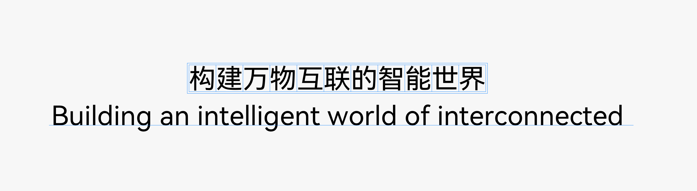

### 使用系统字体

系统字体可支持广泛的语言显示，并且提供了 Thin、Light、Regular、Medium、Bold 的粗细以更好支持你的 UI 设计的信息层级的表达。

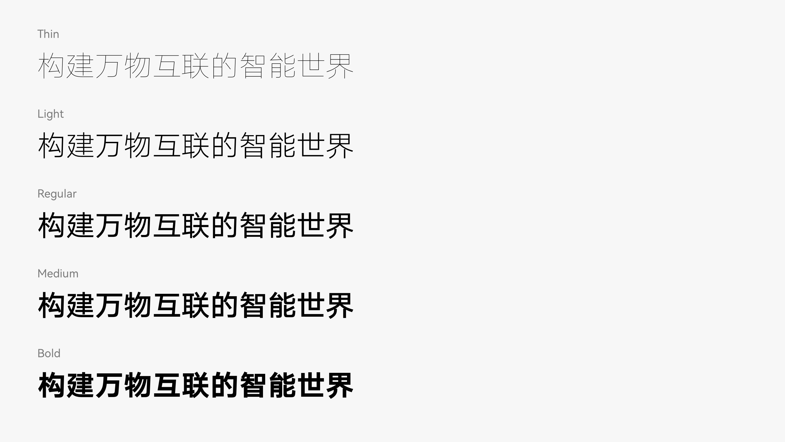

### 可变字体

HarmonyOS Sans 字体支持字重连续变化，使用系统默认字体可以支持用户动态调节 UI 界面中字重的显示粗细。

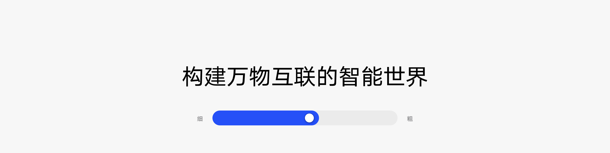

### 使用自定义字体

如果系统默认字体风格无法满足你的诉求，例如为了宣传品牌或者创造沉浸式的游戏体验，你可以使用自定义字体，但需要确保用户可在不同视距和各种条件下都能轻松阅读。

## 字体排版应用

文字比例是一种规定了不同字体大小的系统，旨在确保在用户界面中保持一致的视觉层次结构。这包括主标题、子标题、正文等不同文本元素的字号选择，以及它们之间的比例关系，以提高设计的一致性、可读性和美观性。在 UI 界面的字体排版中，我们将排版字体的类型分为“展示、标题、子标题、正文、说明”五大类，并根据使用场景使用推荐的样式，以达到与系统一致的阅读体验。

## 手机

| 使用场景 | 场景类别 | 字号 | 字重 |
| --- | --- | --- | --- |
| Display_L | 展示文本 L | 56 | Light |
| Display_M | 展示文本 M | 48 | Light |
| Display_S | 展示文本 S | 38 | Light |
| Title_L | 标题文本 L、标题栏组件文本 | 30 | Bold |
| Title_M | 标题文本 M | 24 | Bold |
| Title_S | 标题文本 S、二级标题栏组件文本 | 20 | Bold |
| Subtitle_L | 子标题文本 L、列表标题文本 | 18 | Medium |
| Subtitle_M | 子标题文本 M、按钮文本 | 16 | Medium |
| Subtitle_S | 子标题文本 S、小按钮文本 | 14 | Medium |
| Body_L | 正文文本 L、系统正文 | 16 | Regular |
| Body_M | 正文文本 M、系统辅助文本 | 14 | Regular |
| Body_S | 正文文本 S、系统提示文本 | 12 | Regular |
| Caption_L | 说明文本 L、水印文本 | 12 | Medium |
| Caption_M | 说明文本 M | 10 | Medium |
| Caption_S | 说明文本 S、图表刻度 | 8 | Medium |

### 展示文本

展示文本是用于吸引用户注意力的大标题或短语，通常具有较大的字号和鲜明的样式。展示文本用于突出显示关键信息，例如天气应用里达到“温度数值”、计算器应用里的“计算结果”。

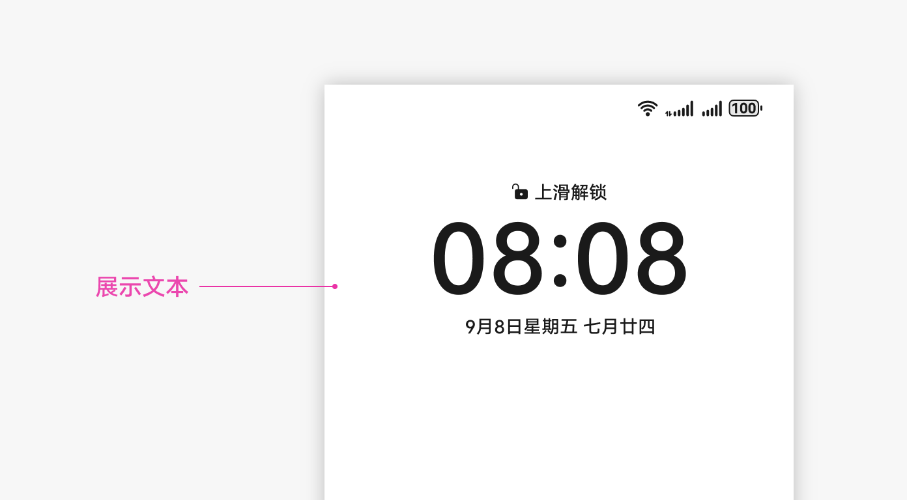

### 标题文本

主标题文本是用于标识页面或区域的主要标题，通常具有较大的字号和明显的样式，但不如展示文本那么突出。主标题文本应用于页面的顶部或板块的开头，用于引导用户关注重要内容，如页面的标题，文章的标题或弹窗的标题。

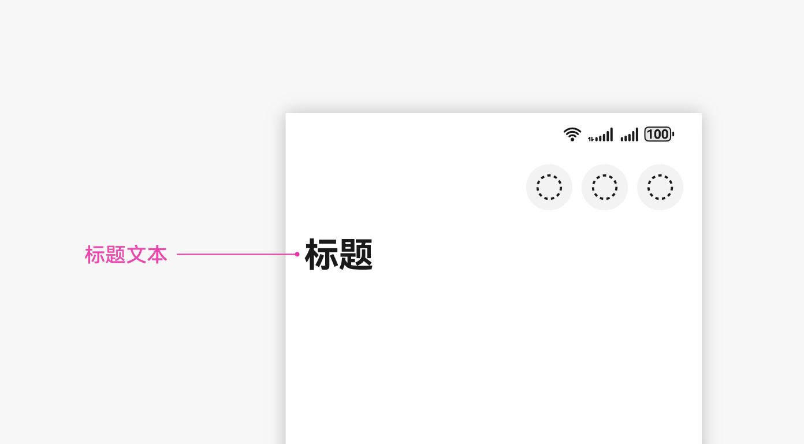

### 子标题文本

小标题是相对于主标题或大标题而言的次要标题，用于划分内容，引导读者在更详细的层次中理解信息。它通常比主标题略小，但比正文文本略大。小标题帮助组织信息、引导读者关注特定段落或主题，提供更好的阅读导向。

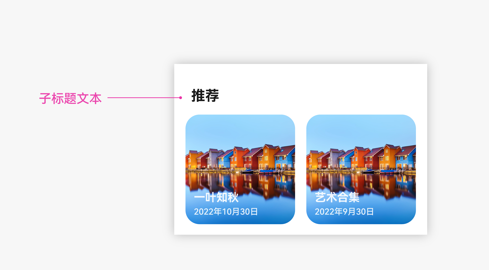

### 正文文本

正文文本用于呈现长篇幅的正文内容，字号适中，样式清晰，以提供良好的阅读体验。正文文本在应用或网页的主要内容区域，用于展示文章详情、列表内容。

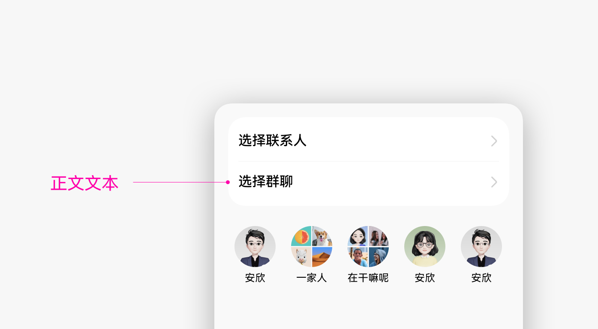

### 说明文本

说明文本用于短小的标签或其他需要简明扼要表达的信息，通常字号较小，样式简洁。说明文本通常应用于图片的简要提示，以及图标的说明文本或者其他需要提供简短解释的地方。

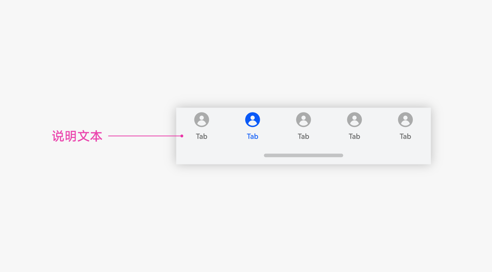

## 穿戴设备

| Token | 场景类别 | 字号 | 字重 |
| --- | --- | --- | --- |
| Display_L | 展示文本 L | 36 | Bold |
| Display_M | 展示文本 M | 30 | Bold |
| Display_S | 展示文本 S、大标题（方表） | 24 | Bold |
| Title_L | 标题文本 L、大标题（圆表） | 19 | Bold |
| Title_M | 标题文本 M | 18 | Bold |
| Title_S | 标题文本 S、小标题 | 15 | bold |
| Subtitle_L | 子标题文本 L、弧形按钮文本（圆表）、列表标题文本 | 19 | Medium |
| Subtitle_M | 子标题文本 M、胶囊按钮文本（方表） | 18 | Medium |
| Subtitle_S | 子标题文本 S、胶囊按钮文本（圆表） | 15 | Medium |
| Body_L | 正文文本 L | 18 | Regular |
| Body_M | 正文文本 M | 15 | Regular |
| Body_S | 正文文本 S | 13 | Regular |
| Caption_L | 说明文本 L、水印文本 | 13 | Medium |
| Caption_M | 说明文本 M | 11 | Medium |
| Caption_S | 说明文本 S、图表刻度 | 10 | Medium |

### 展示文本

展示文本是用于吸引用户注意力的大标题或短语，通常具有较大的字号和鲜明的样式。展示文本用于突出显示关键信息，例如心率应用里的“心率数值”、体温应用里的“推测温度数值”。

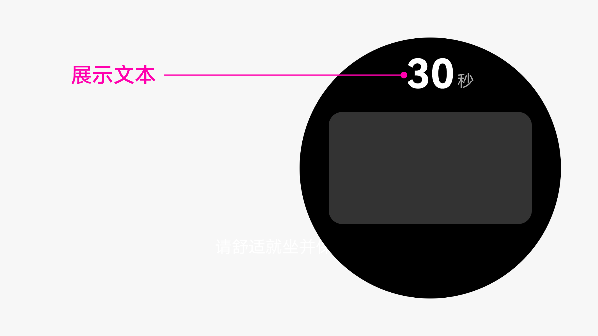

### 标题文本

标题文本是用于标识页面或区域的主要标题，通常具有较大的字号和明显的样式，但不如展示文本那么突出。标题文本应用于页面的顶部或板块的开头，用于引导用户关注重要内容，如页面的标题，文章的标题或弹窗的标题。

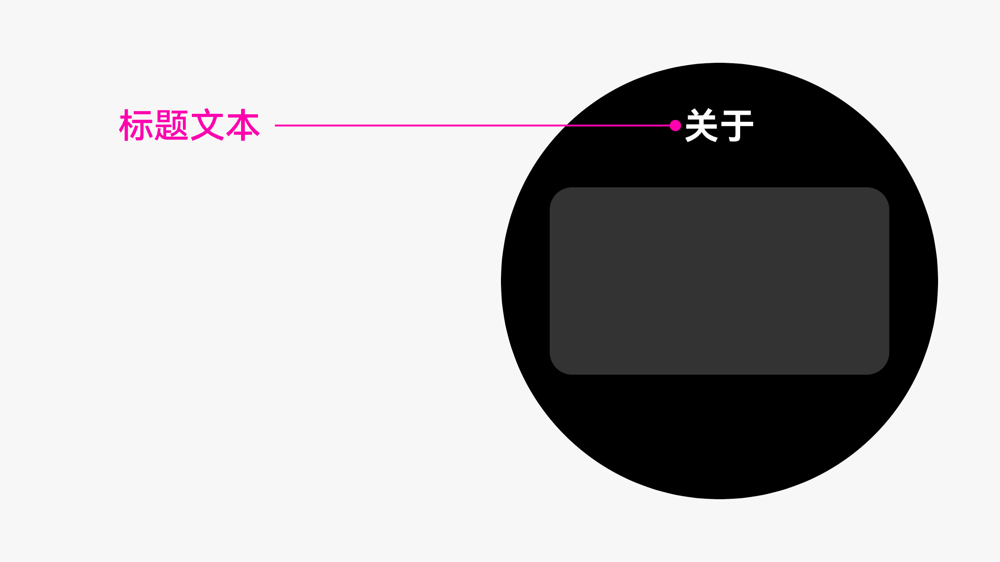

### 子标题文本

小标题是相对于主标题或大标题而言的次要标题，用于划分内容，引导读者在更详细的层次中理解信息。它通常比主标题略小。小标题帮助组织信息、引导读者关注特定段落或主题，提供更好的阅读导向。

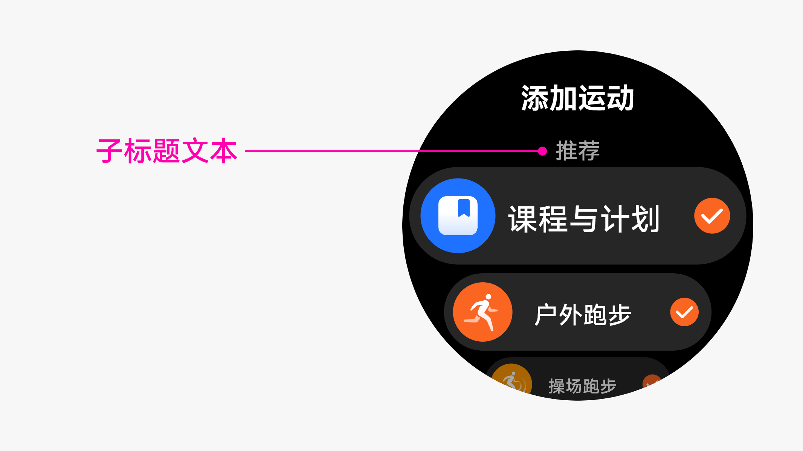

### 正文文本

正文文本用于呈现长篇幅的正文内容，字号适中，样式清晰，以提供良好的阅读体验。

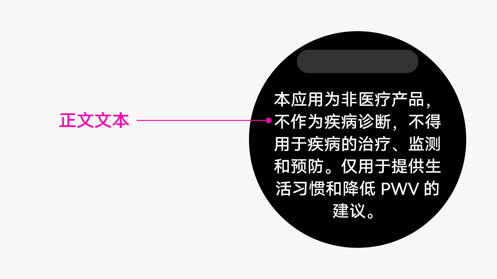

### 说明文本

说明文本用于短小的标签或其他需要简明扼要表达的信息，通常字号较小，样式简洁。说明文本通常应用于图表的说明以及其他需要提供简短解释的地方。

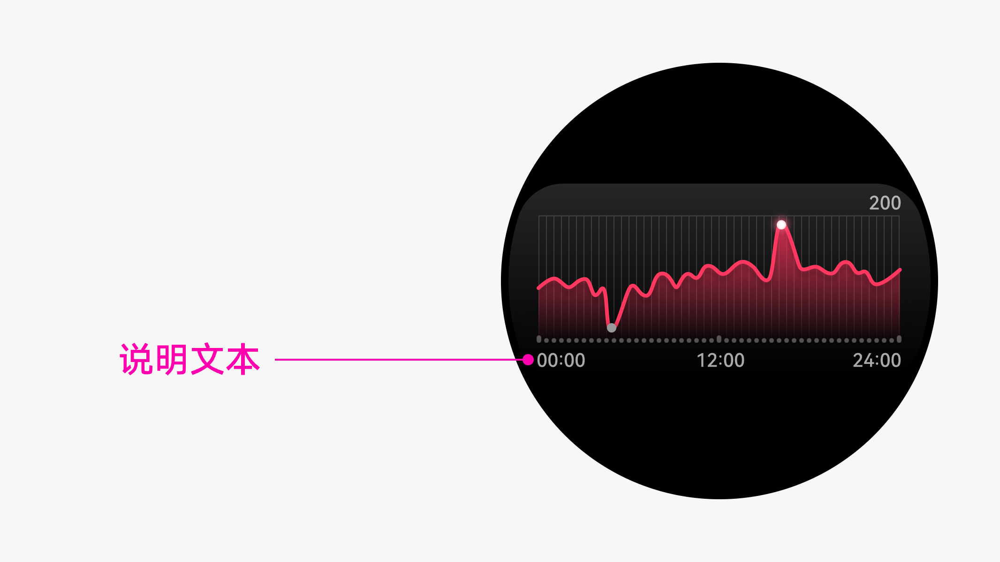

## 字体特性

系统字体支持丰富的字体排版特性，设置对应的特性 Tag 就能轻松开启。例如上标数字 (sups)、下标数字 (subs)、科学下标数字 (sinf)、分子 (numr)、分母 (dnom)、等宽数字 (tnum)、变宽数字 (pnum)、大写变换字符 (case)、分数 (frac)、序列数字 (ordn)、连字 (liga)、全宽字符 (fwid)、变宽字符 (hwid)、竖排字符 (vert)。

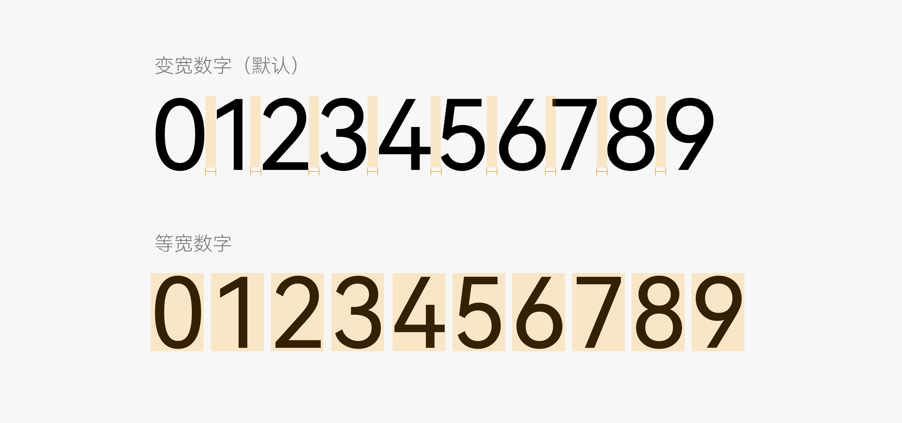

系统字体还支持“连续标点挤压”以及“标点句首缩减”特性，通过设置自定义特性 “ss08” 即可开启。

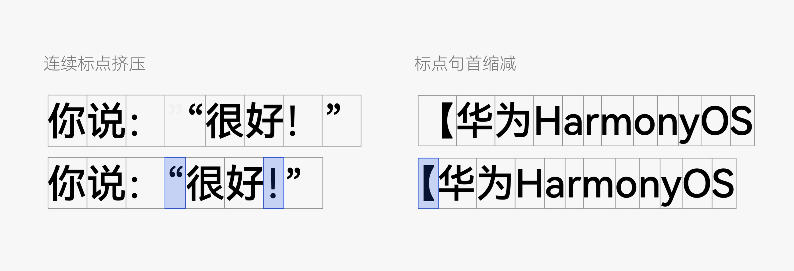

字体特性开发指引
