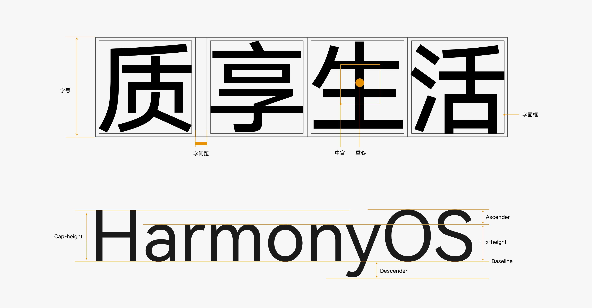
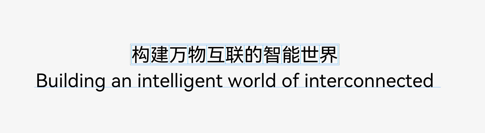

# 鸿蒙黑体

更新时间：2026-07-28 09:56:00

来源：https://developer.huawei.com/consumer/cn/doc/design-guides/font-0000001828772001

#### HarmonyOS Sans

HarmonyOS Sans 是一款无衬线字体，它没有额外的装饰笔画，结构更加简洁清晰，在 UI 界面上具有更良好的屏幕显示效果，并且能带来更高阅读效率。HarmonyOS Sans 在字体设计上考虑了多元的应用场景，优化字形显示的灰度效果，以达到在多端的应用场景下拥有一致的体验效果。

#### 系统默认字体

HarmonyOS Sans 是默认系统字体，它能完全支持简体中文、繁体中文，并广泛支持拉丁、希腊、西里尔、阿拉伯语系的字符显示。

[鸿蒙黑体字体资源下载](https://alliance-communityfile-drcn.dbankcdn.com/FileServer/getFile/cmtyManage/011/111/111/0000000000011111111.20260627152129.89276966309836366526585265125586:50001231000000:2800:A0161E048334FE0271F9F5ECBBD5070D17381C7846125F4D7109DBC7B532C715.zip?needInitFileName=true)

|    | 字体风格设计 团队从字体设计到 UI 应用全过程出发，充分考虑不同场景下的阅读需求，并结合用户反馈持续优化字体表现。其字面灰度适中，字面率更大，底部收笔更加简洁，多语言混排基线更加协调；同时依托符合人体工学的参数系统与可变字体能力，在不同设备、字号和界面环境中都能保持清晰、舒适且稳定的阅读体验。 |    |  |
| --- | --- | --- | --- |
|    |  |    |
| --- | --- | --- |
|    |    |    |    |

#### 在现代屏显与人文笔意间寻找平衡

HarmonyOS Sans 在现代屏幕显示与自然书写感之间寻找平衡：它以更均匀、稳定的笔画形态提升屏幕阅读的清晰度与一致性，同时在曲线、转折与字形结构中保留圆润而自然的笔意，使文字既具备系统字体所需的理性秩序，也拥有亲和、温润的人文气质。

#### 中文设计风格

|  |  |  |  |
| 中文字形以均匀稳定的笔画适配屏幕显示，同时保留人文手写中自然优美的线条曲率。 | 优化复杂字形的笔画避让，减少局部拥挤与灰度堆积，使屏幕显示更清晰均衡。 | 简化斜笔与横竖笔画交接处的小开口，减少细碎视觉干扰，使字形结构更干净稳定。 | 去除部分笔画出头，简化端部结构，使字形轮廓更利落，屏幕显示更清晰。 |

#### 拉丁设计风格

|  |  |  |  |
| 增大字母开口，提升相近字形的辨识度与小字号阅读体验。 | 通过更几何化的结构与更开放的字母开口，提升英文在屏幕中的清晰度、辨识度与界面秩序感。 | 平衡不同英文字母宽度，使中文与英文宫格视觉比例统一，获得更好的中英文混合排版效果。 | 斜体延续手写笔势中的圆润曲线，呈现更自然、流动的人文气质。 |

|    | 丰富的字体样式 系统字体可支持广泛的语言显示，并且提供了 Thin、UltraLight、Light、Regular、Medium、SemiBold、Bold、Heavy、Black 的粗细以更好支持您的 UI 设计的信息层级的表达。 |    |  |
| --- | --- | --- | --- |
|    |    |    |    |

|  |  |
| Condensed 以更窄的字宽呈现紧凑修长的字形，适配空间受限的版面；Italic 则通过倾斜姿态与流动曲线，保留手写感中的圆润节奏，为英文内容提供更自然的强调表达。 Condensed & Italic 风格样式 | 通过可变字体能力，字重可在连续轴上灵活调节，适配不同字号、界面层级和显示环境。 VF 可变字体 |

#### 字体特性

系统字体支持丰富的字体排版特性，设置对应的特性 Tag 就能轻松开启。例如上标数字 (sups)、下标数字 (subs)、科学下标数字 (sinf)、分子 (numr)、分母 (dnom)、等宽数字 (tnum)、变宽数字 (pnum)、大写变换字符 (case)、分数 (frac)、序列数字 (ordn)、连字 (liga)、全宽字符 (fwid)、变宽字符 (hwid)、竖排字符 (vert)。

#### 数字与公式

|  |  |  |  |
|  |  |  |  |

#### CJK 排版&多语言混合排版

|  |  |  |    |
|  |  |    |    |

#### 拉丁字母风格

|  |  |  |  |

#### 竖向排版

|  |  |    |    |

| 文本排印 请参阅《文本排印指南》，了解如何在 HarmonyOS 平台上的应用中使用这些字体。 |  |
