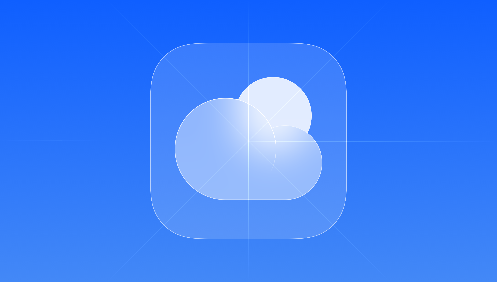
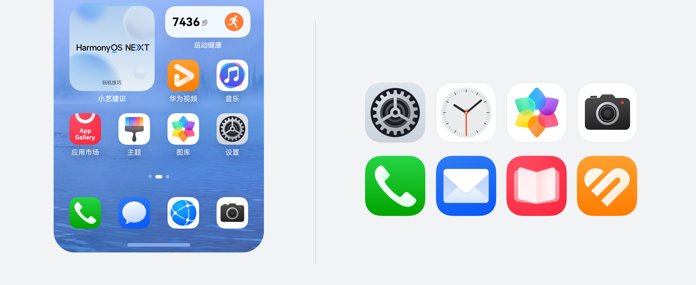
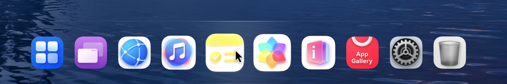
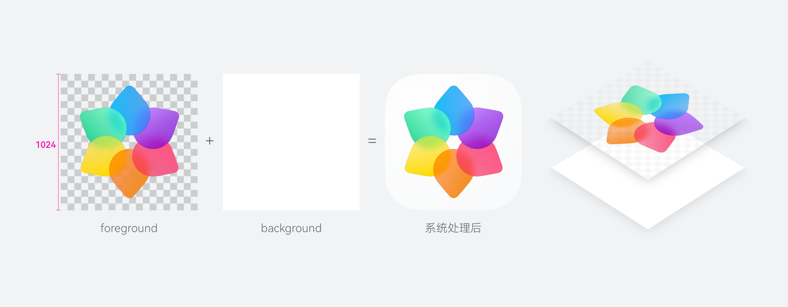

# 应用图标

更新时间：2026-07-28 03:54:30

来源：https://developer.huawei.com/consumer/cn/doc/design-guides/application-icon-0000001953444009

应用图标设计的核心是简洁、高效和品牌识别度。一个好的图标可以准确传达应用相关信息，也可以帮助用户快速定位你的应用。HarmonyOS图标设计旨在回归本源，通过现代化的语义表达，准确传达功能、服务和品牌。视觉上兼顾美观性和识别性；形式上兼收并蓄，和而不同。如果你需要一些图标设计的帮助，我们提供了相关的设计模板资源，请参阅[设计模板和资源](#section152211481332)。

#### 概述

HarmonyOS 应用图标遵循以下设计原则：

|  |  |  |
| 简洁优雅 元素图标简洁，线条表现优雅，传递设计美学。 | 极速达意 图标图形准确传达其功能、服务和品牌。具有易读性和识别性。 | 细腻质感 图标材质以光影塑造体积感与层次感，创造炫彩透光的细腻质感。 |

#### 图形网格

应用图标的图形元素占据了更大的比例，图标整体更饱满，元素图形分布需注意视觉均衡，使其体量感保持一致，伙伴可参考标准网格布局进行图标设计，可满足图标体量的一致性。保持主要内容居中，避免其在系统调整圆角或应用遮罩时被截断。

网格布局主要作用为体量参考，部分图标可根据图形体量感突破网格界限。

#### 色彩规则

对人眼来说，至上而下的照明描绘的物体看起来最为自然。图标底板光源保持至上而下，颜色上浅下深，渐变色应保持在合理范围内，不应出现对比强烈的颜色渐变。为了创造更细腻、富有体积感的质感，对背景色板增加光感勾边。

不同色彩承载着不同的视觉语义，能够传达应用的功能属性、内容特征与品牌调性。为更准确地建立色彩联想和表达，系统提供了 9 种推荐色彩方向作为参考，可根据应用定位和功能场景进行合理选择，以增强图标的识别度和系统整体的视觉活力。

为保证系统视觉一致性，渐变色应采用统一的渐变方向，不宜使用斜向渐变、上深下浅等与系统规范不符的渐变方式。渐变两端色值应保持适度变化，以增强层次感和空间感；色值差异不宜过大，避免产生突兀的视觉效果。

| Don't |

#### 多设备图标适配

#### 手机、折叠屏、平板

作为最具代表性的使用场景，泛手机端的图标应捕捉应用最核心的品牌故事，使用简洁的视觉语言为其一系列的衍生设计以及多设备表现打下基础。图标应包含清晰可辨的前后景、细腻的质感，并避免过于复杂的图层堆叠。在典型的桌面场景中，建议巧用应用主题色，提炼高辨识度的前景图像以最大化品牌视觉在较小屏幕上的可触达性。

#### 电脑

为便于更好地与电脑视觉语言作融合，应用图标应作为其扁平设计在更真实物理环境中的投射。结合动效打造更丰富的首眼体验，使用更具空间感来打造具有微妙差异的首眼感知。当鼠标滑入 dock 栏图标，系统在鼠标对角线位置生成图标前景下的图层动态阴影，突出多层级的空间体验与动态变化。

#### 智慧屏

借用屏幕尺寸上的优势，强调细腻材质的图标通过其柔和的光影效果和鲜亮的色彩，映照在深色的沉浸式场景中，渲染观影氛围感。分层后的应用图标在智慧屏 launcher 上适配动效，使每一次光标的移动都伴随精妙的光学协奏，将简单的功能选择升级成沉浸式的体验。

#### 图标应用场景

系统图标会应用于多个使用场景，其中桌面为核心展示场景。此外，图标还会出现在通知中心、侧边栏、设置等界面。由于各场景的展示尺寸和视觉环境存在差异，图标需考虑不同场景的适配，以确保视觉一致性和良好的识别度。

#### 图标资源规范

为保证图标在系统内显示的一致性，应用预置的图标资源应满足以下要素：

 - 图标资源必须为分层资源
 - 图标资源尺寸必须为1024*1024px
 - **图标资源必须为正方形图像**，无需圆角，系统会为对应场景自动生成遮罩裁切
 - 图标资源使用PNG格式
 - 应用图标的背景图不允许含有透明像素

| Do | Don't |
| 上传尺寸为1024*1024px的正方形分层资源，分为前景与背景两层 | 未正确分层，背景含有透明像素（包含圆角裁切或带有透明内边距的情况） |

为保证图标显示效果，建议在图标上传前进行检查：

 - 图标资源使用正确压缩方式，避免如使用尺寸过小图标直接放大导致模糊等情况
 - 图标前景元素不宜过于靠近背景四角，以免被圆角裁切
 - 为保证效果准确性，建议在图标上架前进行测试

#### 多平台图标资源规格

| 平台 | 资源分层 | 资源形状 | 资源尺寸 | 资源格式 | 典型使用场景 |
| --- | --- | --- | --- | --- | --- |
| 手机、折叠屏、平板 | 双层 | 正方形 | 1024*1024px | PNG | 桌面，启动页等 |
| 电脑 | 双层 | 正方形 | 1024*1024px | PNG | 桌面，启动页，应用中心等 |
| 智慧屏 | 双层 | 正方形 | 1024*1024px | PNG | Launcher，应用中心等 |

智能穿戴图标规格参考智能穿戴设计指南。

请在Hap包中正确预置图标资源，否则将无法通过上架检查。

#### 设计模板和资源

请根据需要选择以下格式的设计模板和资源。

[HarmonyOS AppIcon Design](https://alliance-communityfile-drcn.dbankcdn.com/FileServer/getFile/cmtyManage/011/111/111/0000000000011111111.20250923104446.99069930286504364917048884543987:50001231000000:2800:C0D02F6FA8FC2E0695B7317DDEE58757A326884B61519C19B6E0A59AED8296E0.zip?needInitFileName=true)（.zip）
