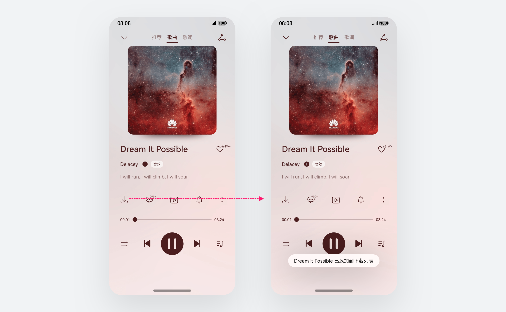
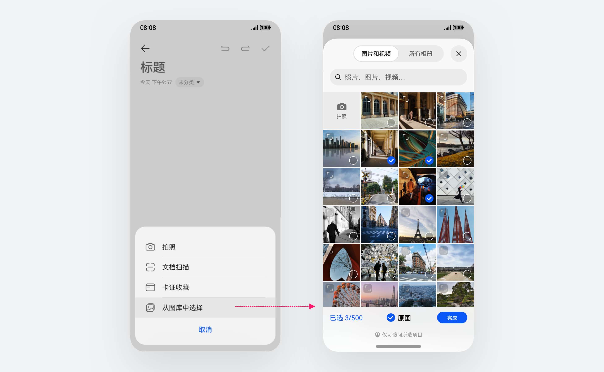
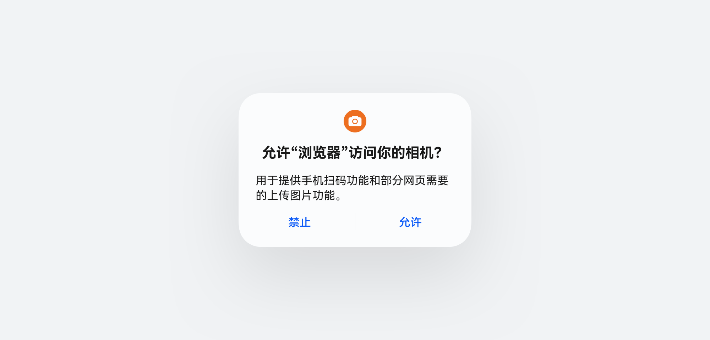

# 隐私

更新时间：

来源：https://developer.huawei.com/consumer/cn/doc/design-guides/privacy-0000001929972682

| 隐私是用户的基本权利，我们非常珍视。基于国标《个人信息安全标准》、欧盟 《一般数据保护法》（简称GDPR）等标准和法规，我们梳理了用户隐私保护设计指南，希望开发者能与我们一起，用心守护用户的隐私安全，为用户打造放心省心的智能产品使用体验。建议开发者在产品设计阶段就开始考虑隐私保护，并在产品开发过程中始终遵守隐私保护设计规范，保证应用的隐私合规和数据安全。HarmonyOS 应用上架应用市场时，应用市场会根据隐私保护规则进行校验，如不满足条件则无法上架。 |  |
 
 

#### 用户授权

应用获取数据时需满足数据最小化和透明可控原则，只有在触发对应场景时申请用户数据，用户可自由授予或禁止、撤销授权。
 
为了更好地保护用户隐私、规范并简化用户对数据的管控方式，我们提炼了常需用户管控的数据。应用向用户申请常见数据时，系统统一提供申请方式及可在“设置”>“隐私和安全”中管理的能力。其中位置信息、相机、麦克风、图片与视频、通讯录为高敏感用户数据。
 

 
**应用可通过以下方式向用户申请授权**
 
控件授权：应用通过系统控件临时获取用户数据，包含按钮式和选择器两种形式，无需弹框授权
 
弹框授权：应用通过弹框向用户申请授权
 
 

#### 按钮式授权控件

按钮式授权控件是系统预置的临时授权能力，无需弹框授权，可通过用户主动触发临时获取用户数据。应用开发者仅需要像使用 Button 等组件那样集成到应用自己的页面即可。有关开发指南，请参阅 [按钮式控件开发指导](https://developer.huawei.com/consumer/cn/doc/harmonyos-guides/security-component-overview)
 

 
 

#### 选择式授权控件

选择式授权控件是系统预置的临时数据选择能力。应用可通过这类控件临时获取图库、文件、相机、联系人等用户数据，无需弹框授权。有关开发指南，请参阅 [选择器控件开发指导](https://developer.huawei.com/consumer/cn/doc/harmonyos-guides/system-app-startup)
 

 
 

 

#### 弹框授权

适用于需长期或后台获取用户数据的场景，业务可基于最小化授权的原则申请合适的授权范围。需注意不允许为获取用户隐私数据而多申请权限，不建议出现两个以上的连续弹框，用户未使用对应的业务功能前，不允许提前申请权限，避免对用户造成严重干扰。
 

 
 

#### 权限使用说明

业务需提供权限使用说明，用于统一展示在用户授权弹出框及应用权限详情页中，以便用户了解权限使用场景。
 

 
用语衡量标准
  
| 清晰、准确 | 简洁、易懂 |
| --- | --- |
| 着重于权限允许访问后的详细功能描述 | 描述文本不要出现技术化、专业术语。避免从开发者角度书写。 |
| 对于功能的描述尽量准确、具体 | 功能较多，复杂功能的应用，选择描述重点功能，不需要描述全部 |
 
 
撰写要求
 
尽量保持描述简洁，着重描述获取数据的用途而不是获取数据的内容，不要出现不必要的分割符号，以便翻译。
  
| 正例 | 反例 |
| --- | --- |
| 用于扫码拍照和添加好友 | 用于使用摄像头 |
| 用于提供手机扫码和部分网页需要的上传图片功能 | 用于提供拍摄输入服务 |
| 用于使用户外运动、穿戴设备天气推送、家庭空间成员内位置查看等 | 用于获取您的位置信息 |
 
 
有关开发指南，请参阅 [应用权限使用理由开发指导](https://developer.huawei.com/consumer/cn/doc/harmonyos-guides/declare-permissions#权限使用理由的文案内容规范)
 
 

#### 用户不同意授权

授权被禁用后，用户再次点击业务触发需要授权的场景时可引导用户主动前往设置。
 
不允许用户“禁止”授权后出现应用闪退、强制退出界面等问题；不允许点击“禁止”后重复弹框引导授权。
 
建议用户再次触发授权场景时，提供开启引导。
