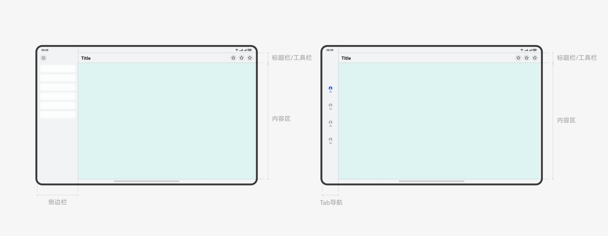
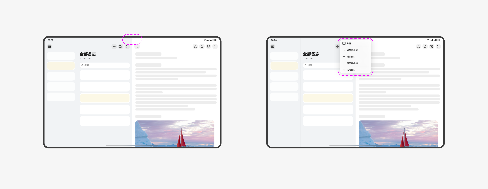
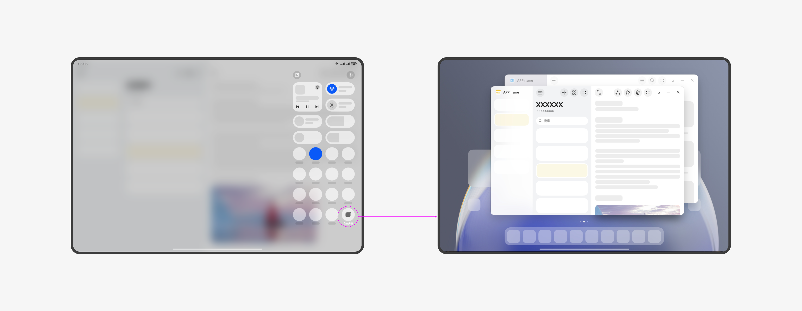
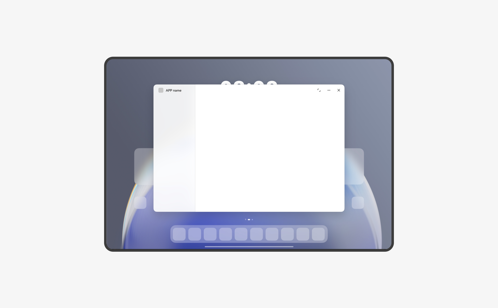
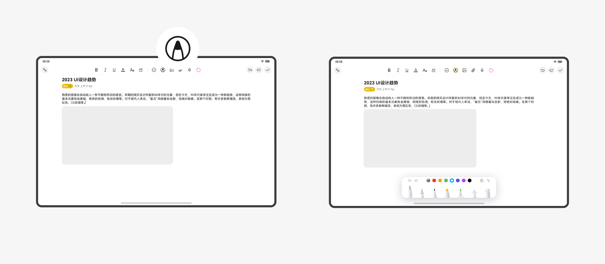
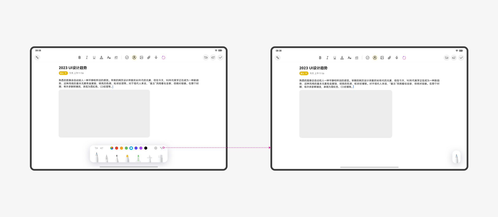

# 平板

更新时间：2025-09-19 03:46:23

来源：https://developer.huawei.com/consumer/cn/doc/design-guides/pad-0000001823654157

平板是很多用户经常使用的设备，用户使用平板来影音娱乐，阅读学习以及办公创作，系统和应用的体验对用户至关重要。

如果要设计出优秀的平板应用或服务，需要熟悉并充分利用平板的设备特性，这些特性包括硬件特征、使用方式、交互方式、使用场景等。

| 硬件特性 | 屏幕：中等分辨率的大屏幕。         摄像头：一般配备较好的后置和前置摄像头。         音频：较好的音频输入输出能力。         生物认证识别：一般配备指纹、人脸等。         地理位置：可通过 GPS 等获取设备所在的地理位置。         其他：陀螺仪、加速计等，可获得设备运动状态的信息。 |
| --- | --- |
| 使用方式 | 由于平板尺寸较大，通常需要双手操作，基本操作方式包括以下几种：                   一手握持，另一手点击操作或双手持握。          平放或支架放置，点击操作。          接入键鼠，键鼠操作。          接入手写笔，使用手写笔操作。 |
| 使用场景 | 大屏的平板的使用场景非常广泛，几乎可以胜任任何场景和任务，其中包含：                   影音娱乐，可以花几个小时观看视频，听音乐，提供更加沉浸式的体验和更好的视觉效果。          阅读学习，也可以花多个小时上网课学习和书籍般的阅读体验。          办公创作，接入键鼠，开启多窗，可以随时随地轻办公，还可以打开笔记，用手写笔记录日常生活细节或创意灵感。 |

## 应用和服务设计

在设计平板应用和服务时，请考虑以下方法，这将帮助您提供优秀的用户体验。

### 保证基础体验

在应用/服务设计中需要遵守一些基础体验要求，如果不满足这些基础要求，则会极大损害用户的使用体验。例如，如果界面元素的响应热区太小会导致用户很难操作成功，从而无法完成要操作的任务。具体要求请参阅应用 UX 体验标准。

### 设计应用和服务体验

- **使用系统控件：**利用系统提供的底部页签、标题栏、弹出框等标准控件，在保证良好基础体验的同时，减少设计和开发的工作量。必要时自定义控件的样式和大小以体现自己的品牌特征。
- **使用合适的应用架构：**根据业务的特点采用合适的架构。例如，内容类应用通常采用侧边页签的应用架构，以达到快速在不同类别的内容间切换的作用；效率类应用通常采用二分栏以及三分栏的应用架构，以达到快速高效浏览的作用。
- **考虑更多内容合理布局：**考虑充分利用平板屏幕大尺寸的优势，利用响应式布局方法优化界面结构，同时展示更多内容。关于响应式布局方法，请参阅[布局](https://developer.huawei.com/consumer/cn/doc/design-guides/design-layout-0000001748539680)。
- **考虑横竖屏和挖孔显示：**用户可能横屏或竖屏使用平板，除特殊类型外，应用/服务应该同时支持横屏和竖屏显示，以保证页面正常显示，不影响用户的使用。同时，也需要针对挖孔位置合理显示界面内容。
- **考虑多任务交互：**利用大屏幕的优势来同时完成多种任务，并且结合上下文来聚焦当前任务，提高生产力效率。
- **支持更多交互方式：**在合适的场景下，平板可以连接一些配件来提升交互的效率，带来更好的体验。例如：手写笔、键盘、鼠标。

- 触控板等设备，在设计中需要增加对这些配件的交互设计支持。关于平板支持的交互方式，请参阅[人机交互](#section10191109163614)。

### 支持系统特性

- **充分利用系统特性：** HarmonyOS 提供了一些系统特性，用户能够通过这些系统特性获得良好的系统体验，其中部分系统特性是开放的，应用/服务可以根据业务属性接入这些系统特性，以获得更多触达用户的机会。例如，媒体播放应用/服务可以通过实况窗来传递状态信息。关于平板提供的系统体验，请参阅[系统特性](#section17357953173513)。
- **遵循系统特性的体验要求：**在接入系统特性时，应用/服务要遵循系统特性的体验要求。例如，在接入实况窗时需要按照模板来设计实况窗的布局和信息，以保证用户使用实况窗特性的良好体验。部分系统特性是为了满足了用户对系统整体的某项诉求，应用也应当遵循系统特性的规则进行接入。例如，当用户切换至深色模式时，希望系统中的所有应用都能进行切换，应用应该跟随系统的设置，实时切换至深色显示。例如分屏或者分栏时，应用应支持响应式布局拉伸。

## 应用架构

当平板尺寸从小尺寸到大尺寸，越来越丰富，设计需要思考横屏的高效利用和横竖屏灵活的切换，且需兼顾大屏优势与多任务操作需求。

### 窗口布局

一般应用布局包含侧边栏、内容区，标题栏和工具栏，大屏设备一般建议工具栏的操作放在顶部显示。

### 窗口切换

平板需同时兼顾单窗全屏和多窗切换的使用操作，满足沉浸式娱乐和多任务并行的使用场景。我们将在窗口顶部增加窗口快捷按钮，方便单窗和多窗之间的切换。

应用需支持比例调整，方便切换至悬浮或者分屏等形态。

### 自由多窗

全新自由多窗功能，支持窗口自由比例调节和自由叠放，搭配华为智能磁吸键盘，可提供 PC 级多窗口交互体验。切换至自由多窗模式，可以一边编辑文档，一边接入会议，高效处理多任务工作场景，提升生产力。

应用需考虑窗口支持窗口化以及窗口比例调整显示。

对于窗口顶部标题栏，我们将提供两个样式，推荐使用样式一，窗口三键和工具栏合一显示，具体规则可参考电脑窗口框架。

## 手写笔

手写笔作为平板的最佳搭档，遵循直觉化、及时反馈、兼容性三大原则，以确保手写笔在不同场景下都能提供一致、直觉、高效的用户体验，使手写笔成为提升生产力的第一配件。

### 设计原则

- **符合直觉**** ****：**遵循现实世界的书写、绘画、标注习惯，让用户能够自然地使用手写笔，不需要复杂学习成本。
- **兼容性：**适配不同应用场景 (如绘图、文本输入、窗口管理) ，允许手写笔与触控、鼠标、键盘混合使用，互不冲突。
- **反馈及时：**低延迟，确保书写流畅，避免滞后感。提供视觉、触觉、音效反馈，让用户明确操作结果。

### 应用基本操作适配

在适配手写笔时，应用需考虑同时支持手写笔的操作，例如点击、长按、滑动和拖拽等基础手势操作。

### 手写类应用适配

有手写类诉求的应用可调取系统手写能力，例如编辑类应用 (如文档编辑、笔记应用等，支持手写笔输入、标注、批注等功能) ，涂鸦类应用 (如绘图、设计软件，提供丰富的笔刷、颜色和图层管理功能) 。

应用可通过统一的图标入口调起手写笔的工具面板，同时手写笔也支持悬浮收起。

## 系统特性

- [导航条](https://developer.huawei.com/consumer/cn/doc/design-guides/navigation-0000001957075737)
- [通知](https://developer.huawei.com/consumer/cn/doc/design-guides/system-features-notification-0000001793074217)
- [实况窗](https://developer.huawei.com/consumer/cn/doc/design-guides/system-features-live-view-0000001955186861)
- [多窗口交互](https://developer.huawei.com/consumer/cn/doc/design-guides/system-features-multi-window-interaction-0000001795392917)
- [画中画](https://developer.huawei.com/consumer/cn/doc/design-guides/pip-0000001927422624)
- [深色模式](https://developer.huawei.com/consumer/cn/doc/design-guides/dark-mode-0000001823255497)
- [状态栏](https://developer.huawei.com/consumer/cn/doc/design-guides/status-bar-0000001776775568)
- [播控中心](https://developer.huawei.com/consumer/cn/doc/design-guides/broadcasting-control-0000001957017133)

## 人机交互

- [触屏手势](https://developer.huawei.com/consumer/cn/doc/design-guides/hmi-touchscreen-0000001928273206)
- [键盘](https://developer.huawei.com/consumer/cn/doc/design-guides/hmi-keyboard-0000001928070488)
- [鼠标](https://developer.huawei.com/consumer/cn/doc/design-guides/hmi-mouse-0000001930021626)
