# 三折叠

更新时间：

来源：https://developer.huawei.com/consumer/cn/doc/design-guides/trifold-0000002352915021

##### 概览

 
三折叠手机是一种具有特殊形态的终端设备，支持单屏态、双屏态、三屏态等多种形态，适应不同应用场景，打破终端场景边界，实现一机多能。三折叠手机具备更大的屏幕尺寸和更灵活的形态，给用户带来更极致、高效的使用体验。
 

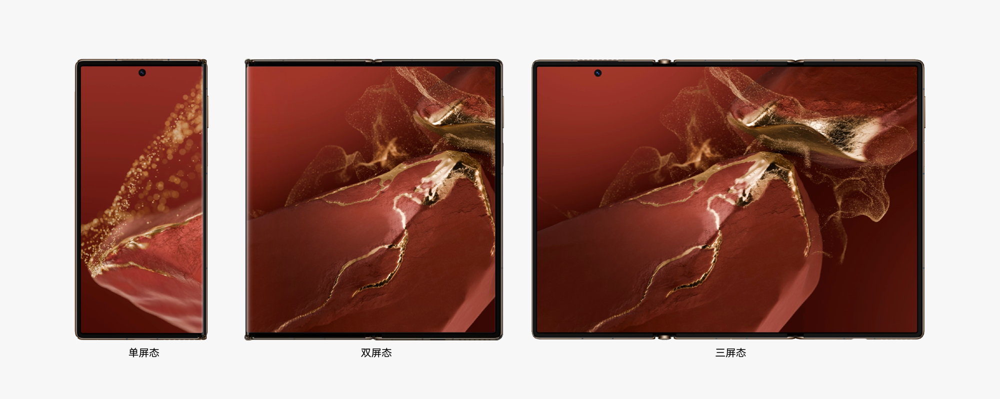

 

##### 基础要求

 

##### 横竖屏适配

三折叠手机在三屏态下的横竖屏比例存在差异，为了确保流畅的使用体验，建议应用适配横屏和竖屏布局，实现不同屏幕方向间的无缝接续。适配过程中，应注意避免应用界面撑不满屏幕、强制竖屏、留白、页面元素比例失调等情况的出现。
 

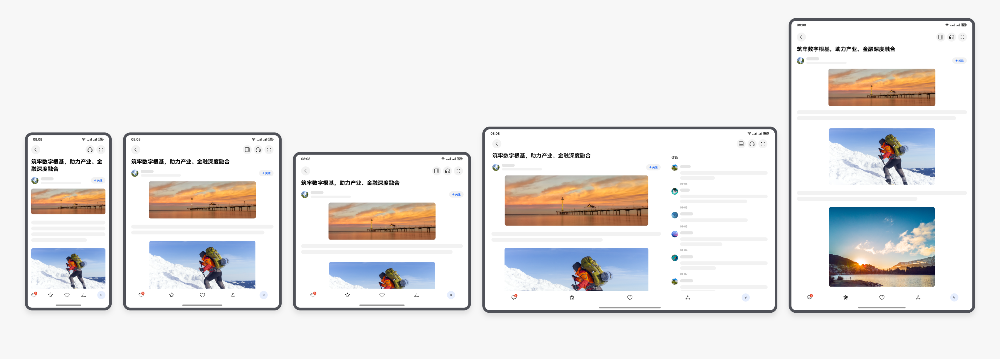

 

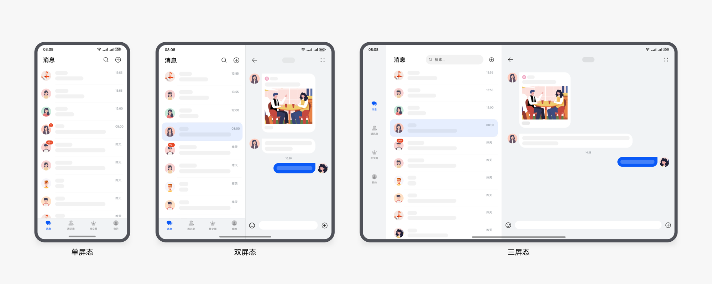

 
推荐：不同形态横竖屏的响应式布局
 

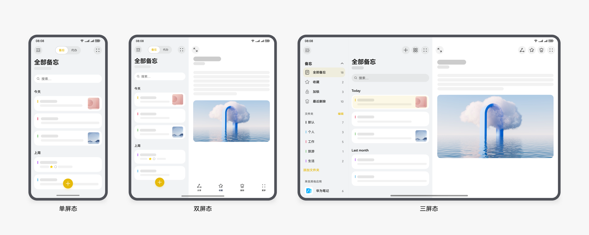

 

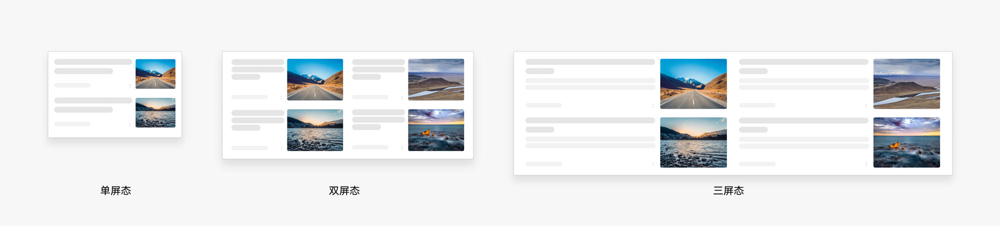

 
不推荐
 
 

##### 交互跟手

**跟手弹框**
 
为了减少用户操作路径过长的情况，在双屏态和三屏态可通过跟手弹窗进行展示，弹出框的弹出位置离手更近，以便用户能够快速操作。跟手弹框详细规格，请参阅[弹出框比例与界面布局](https://developer.huawei.com/consumer/cn/doc/design-guides/dialog-0000001957012569#section5639104752013)。
 

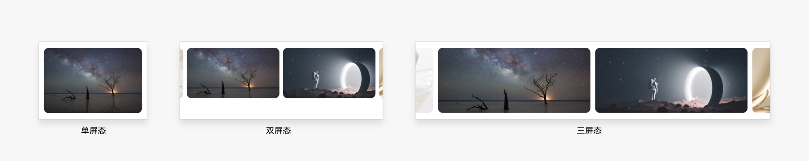

 
**跟手半模态**
 
在单屏态，半模态窗口通常从屏幕底部弹出；在双屏态，建议窗口居中显示；而在三屏态，可以考虑跟手半模态窗口或者居中半模态窗口显示，具体根据业务需要选择。
 
跟手半模态详细规格，请参阅[半模态比例与显示布局](https://developer.huawei.com/consumer/cn/doc/design-guides/bindsheet-0000001956852753)。
 

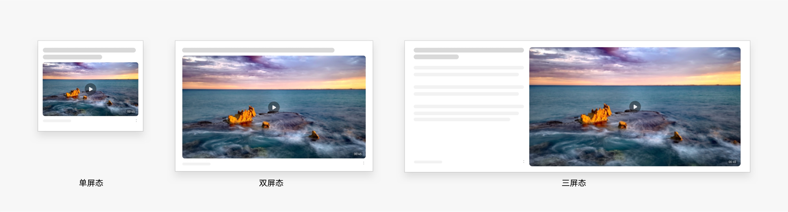

 
 

##### 开合接续

在单屏态、双屏态和三屏态切换时，应确保页面不发生跳转，焦点不发生偏移。
 
 

##### 页面不跳转

在三折叠设备折叠开合过程中，需要保证当前任务的连续性。不应出现页面跳转、操作步骤增加，操作更复杂等体验下降的情况，同时确保任务状态的保存和快速恢复。
 

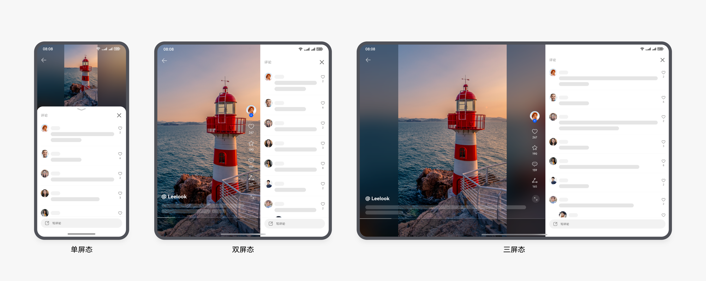

 
 

##### 焦点不偏移

确保用户当前浏览内容、图片等焦点区域保持视觉稳定，焦点不发生偏移。
 

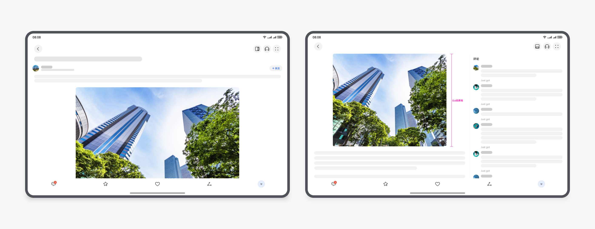

 
 

##### 应用架构

 

##### 导航栏

为提高大屏幕状态下设备的交互易用性，建议在三屏态横屏使用侧边Tab，将底部Tab结合挪移布局的方法，挪移到左侧。侧边tab的导航选项继承底部 Tab ，适用于导航结构简单的内容型应用。
 

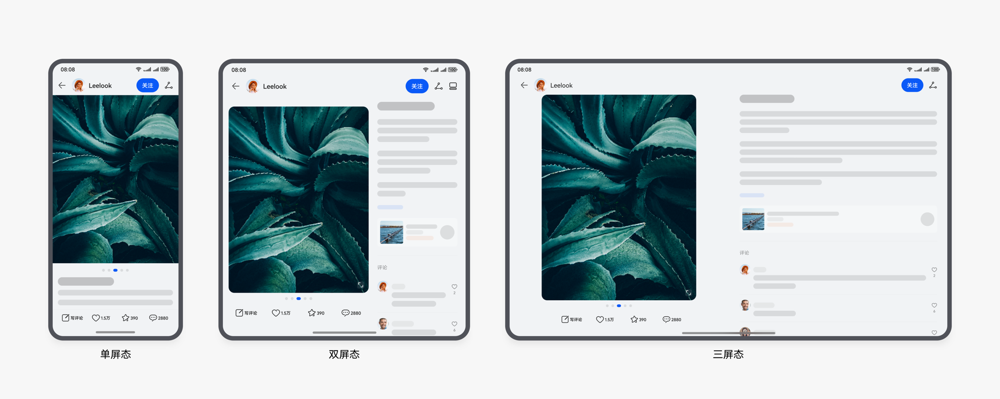

 
 

##### 两分栏

分栏布局可以帮助用户在宽屏设备上更高效地处理任务。三折叠设备分栏布局在折叠展开过程中保持分栏样式，分栏后两侧窗口分别基于栅格进行窗口内的布局。三屏态屏幕较宽，建议统一按照屏幕宽度减掉侧边导航后再计算内容区域的宽度。详情请参阅[分栏规范](https://developer.huawei.com/consumer/cn/doc/design-guides/design-responsive-layout-structure-0000001748539684#section194871434192212)。
 

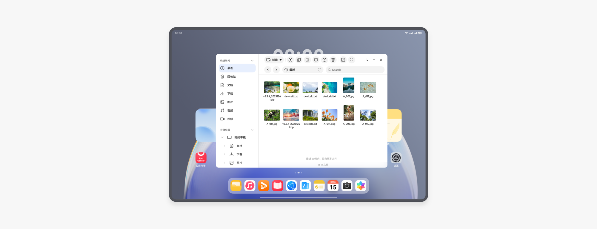

 

 
 

##### 三分栏

三屏态下可支持三分栏布局，原来父子关系的层级页面可拆分后平行显示，使侧边导航抽屉完全展开，充分利用屏幕空间。在双屏态和单屏态下，导航抽屉收起至导航按钮，点击后展开为悬浮导航面板。详情请参阅[响应式应用架构](https://developer.huawei.com/consumer/cn/doc/design-guides/design-responsive-layout-structure-0000001748539684)。
 

 
 

##### 响应式布局

 

##### 重复布局

为避免结构过于单调且信息量过少，可通过重复布局来改善页面的浏览舒适度和使用效率。
 

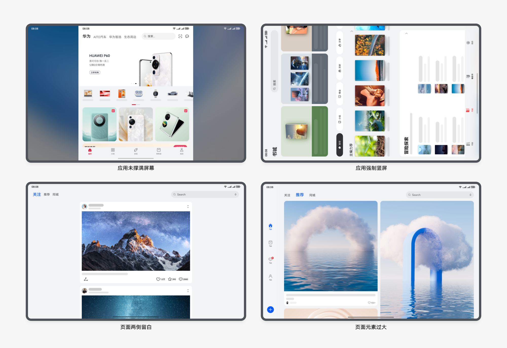

 
 

##### 延伸布局

在宽屏设备上可以使用延伸布局，同时结合设备的物理尺寸适当进行形变、自适应裁剪，确保更好的显示效果。
 

 
 

##### 挪移布局

为利用屏幕宽度优势，避免在宽屏设备上内容仅横向延伸过于单调，在宽屏设备上可使用挪移布局，将上下结构变为左右结构。
 

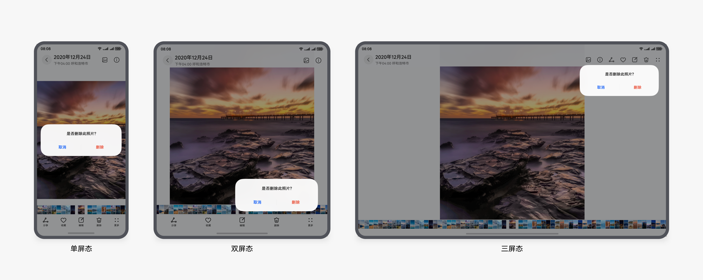

 
详情请参阅[响应式布局方法](https://developer.huawei.com/consumer/cn/doc/design-guides/design-responsive-layout-method-0000001795698449)。
 
 

##### 价值场景

 

##### 边看边评

为了更有效地利用三折叠屏幕空间，在带有评论的页面场景中，我们建议在双屏态和三屏态下将评论区挪移到右侧，以实现边浏览观看边评论的效果。这种布局适用于影音娱乐、新闻阅读和图文笔记等场景。
 
**影音娱乐类**
 
观看短视频时，在单屏态下，评论区从屏幕底部弹出；而在双屏态和三屏态下，建议将评论区从右侧展开，以实现边观看边评论的效果，从而不影响视频观看体验，提高用户体验。
 

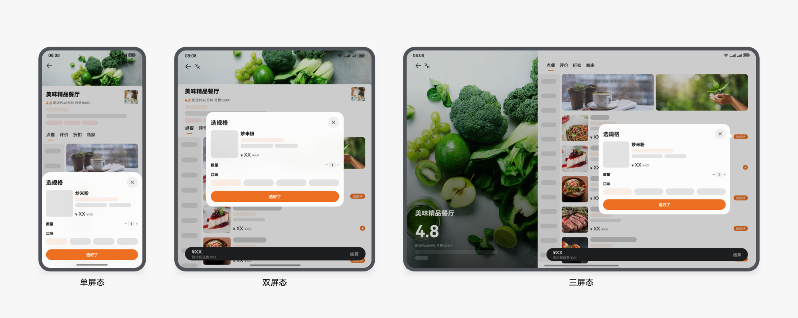

 
**新闻阅读类**
 
当用户阅读新闻详情时，为确保沉浸式阅读体验，默认全屏图文显示。同时允许用户手动切换布局，将评论区挪移到右侧，实现边看边评的效果。详情请参阅[应用设计最佳实践-新闻阅读类](https://developer.huawei.com/consumer/cn/doc/design-guides/responsive-design-examples4-0000001746657290)。
 

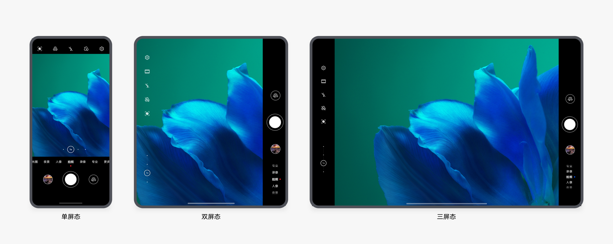

 
**图文笔记**
 
在阅读笔记详情时，随着屏幕变宽，在双屏态和三屏态建议采用挪移布局：将文字挪移到图片右侧，以实现左图右文的图文对照效果。在双屏态中，我们建议按照6:4的图文区域宽度比例进行布局；而在三屏态中，建议该比例为1:1。
 
 

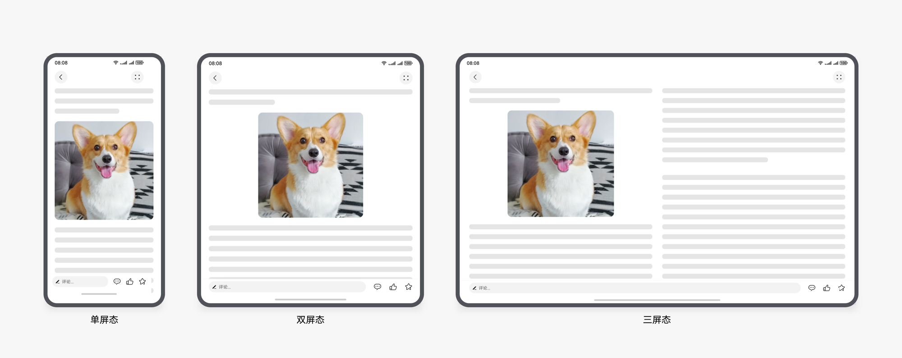

 

##### 增值体验

**自由多窗**
 
三折叠设备在三屏态时可开启自由多窗模式，支持同时开启多个应用窗口，允许用户自由调整尺寸、位置及堆叠层级，实现高效的多任务操作。应用窗口可在最小档位与全屏之间无极调节。详情请参阅[平板自由窗口](https://developer.huawei.com/consumer/cn/doc/design-guides/pad-0000001823654157#section1768267204717)。
 

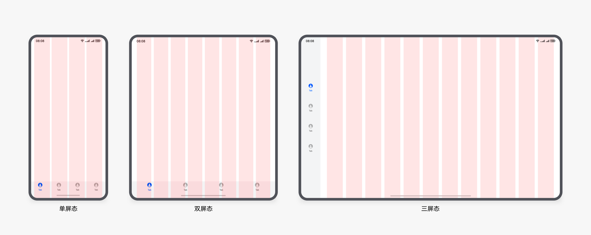
