# 双折叠

更新时间：

来源：https://developer.huawei.com/consumer/cn/doc/design-guides/foldable-0000002352875141

#### 概述

| 折叠屏设备的三种形态分别为折叠态、展开态和悬停态。 折叠态便于随身携带和单手操作，适合移动场景下的便捷使用；展开态屏幕变宽，能够充分展示应用内容，适合多任务处理和沉浸式体验；悬停态则处于完全展开和折叠的中间状态，设备可稳定放置，让用户解放双手。 |

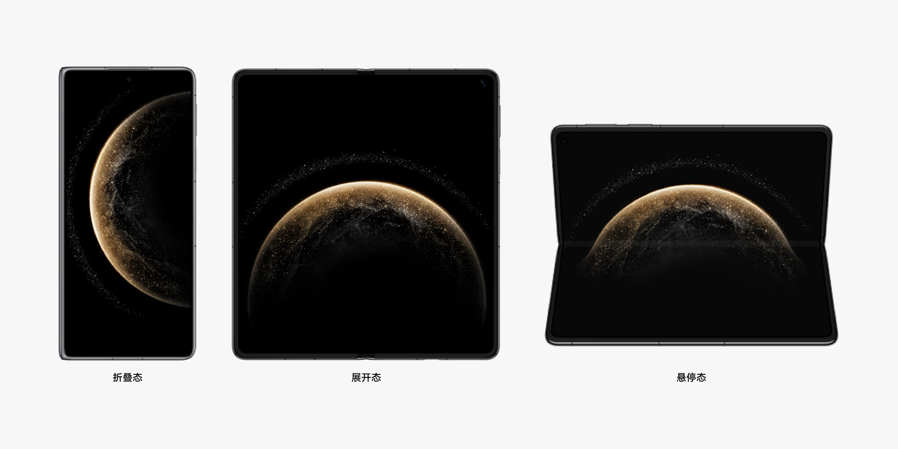

#### 基础要求

为了保证以上体验，需要满足以下基础体验要求：

#### 信息完整

 - 图片、视频等视觉元素不应发生变形、裁剪、显示不全等信息缺失。
 - 一般情况下，展开态不应出现页面内的内容元素数量减少，或图形化元素模糊、分辨率下降或视觉体量减小等损失，确保展开态的内容元素不少于折叠态内容元素信息量的3/4。

| 推荐 | 不推荐（图片过大导致一屏信息显示过少） |
| 推荐 | 不推荐（内容放大导致一屏信息显示过少） |

#### 交互跟手

折叠屏展开态屏幕尺寸较大，弹出框上的操作按钮不易触达。建议针对折叠屏展开态、平板等大尺寸的设备，提供跟手的弹出框。

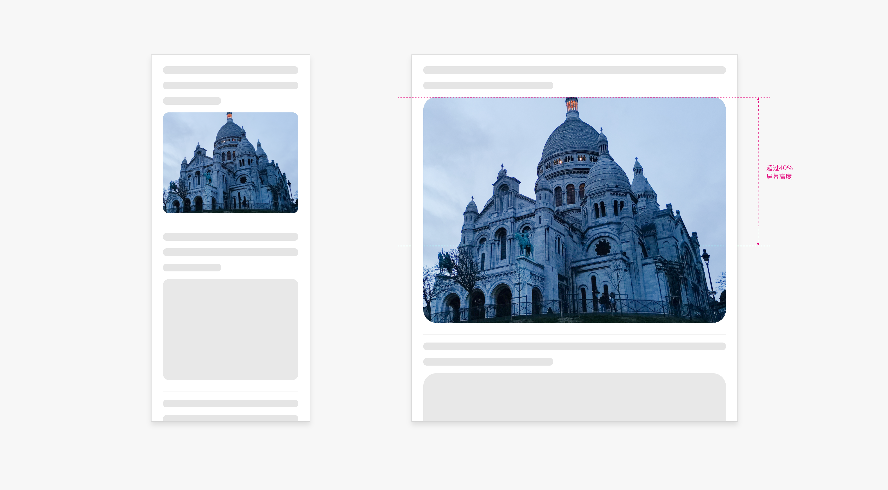

#### 横屏适配

折叠屏在展开态下的屏幕显示比例接近正方形，基于此特征，应用设计和开发时需要做如下考虑：

 - 支持展开态横屏显示。
 - 展开态横竖屏布局一致。除部分特殊界面外，建议应用在横屏和竖屏下保持一样的布局。
 - 横竖屏旋转时，需要适配摄像头的挖孔区域，重要信息需要避开挖孔区显示。

#### 挖孔适配

在设计界面布局时，应确保其适应摄像头挖孔区域，以确保重要信息不会在挖孔区域内显示。

当设备处于竖向显示时，状态栏应避让挖孔区域；而在设备横向显示时，建议整列避让挖孔，对于一些固定且不会对内容产生影响的元素，如底部的标签栏，可以不进行避让。

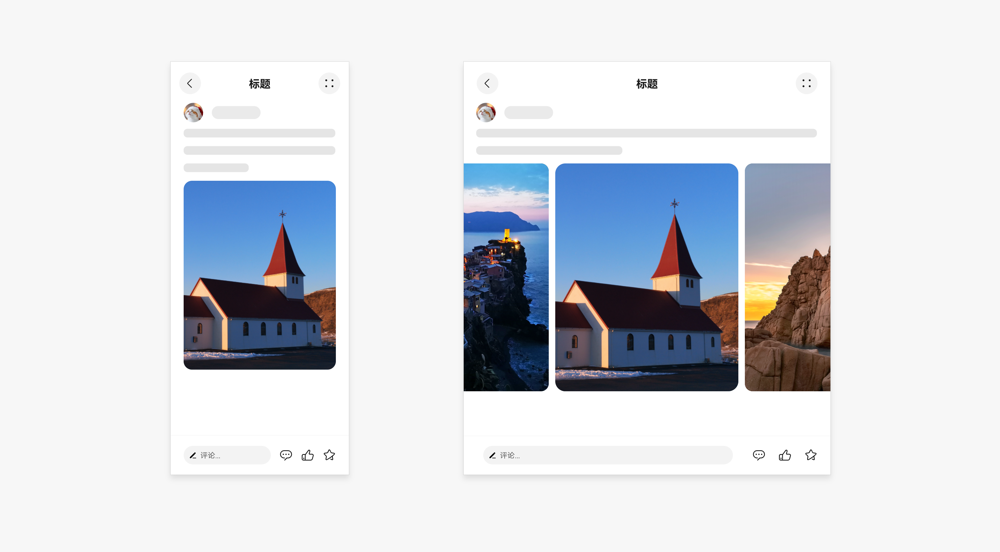

#### 文字适配

在折叠屏设备的展开态，图标和字体大小应保持与折叠态一致，以确保良好的可读性和用户体验。若确需调整，建议控制在1.2倍以内。单屏文本长度建议控制在36字左右，最长不超过40字。

| 推荐 | 不推荐（字体过大导致一屏幕显示的信息太少） |

#### 图标适配

展开态图标大小不应发生明显变化，建议保持跟折叠态一样的大小。若一定要发生大小变化，则最大不要超过1.2倍。

折叠屏展开态入口图标显示主要有相对拉伸、挪移布局、延伸布局、相对拉伸&挪移布局四种方式。

(1) 相对拉伸：折叠屏展开后，入口图标数量不变、大小不变、布局不变，图标间距均匀变宽。但需要避免图标左右边距过大或图标之间间距过大。

| 推荐（图标相对拉伸） |

(2) 挪移布局：折叠屏展开后，图标使用挪移布局，入口图标3行变2行，横向平铺。

| 推荐（图标挪移布局且适当调整间距） |

(3) 延伸布局：折叠屏展开后，图标使用延伸布局，一屏内显示更多图标数量，用户可以横滑显示更多。

| 推荐（图标延伸布局且适当调整间距） |

(4) 相对拉伸&挪移布局：折叠态图标数量固定时，折叠屏展开后图标间距相对拉伸，大小不变，建议文字部分进行挪移布局，图标在左，文字在右，以避免图标信息过疏。

| 推荐（图标相对拉伸&挪移布局） |

(5) 以下3种为图标适配中常见的显示效果不佳的案例。

| 不推荐（左右边距过大） |

| 不推荐（信息过密） |

| 不推荐（图标过大） |

#### 组件适配

#### 列表

(1) 相对拉伸：折叠屏展开后，控件元素大小不变，列表横向拉伸。

| 推荐（列表内容相对拉伸） |

(2) 重复布局：折叠屏展开后，控件元素大小不变，内容从单列变为双列。

| 推荐（列表重复布局，单列变双列） |

| 不推荐（边距过大） |

#### 组合控件

**顶部搜索框+子页签/其他控件**

(1) 相对拉伸：折叠屏展开后，按钮、图标等元素大小不变，间距横向均匀变宽。

| 推荐（相对拉伸） |

(2) 延伸布局：折叠屏展开后，控件元素的大小不变，间距均匀变宽，可显示的页签数量增多。

| 推荐（延伸布局） |

(3) 挪移布局：折叠屏展开后，由于横向空间明显增加，组合控件内的元素由原来上下排布的两行变为左右排布的一行。变为一行后，可根据优先级对内容进行先后排序。

| 推荐（挪移布局） |

| 不推荐（内容过大） |

#### 底部工具栏

延伸布局+相对拉伸：在折叠屏展开后，通过相对拉伸让图标间距均匀变宽，同时通过延伸布局来显示更多工具按钮。二级工具栏，同样适用于以上规则。

| 推荐（延伸布局&相对拉伸） |

| 推荐（一级和二级工具栏同时延伸布局且相对拉伸） |

| 不推荐（信息过密） |

#### 运营类图片/视频/卡片

运营类的图片/视频等，通常有卡片和沉浸式两种样式。

展开态的图片/视频/卡片应适应页面的宽度、间距、列数等因素进行适配显示，不能造成信息量的明显减少或信息密度过大。

**居中的运营类图片/视频/卡片**

 - 折叠态显示单张居中的卡片，折叠屏展开后，可横向延伸显示两张或三张运营卡片。

| 推荐（展开态显示两张运营卡片） |

| 推荐（展开态显示四张运营卡片） |

| 推荐（展开态显示三张运营卡片） |

| 推荐（展开态显示三张运营卡片的创新样式） |

| 不推荐（展开态运营卡片等比放大，且超过1/2屏幕高度） |

**首页的沉浸式运营类图片/视频/卡片**

应用首页的沉浸式的图片/视频/卡片在展开态显示过大，是折叠屏适配中较为常见的问题。

（1）针对有多张沉浸广告图的，展开后，横向平铺显示多张广告图。

| 推荐（一排平铺显示多张沉浸式广告图） |

（2）针对只有单张沉浸广告图的，宽高比大于2∶1的沉浸式广告，折叠屏展开后，整体内容等比放大。

| 推荐（宽高比大于2∶1且只有单张沉浸式广告图，展开态等比放大广告图，确保不超过屏幕的1/2高度） |

（3）针对只有单张沉浸广告图的，宽高比小于2∶1的沉浸式广告，建议将背景图和广告内容元素分层。折叠屏展开后，背景图等比放大的同时顶部和底部适当裁剪。避免裁剪到核心信息，同时确保广告背景图的高度不超过屏幕高度的1/2，广告内容的核心元素可适当放大。

| 推荐（宽高比小于2∶1且只有单张沉浸式广告图，背景图进行智能裁剪，核心元素适当放大，确保不超过屏幕的1/2高度） |

| 不推荐（宽高比大于2/4且只有单张的沉浸式广告图，直接放大显示，展开态太大） |

（4）针对有按钮、页签等控件的沉浸广告图，建议将背景图和广告内容元素分层。展开后，背景图横向撑满且高度不变，按原来布局基于响应式规则调整内容元素的大小。

| 推荐（背景图高度不变横向撑满，广告元素自适应布局） |

**详情页的沉浸式运营类图片/视频/卡片**

部分应用详情页使用较大的沉浸式图片/视频/卡片展示商品详情，用于吸引用户。在该页面，需要确保展开态时，广告内容能显示完全，且商品的核心信息不被裁剪。通常建议在展开态通过显示多张广告图来解决宽屏适配问题。

| 推荐（详情页的沉浸式大图，展开态显示两张沉浸式大图） |

| 不推荐（详情页的沉浸式大图，展开态直接放大，图片显示不完全） |

| 不推荐（详情页的沉浸式大图，展开态直接放大，导致商品的核心信息显示不完全） |

#### 内容类图片/视频/卡片

折叠屏展开态内容的显示主要有瀑布流或宫格布局、信息流布局两种形式。

**瀑布流或宫格布局的图片/视频/卡片**

 - 横向的图片/视频/卡片，在展开态建议增加1列。
 - 竖向的图片/视频/卡片，在展开态建议增加1列或2列。
 - 瀑布流或宫格布局的图片/视频/卡片，在展开态的列数至少不低于2列，至多不超过6列。
 - 若该瀑布流或宫格布局的内容，在展开态不增加列数，则需要确保单个图片/视频/卡片的高度不超过1/2屏幕高度。

| 推荐（横向图片，1列变2列） |

| 推荐（横向图片，2列变3列） |

| 推荐（竖向图片，2列变3列或4列） |

| 推荐（横向图片，3列展开后还是3列） |

| 不推荐（单列展开后还是单列，单张图片高度过大） |

| 不推荐（3列展开后还是3列，单张图片高度过大） |

| 不推荐（4列展开后变成7列，信息过密） |

**社交类信息流布局的图片/视频/卡片**

此类信息流布局，从折叠到展开需要重点考虑图片/视频/卡片的适配，并区分首页和详情页两种情况。

首页或该页面有多条信息流的：

（1）9宫格聚合图片/视频/卡片，建议不低于1/2屏幕高度，不超过60%屏幕高度，约为55%屏幕高度最佳；

（2）单张横向或方形图片/视频/卡片，建议不低于1/3屏幕高度，不超过40%屏幕高度；

（3）单张竖向图片/视频/卡片，建议不低于1/3屏幕高度，不超过60%屏幕高度，约为50%屏幕高度最佳；

详情页或该页面仅极少条信息流内容的，信息流中的单张图片/视频/卡片或多张聚合的图片，高度建议不超过屏幕高度的60%。

| 推荐（首页聚合图，不低于1/2屏幕高度，不超过60%屏幕高度，约为55%屏幕高度最佳) |

| 推荐（详情页聚合图，不超过60%屏幕高度，动态的完整内容一屏幕显示完整效果最佳） |

| 推荐（首页横向图，不低于1/3屏幕高度，不超过40%屏幕高度） |

| 推荐（详情页横向图，不超过60%屏幕高度，一屏幕显示完整效果最佳） |

| 推荐（首页竖向图，不低于1/3屏幕高度，不超过60%屏幕高度，约为50%屏幕高度最佳) |

| 推荐（详情页竖向图，不超过60%屏幕高度，一屏幕显示完全效果最佳） |

**新闻资讯类信息流布局的图片/视频/卡片**

此类信息流布局，从折叠到展开需要重点考虑图片/视频/卡片的适配，并区分首页和详情页两种情况。

首页或该页面有多条信息流的：

（1）单张方形或竖向图片/视频/卡片，建议不超过60%屏幕高度；

（2）单张横向图片/视频/卡片，建议不超过40%屏幕高度；

（3）有多张图片/视频/卡片时，建议平铺显示。

详情页信息流中的图片/视频/卡片，建议不超过60%屏幕高度，有多张连续的图片/视频/卡片时，建议其横向平铺。

点击图片/视频/卡片后，全屏显示图片/视频时，需要确保默认一屏幕内显示完整的图片/视频内容。特殊的超长广告图除外。

| 推荐（信息流首页，横向平铺显示更多图片） |

| 推荐（信息流首页，图片文字分离，进行挪移布局） |

| 不推荐（信息流首页，图片直接放大显示，超过40%屏幕高度） |

| 推荐（详情页，横向平铺显示更多图片） |

| 不推荐（详情页，图片直接放大显示，超过60%屏幕高度） |

| 推荐（点击查看具体单张大图时，默认图片不超过一屏幕高度） |

#### 弹出框

弹出框在应用设计中较为常见，例如红包、广告等，建议展开态和折叠态弹出框保持相同的大小，或大小变化最大不超过1.2倍。

| 推荐（弹窗大小不变） |

| 不推荐（展开态弹出框过大，导致显示不全或无法交互） |

#### 其他控件

页面中的其他界面元素，例如按钮、输入框等，建议展开折叠时高度按照字体大小的缩放比例进行缩放，或大小变化最大不超过1.2倍，宽度根据元素本身的响应式规则进行设计，部分元素（例如按钮）保持等比缩放，部分元素（例如列表、输入框）对宽度进行适当延伸，最宽不超过整个窗口的宽度。

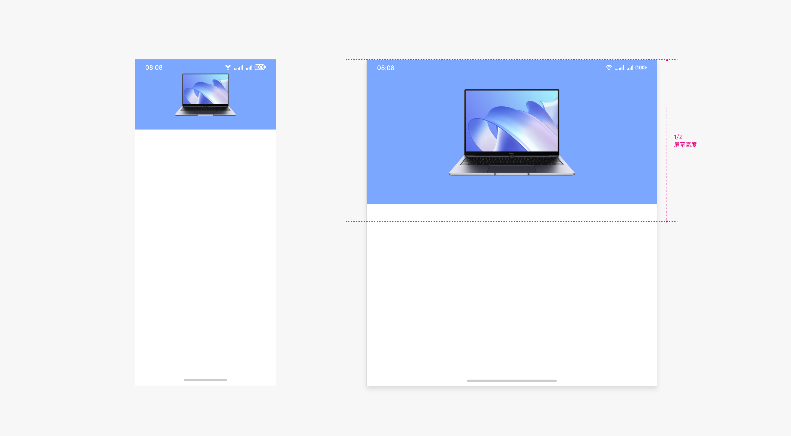

#### 开合接续

在折叠态和展开态切换时，应确保页面不发生跳转，焦点不发生偏移。

#### 页面不跳转

展开态不应出现页面跳转、操作步骤增加，操作更复杂等体验下降的情况。

不应破坏应用内原有的沉浸式体验，避免仅仅为了扩充内容，或强制应用分屏而过度改变用户体验和用户习惯。

在折叠态和展开态之间切换时，需要保证当前任务的连续性。切换前的任务和相关状态应能够保存、延续或快速恢复，以提供连续的用户体验，避免出现闪退、重启等异常情况。

 - 页面内容，均需要支持开合接续；
 - 弹出层控件，且点击周边空白区域自动关闭的，可以开合不接续，例如弹出框、toast 等；
 - 半模态控件需要支持开合接续。

| 推荐 (拍摄状态和参数不变) |

| 推荐 (阅读的焦点不偏移) |

| 不推荐 (页面跳转，任务中断) |

#### 焦点不偏移

当有足够多的显示内容时，第一个完整的信息作为接续的起始位置，例如下图的卡片 7 作为接续的起始位置。

当显示的内容不足一排时，以当前态看到的第一个内容，作为另一个状态的起始行内容。

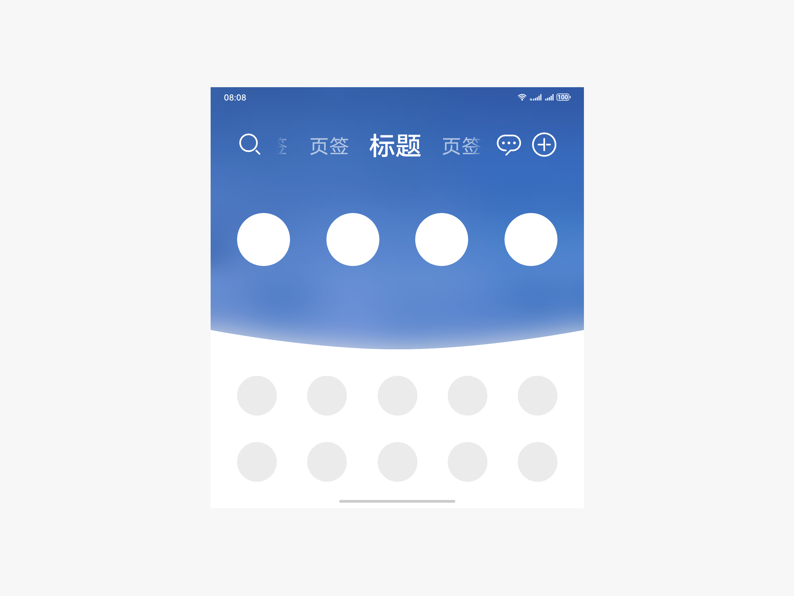

支持左右横滑的内容，开合接续时，左侧第一个完整的内容作为另一个状态的起始位置。

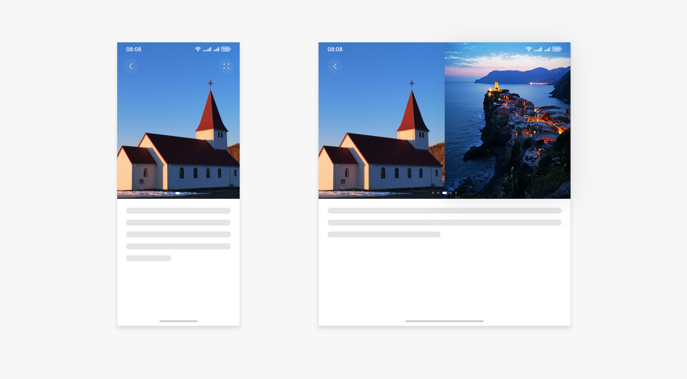

当支持左右横滑的内容，在另外一个状态遇到末尾数据时，右侧内容填满。

#### 交互架构

在大屏幕设备上，双页面同时显示为用户提供了创新的操作体验。当应用程序中的两个页面存在关联关系时，可以考虑采用组合页面的方式。根据不同的场景需求，选择合适的页面组合关系至关重要。组合页面主要包括以下三种类型：层级关系、主从关系和并列关系。

#### 层级关系

层级关系可以分为多层级和单一层级两种类型。层级关系的双窗口展示方式通常被称为分栏。

**多层级分栏**

在多层级分栏结构中，存在一个完整的多层结构，例如复杂的系统设置菜单、海量内容（如综合电商的商品、视频、图片或音乐的媒体资源、新闻网站的海量新闻）的门户及多级分类子页面。

这种交互方式的特点如下：

第一级的基础分类通常以列表形式呈现，以便用户能够快速了解整个结构的概览。

末级列表页面中的元素为最小内容元素，例如单个商品、单个媒体素材、单条新闻等。这使得用户能够更方便地访问和操作具体的信息。

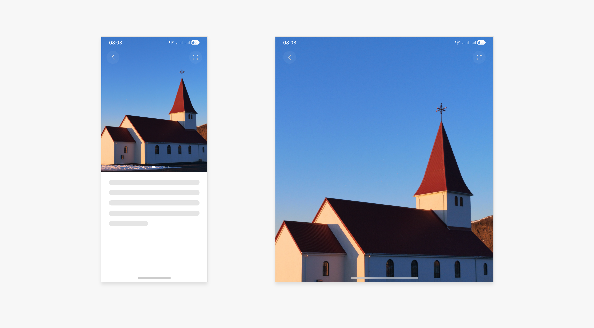

有多个层级递进关系的场景示例

**单一层级分栏**

单一层级结构通常采用“列表+详情”的形式展示，其中列表中的每个元素均为末端元素，不包含二级分类列表。这种结构适用于邮件、信息、备忘录等类型的内容元素列表。此类交互的特点如下：

列表中仅包含独立的元素，无子列表，左右两侧内容属性固定，有助于减少用户迷失。

用户点击左侧列表中的某个条目时，右侧将显示对应的详情内容。

用户可通过在左侧列表中点击任意一个条目，快速在右侧打开对应的详情内容，实现内容的快速切换。

#### 主从关系

在主从关系类型中，一侧的主导页面为沉浸式场景，而另一侧的辅助页面则呈现评论、互动讨论、参考信息等相关内容。根据沉浸内容的情况，主从关系可以分为左右或上下的组合页面结构。

主从关系的交互逻辑特点如下：

两部分之间相互独立，且具有明显的主从关系。

辅助侧依赖主导侧存在，若主导侧关闭或切换，辅助侧页面不能单独存在，需同步关闭或切换。

主导侧的内容呈现不受打扰和中断，持续保持最佳的沉浸状态。

辅助侧的内容用户可以进行滚动浏览，适合于信息流数据，用户可参与互动。

主从关系的信息架构样式主要有以下几种，应用可根据具体场景进行选择：

**悬浮面板**

从属信息默认以悬浮面板的形式显示，通过特定按钮或特定手势交互触发，一般用于作为主要信息的筛选项或更多菜单项，不影响主要信息的展示。

短视频应用使用悬浮面板的示例

导航应用悬浮面板的示例（折叠屏展开后，悬浮面板不拉伸，不遮挡底部主要信息）

**侧边栏**

从属信息默认以边栏形式显示，通过界面比例和视觉效果表现从属关系，不影响主要信息的展示，同时能快速浏览或操作从属信息。

短视频应用使用侧边栏的示例

#### 并列关系

在并列关系中，界面中的两侧内容具有同等的重要性。这些内容可以是同类型的内容，也可以是不同类型的内容。

例如，在购物应用中，下单前对两个相似商品进行详细对比的页面属于同类型内容的并列；而购物应用中一侧窗口显示商品信息，另一侧显示与商家的对话界面，则属于不同类型内容的并列。

并列关系有助于用户更详细地比较两个商品的信息，或进行更高效的交互操作。在这种组合页面中，左右两页面之间不存在主次和从属关系，页面分割比例应为1:1。

|  |  |
| 相同类型内容的页面并列 两边有相同的页面布局、各段信息相互对应 | 不同类型内容的页面并列 两边页面布局和内容不同，但相互间有关联性 |

#### 响应式布局

随着屏幕设备规格的变化，界面中所呈现的信息量有增加，常见的响应式布局的表现形式为：相对拉伸、相对缩放、延伸布局、挪移布局、重复布局、瀑布布局等。

#### 相对拉伸

布局特点：页面内元素的显示宽度不是固定值，而是通过相对参照物的方式来确定其开始和结束的位置。当布局的显示大小发生变化时，元素的显示宽度随之发生改变。

#### 相对缩放

布局特点：布局内元素的显示大小不是固定值，而是通过相对参照物的方式来确定其宽或者高的参数。当布局的显示大小发生变化时，元素的大小随之发生缩放。

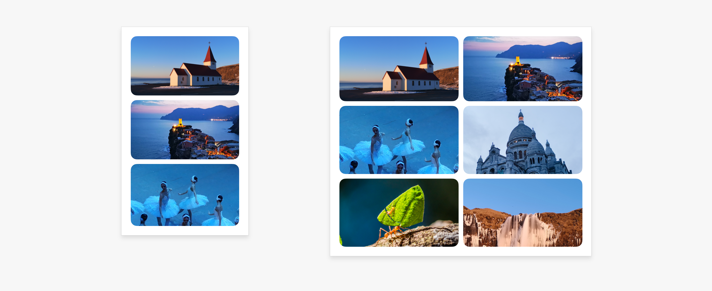

#### 延伸布局

布局特点：组件内元素横向布局，元素间的距离固定，可显示元素的数量可随着显示宽度的改变而变化。

适用场景：内容呈现型界面，单页面内信息架构扁平，内容元素为单层列表或分组列表结构，例如内容门户网站首页面。

适配规则：保持页面元素尺寸或间距不变，随着屏幕宽度的增加，在横向显示更多元素。

#### 挪移布局

布局特点：布局内的元素根据布局的宽度来选择是上下排布还是左右排布。

适用场景：页面内信息架构层级少的，例如门户网站首页面、内容详情页面等。

适配规则：首先判断布局区域是否有明显的“宽高特征”，即横纵比是否大于4:3；其次判断横向宽度，是否能容得下若干个元素，如果容得下就左右排布，容不下就上下排布。

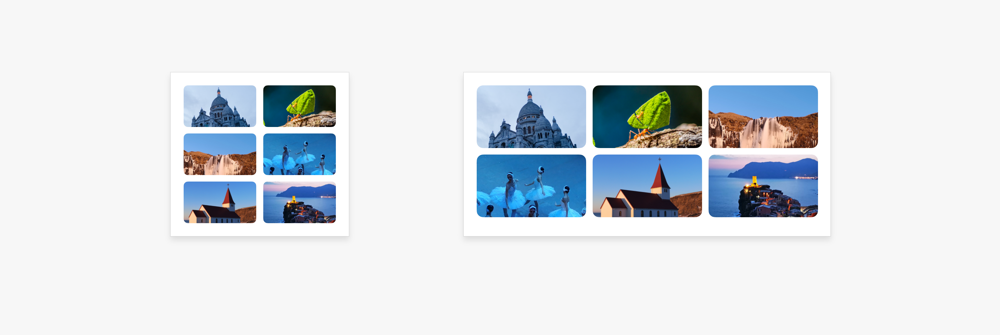

#### 重复布局

布局特点：利用屏幕的宽度优势，将相同属性的布局组件横向并列同时排布。

适用场景：内容运营类列表信息，例如歌单列表、应用列表等。

适配规则：可以定义单个元素的宽度规则，随着屏幕宽度的变化，⾃动计算可以重复的元素的个数，满足宽度条件时横向重复排列。

#### 瀑布布局

布局特点：利用屏幕的宽度优势，将原来单列纵向布局，拓展为两列或多列的纵向布局。

适用场景：适合用卡片呈现内容的场景，通过卡片的横纵扩展在⼤屏上展示更多内容。

适配规则：可以定义单个组件的宽度规则，随着页面宽度的变化，⾃动计算可以重复的卡片个数，满足条件时横向排列更多卡片。

#### 布局&交互创新

结合六种动态布局规则，三种双页面交互架构规则以及多窗交互规则，在折叠屏上可以进行多种布局样式和交互的创新设计，以下为一些参考范式。

 - 分栏布局
 - 挪移布局
 - 重复布局
 - 瀑布流&宫格布局
 - 临时双窗

#### 分栏布局

分栏布局是一种具有层级关系的左右分窗口设计，其主要目的是在宽屏设备上实现良好的视觉效果，从而提高用户的任务处理效率。这种布局方式特别适用于文件管理、联系人、设置、备忘录等应用程序的展开状态。

备忘录的分栏布局示例

#### 挪移布局

通过调整折叠屏设备的布局，从折叠状态到展开状态，可以实现布局的挪移变化，从而提高阅读舒适度和浏览效率。以下是四种常见的挪移布局用法。

**范式1：将不同页面的内容整合到同一页的布局调整。**

**边看边评**

在阅读时，展开状态下同时显示文章详情和评论列表，满足用户在阅读文章的同时查看评论的需求。

边看新闻边看评论的示例

**范式2：同一页面的上下结构内容，变成左右结构的挪移布局。**

**杂志排版**

本范式常用于阅读场景的图片和文本之间的挪移布局。不仅能解决图片过大的问题，还能通过杂志化布局带来更好的视觉效果。

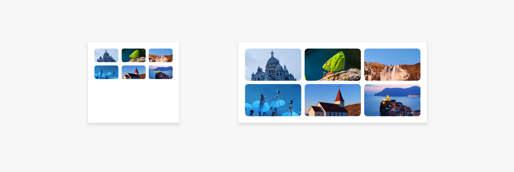

同一页面的新闻，从上下图文变成左右图文的挪移布局示例

同一页面的生活服务信息，从上下图文变成左右图文的挪移布局示例

**范式3：有层级结构的图文内容，变成左右结构的挪移布局。**

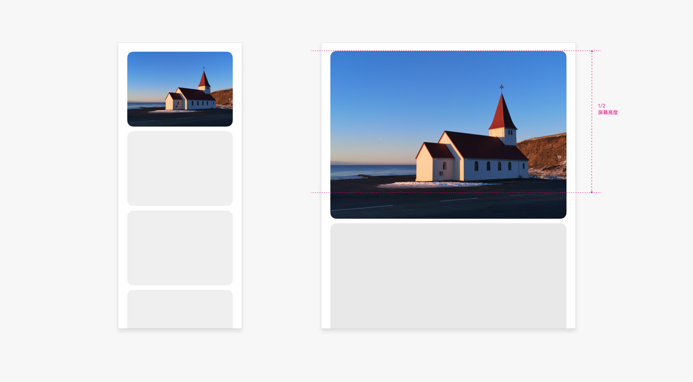

首页的图文内容，从层叠变成左右图文的挪移布局示例

**范式4：通过挪移布局，在展开态上减少次要信息对核心信息的干扰。**

看视频时，弹幕和操作按钮挪移布局到周边空闲区域的示例

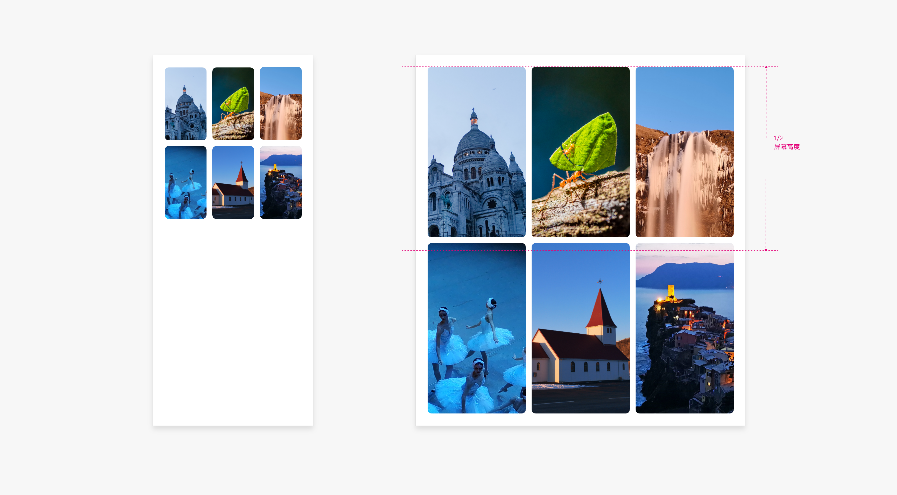

多人视频通话时，参会人信息从底部挪移到展开态的侧边，减少对视频通话画面遮挡的示例

#### 重复布局

折叠屏设备，从折叠到展开，页面内的列表、卡片等均可通过重复布局，横向展示更多信息，提升页面的浏览效率，同时避免信息过疏。

列表在展开态重复布局的示例

从折叠态到展开态，使用重复布局时，通常内容按照从左到右的Z字形排布。

卡片在展开态重复布局的视频示例

#### 瀑布流&宫格布局

瀑布流布局适用于卡片式结构。折叠态的单列卡片，到展开态显示双列卡片，不同高度的卡片形成错落有致的瀑布流布局。可以有效提升页面的浏览效率和可视化效果。

新闻首页卡片瀑布流布局示例

瀑布流布局和卡片的重复布局比较相似，内容也按照从左到右的Z字形排布，卡片的高度可以不同。

视频卡片从折叠到展开态的瀑布流布局示例

宫格布局的应用，从折叠到展开建议显示更多列数。一般在展开态横向显示3列效果最佳。

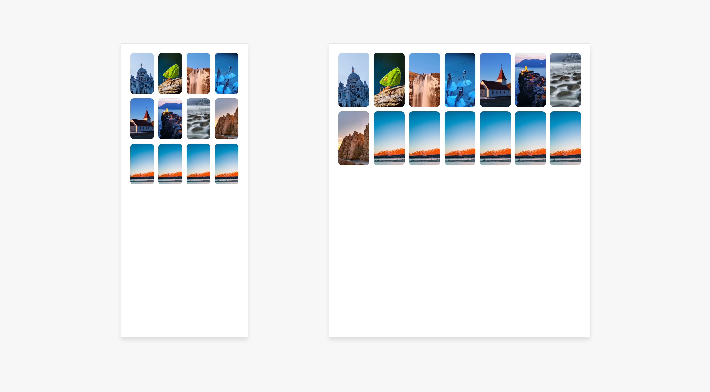

从折叠到展开态增加列数的宫格布局示例

瀑布流布局或宫格布局的页面，建议可通过双指缩放进行布局调整，从而满足不同用户的高效浏览或大图浏览等不同诉求。

双指缩放进行宫格布局调整的视频示例

#### 临时双窗

播放视频或购物类场景，通常使用临时双窗口来实现“边看边评”或“边看边买”的体验。

**边看边评**

播放视频时，点击评论按钮，在不影响视频播放等核心任务的前提下，为评论留出足够的空间，从而实现一边看视频一边看评论或边看边写评论的体验。

看视频时，点击“查看评论”按钮，核心内容被向左推挤，在右侧窗口显示评论信息的示例

播放视频时，点击“评论”按钮，核心内容被向上推挤并缩小，在下方的临时窗口进行评论输入的示例

在同时显示视频和评论的视频详情页面，建议通过上下拖动进一步调节评论区域的大小。

向上拖动评论标题区域，视频内容被向上推挤并缩小，留出更大区域显示评论的示例

**边看边买**

在电商或生活服务类应用中，经常需要一边浏览商品信息一边和商家进行沟通，可通过临时双窗口实现一边浏览商品信息一边和商家交流的体验。

购物时通过临时双窗口和商家对话的示例

在播放视频或阅读文本等信息时，遇到需要购物的场景，可通过临时双窗口完成购物过程，确保主任务不会被中断。

看直播时通过临时双窗口完成购物及支付的示例

#### 多窗口交互

折叠屏设备因其大屏特性，天然具备多窗口适配的优势。这种多窗口交互方式能够显著提高信息处理效率，特别适用于需要同时处理多个任务的场景。通过充分利用屏幕空间，用户可以实现多任务的高效协同，从而显著提升工作效率。

#### 悬浮窗

可通过悬浮窗显示需要临时使用的任务，全屏显示需要长时间使用的任务，从而实现任务的短暂并行或快速处理。实现临时任务处理。

示例：调出支付悬浮窗快速完成支付，避免页面跳转

#### 分屏

分屏功能适用于需要同时运行两个应用的多任务场景，支持左右分屏和上下分屏两种样式，在大尺寸设备上可提供无遮挡的高效任务并行体验。例如，用户可以边逛商品边比价、边看视频边聊天、边学视频边记笔记。

示例：边看视频边聊天

#### 跨屏拖拽

在形成分屏或打开悬浮窗后，用户可以从一个窗口内拖拽内容到另一个窗口。这个功能支持内容的跨应用传递，例如将文字、图片、视频或链接从一个窗口拖拽到另一个窗口，从而实现高效的内容交互，进一步提升多任务处理的效率和灵活性。

#### 悬停态

折叠屏产品支持独特的悬停态，即产品半折后立于桌面，实现免手持的便捷体验。悬停态适用于无需频繁交互的场景，如观看视频、视频通话、拍照及听歌等。

#### 悬停态适配

悬停态时，持握和放置状态下，手指最舒适的操作热区均集中在下半屏，而上半屏的可视角度更加友好。

悬停状态下，屏幕按照交互的难易程度，可分为以下四个部分：

1 易操作区：在此区域内，手指交互操作稳定舒适，一般在此区域放置关键交互操作，例如按钮、拖动条等；

2 不易操作区：在此区域内，手指交互时不太容易直接触达，需要更多地伸展手指或发生持握方式的变化

3 难操作区或显示区：在此区域内，执行触屏交互容易导致设备不稳定，一般不在此区域呈现交互类控件，或将此区域作为显示区，呈现浏览型内容，例如图片、视频等；

4 无法操作区：该区域一般为设备的悬停夹角区域。该区域操作精准度低，且显示内容容易变形，应尽量避免在此区域放置交互操作或显示重要信息；建议在上下半屏分别预留一定的空白区域。

| 悬停态双手持握 | 悬停态半折平放 |

#### 悬停态折痕避让规格

悬停态时，中间弯折区域难以操作且显示内容会变形，因此建议页面内容进行折痕区避让适配。建议上半屏内容由中线向上避让16vp（3毫米）、下半屏内容由中线向下避让40vp（7毫米）。

#### 典型悬停适配案例

悬停状态下，界面布局应自动调整。即将浏览型内容上移，在上半屏显示；将操作类控件元素下沉，在下半屏显示。提供更舒适和高效的使用体验。

**视频通话**

悬停时，上半屏显示通话界面，下半屏显示通话相关的操作按钮。

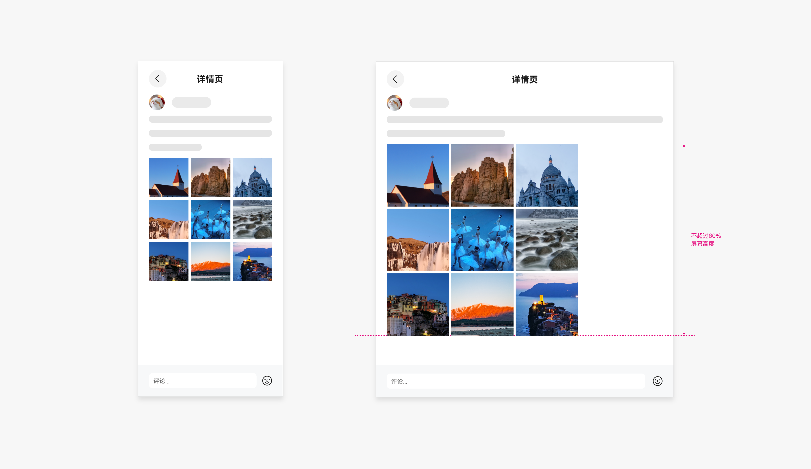

**视频**

悬停时，上半屏显示视频画面，下半屏显示视频相关的操作按钮或周边信息。

**短视频**

短视频悬停时，头像、评论、视频画面等显示的内容在上半屏展示，输入框等操作在下半屏显示。短视频类应用进行需要手势操作快速切换视频内容。建议下半屏支持横向滑动切换视频。

悬停态看短视频示例

**健身视频**

悬停时，上半屏显示动作跟练视频内容、进度，下半屏显示播放及切换功能。

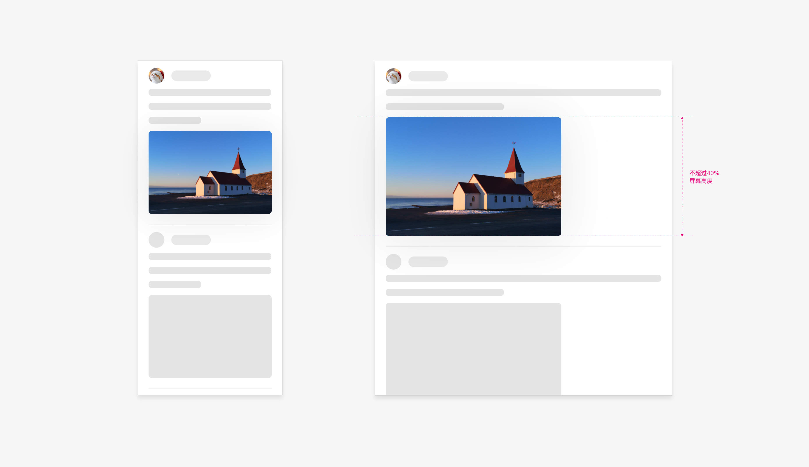

悬停态看健身视频示例

**拍摄**

悬停时，上半屏显示取景画面，下半屏显示取景模式、拍摄参数控制按钮等操作类功能。

悬停态拍摄示例

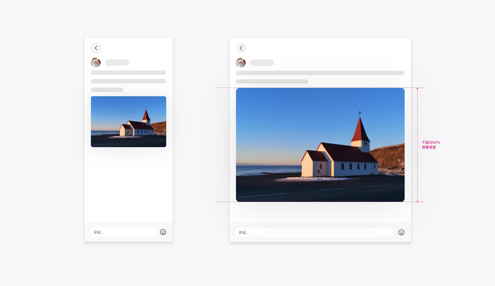

悬停态录制视频示例

**音频播放**

悬停时，上半屏显示专辑封面或歌词、音乐MV，下半屏显示音频播控功能。

悬停态播放音乐示例

**控件适配-弹出框**

悬停态若触发应用内的弹出框等操作型控件，建议在下半屏显示。

**菜单**

悬停时菜单跟随触发按钮位置，菜单高度自动适配屏幕高度。

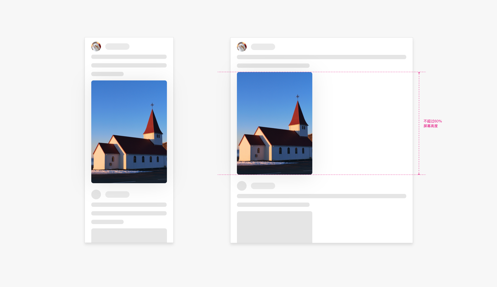

**输入**

悬停时输入，避免在中间折痕区域显示输入框。

