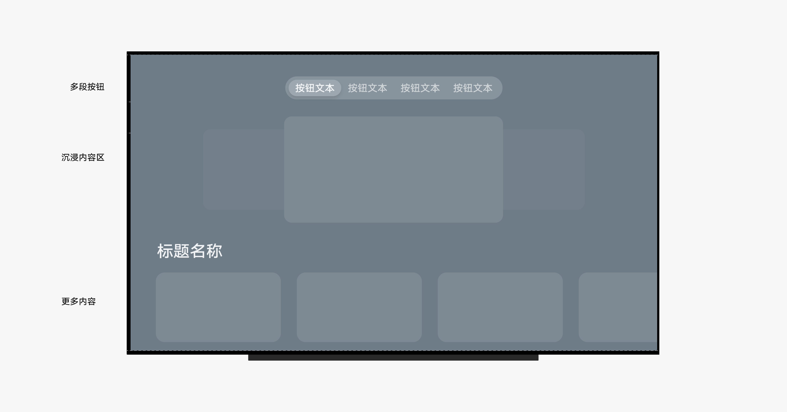
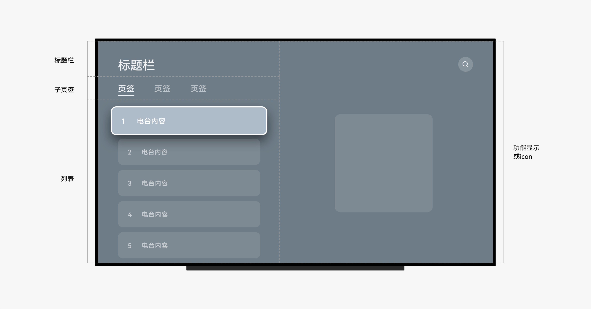
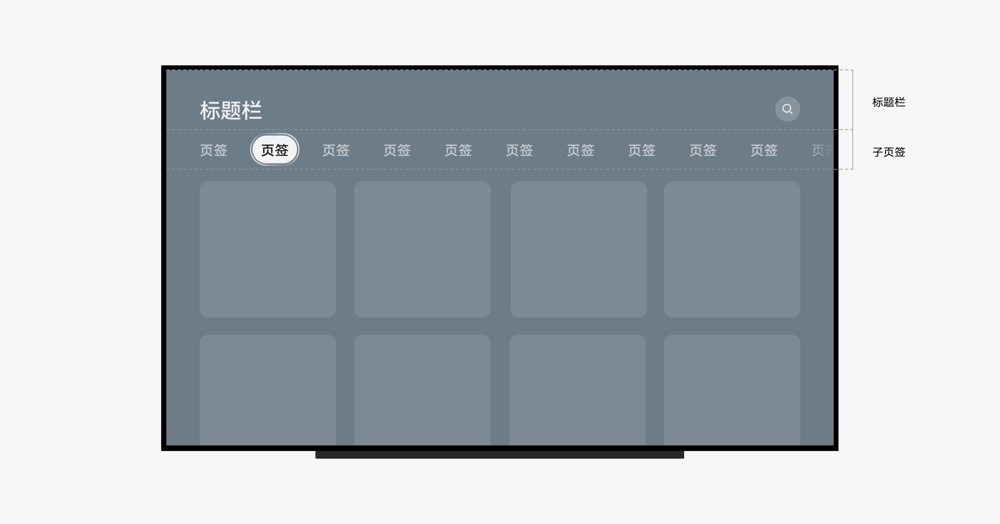
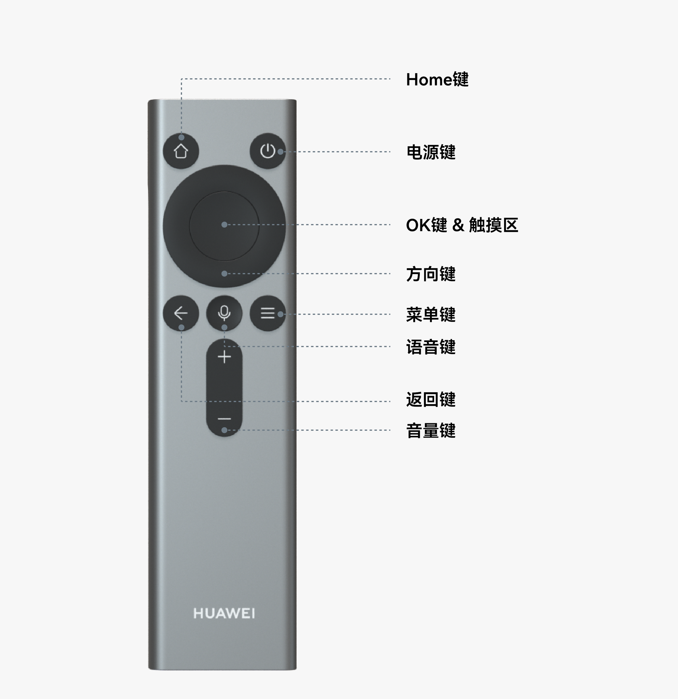

# 智慧屏

更新时间：2026-03-11 06:16:00

来源：https://developer.huawei.com/consumer/cn/doc/design-guides/vision-0000002321377950

智慧屏作为家居场景下的核心设备，采用了自然简单，符合直觉的设计原则，让全家人轻松简单的使用智慧屏。努力为家庭用户带来更加智慧、沉浸、无缝的娱乐体验。
 

#### 设计原则

- **沉浸：**智慧屏是适合展示沉浸式设计的家庭设备。剧场空间感的排版布局，流畅的转场动效，高端音响设备，这些能力都致力于为用户打造身临其境般的沉浸式体验。进行界面设计时，发挥智慧屏的屏幕尺寸优势，能够为应用的显示效果带来意想不到的视觉效果。除了必要元素外，减少不必要的露出，将更多的界面空间用于精美画面展示，从而更好地吸引用户。
- **智慧：**智慧能力的提升给用户带来更优质的服务和体验。在设计应用时，请结合已有的成熟技术与解决方案创造更新颖与智慧的应用。例如，摄像头提供无死角的视频通话体验；隔空手势彻底摆脱遥控器束缚，让高频操作一步直达，这些都是智慧化带来的极致体验。智慧屏借助硬件和算法能力，提供了可感知、可互动的界面体验。智慧屏不仅仅是一台视频播放设备，作为家庭智能场景的中枢，为用户的生活方式提供更加智慧化的选择。
- **无缝：**多终端之间的跨设备协同是 HarmonyOS 的核心，在不同设备之间自如切换，协同操作，创造家庭场景的更多可能性是 HarmonyOS 的目标。基于 HarmonyOS 的智慧屏，作为家庭设备的中枢产品供全家人共同使用，它可以连接不同的终端产品，并且实现流畅的影音流转和信息共享。请发挥应用在不同终端设备上的交互特征和显示能力，创造更加贴合使用场景的分布式体验。此外，智慧屏的应用还应当在交互流程上减少操作步骤，构建全家人都能轻松操作的智能情景。

 
 

#### 设备特性

如果要设计出优秀的智慧屏应用或服务，需要熟悉并充分利用智慧屏特性，这些特性包括硬件特征、使用方式、使用场景等。
  
| 硬件特性 | 屏幕：大尺寸高分辨率的大屏幕； 音频：较好的音频输入输出能力； 摄像头：一般配备较好的前置摄像头； HDMI 接口：配备多个 HDMI 接口，可用于连接机顶盒、游戏机、电脑等输入设备 |
| 使用方式 | 远距离使用：人与智慧屏的物理距离一般为 1.5m-4m， 通过遥控器进行遥控使用 遥控器：根据遥控器的型号，智慧屏可支持 2 种交互方式。光标指向 - 使用灵犀指向遥控器时，根据遥控器指向对屏幕内容进行直接交互。请参阅光标交互； 焦点导航 - 使用走焦类遥控器时，通过点击遥控器方向键移动焦点对象进行交互。请参阅焦点导航 |
| 使用场景 | 智慧屏的使用场景主要是居家娱乐，如观影、游戏。除此之外，智慧屏还在家居环境起到重要的氛围调节作用。 |
 
 
 

#### 应用和服务设计

在设计智慧屏应用和服务时，请考虑以下方法，这将帮助您提供优秀的用户体验。
 
 

#### 保证基础体验

在应用/服务设计中需要遵守一些基础体验要求，如果不满足这些基础要求，则会极大损害用户的使用体验。例如，如果界面元素的响应热区太小会导致用户很难操作成功，从而无法完成要操作的任务。具体要求请参阅[应用 UX 体验标准](https://developer.huawei.com/consumer/cn/doc/design-guides/ux-guidelines-overview-0000001760867048)。
 
 

#### 设计应用和服务体验

- **使用系统控件：**利用系统提供的底部页签、标题栏、弹出框等标准控件，在保证良好基础体验的同时，减少设计和开发的工作量。必要时自定义控件的样式和大小以体现自己的品牌特征。
- **使用合适的应用架构：**根据业务的特点采用合适的架构。例如，娱乐类应用可选择沉浸式布局，提升内容视觉沉浸感；效率类应用通常采用左右分栏的应用架构，以达到快速高效浏览的作用。请参阅[应用架构](#section18763125132511)。
- **充分利用遥控器交互：**遥控器除了指向或走焦外，可充分利用其他硬按键或交互特性。如 短按菜单键调出交互对象更多隐藏功能； 如 配合指向光标悬浮状态，提供更具创意的视觉反馈。请参阅[灵犀指向遥控器](#section193874172613)。

 
 

#### 支持系统特性

- **充分利用系统特性：**HarmonyOS 提供了一些系统特性，用户能够通过这些系统特性获得良好的系统体验，其中部分系统特性是开放的，应用/服务可以根据业务属性接入这些系统特性，以获得更多触达用户的机会。
- **遵循系统特性的体验要求：**在接入系统特性时，应该要遵循系统特性的体验要求。部分系统特性是为了满足用户对系统整体的某项诉求，应用/服务也应当遵循系统特性的规则进行接入。

 
 

#### 应用架构

智慧屏应用架构有以下三种供开发者选择
 
**沉浸式布局**：适用于追求沉浸感的内容类应用，如视频、音乐等。应用可根据需求自行搭配沉浸区内容呈现。
 

 
**分栏式布局**：适用于追求效率的工具类应用，如文件管理、设置等。
 

 
**通用布局**：内容丰富的应用可通过子页签在首页展示全量内容，减少 App 内层级
 

 
 

#### 灵犀指向遥控器

灵犀指向遥控器作为单框架智慧屏特有硬件，为用户提供远距离下指哪点哪的交互体验。除指向外，遥控器其他功能按键也可提供便捷的交互操作。
 

 
**电源键**：关机或熄屏
 
**Home 键：**短按返回 Home 页，长按进入任务中心
 
**OK 键 & 触摸区**：短按 OK 键即对当前指向对象进行点击，如指向应用图标，点击 OK 键即可打开应用。在触摸区滑动即可对指向对象进行滑动交互，如左右滑动切换桌面
 
**方向键**：可进行上下左右，四个方向的操作。 应用调用时，可点击方向键调节视频进度等
 
**菜单键**：短按可呼出当前交互对象更多隐藏功能；长按可进入控制中心
 
**语音键**：长按可呼出小艺进行语音交互
 
**音量键**：调节音量大小
 
 

#### 系统特性

- [通知](https://developer.huawei.com/consumer/cn/doc/design-guides/system-features-notification-0000001793074217)
- [实况窗](https://developer.huawei.com/consumer/cn/doc/design-guides/system-features-live-view-0000001955186861)
- [服务卡片](https://developer.huawei.com/consumer/cn/doc/design-guides/system-features-service-widget-0000002087671904)
- [播控中心](https://developer.huawei.com/consumer/cn/doc/design-guides/broadcasting-control-0000001957017133)

 
 

#### 人机交互

- [光标交互](https://developer.huawei.com/consumer/cn/doc/design-guides/hmi-cursor-0000001795531205)
- [焦点导航](https://developer.huawei.com/consumer/cn/doc/design-guides/hmi-focus-0000001748650376)
