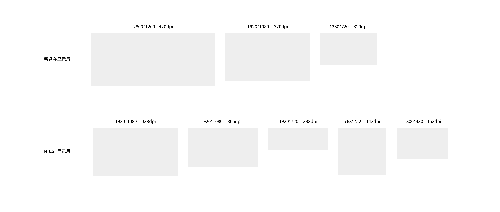
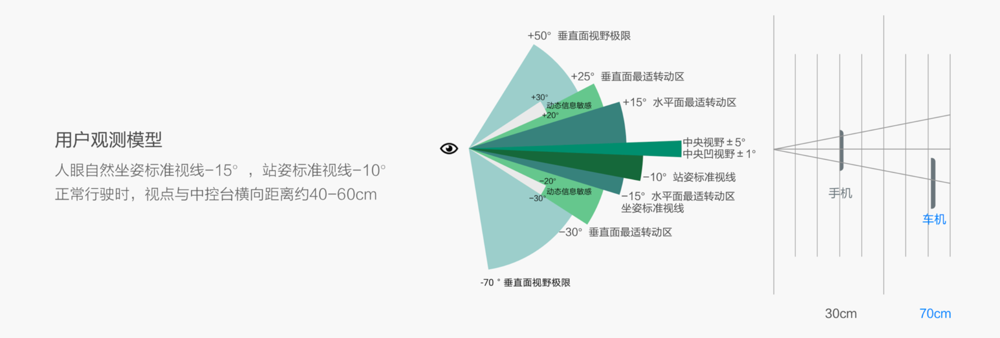
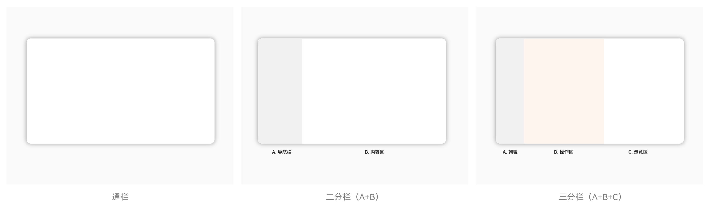
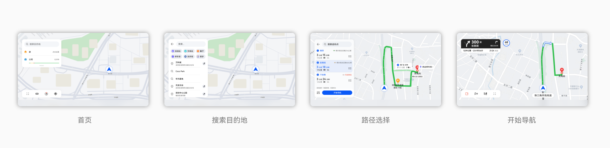
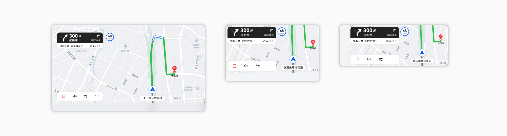
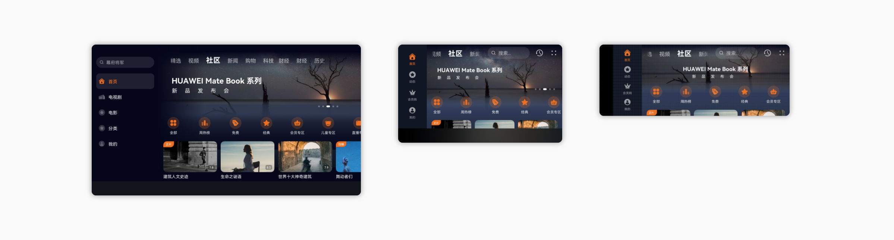
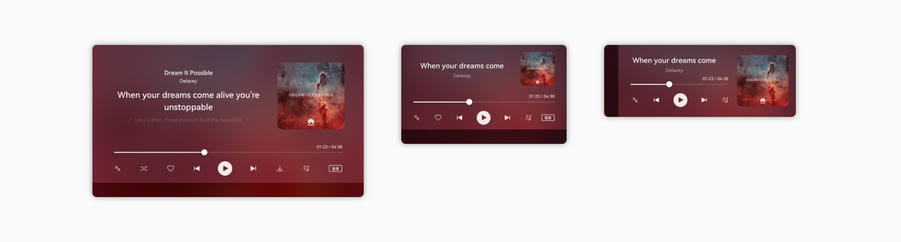
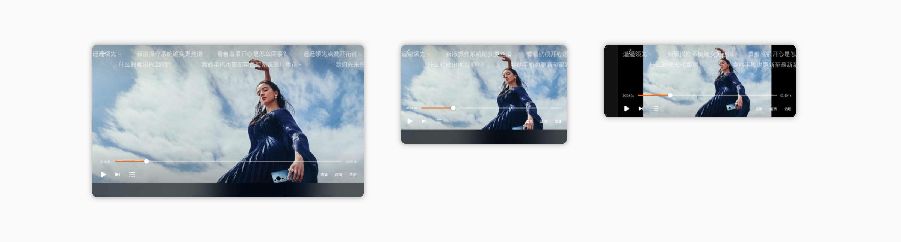
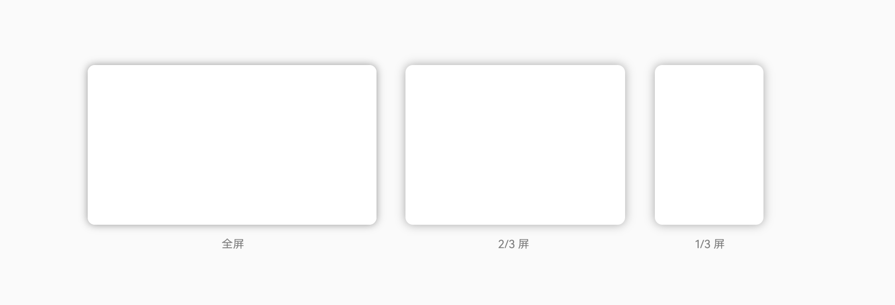
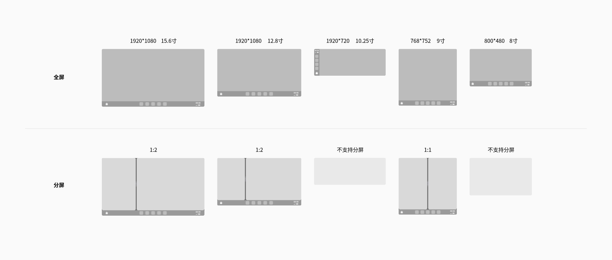

# 智能座舱

更新时间：2025-08-19 02:55:52

来源：https://developer.huawei.com/consumer/cn/doc/design-guides/smart-cockpit-0000002045925712

## 概述

智能座舱是一种智能移动空间，通常由一个或多个显示屏为中心，结合智能化的舱内硬件设备，给用户带来更好的驾驶、娱乐体验。因此，智能座舱屏幕的系统和应用体验，对用户至关重要。

如果要设计出优秀的智能座舱应用或服务，需要熟悉并充分利用智能座舱设备特性，这些特性包括硬件特征、使用方式、使用场景等。

| 硬件特性 | 显示屏：为覆盖各种车型的诉求，智能座舱有多样化的屏幕尺寸，有以下几种常见尺寸。   摄像头：车用摄像头是智能座舱和自动驾驶的重要传感器，智能座舱一般配备电子内外后视镜摄像头(CMS) 、驾驶员防疲劳监测预警系统（DMS）、乘员监测系统（OMS）、倒车辅助摄像头、手势摄像头等。 音响：智能座舱有较好的空间音频输入输出能力，通常有车内环绕扬声器、驾驶员头枕扬声器、车外扬声器。 灯光：智能座舱一般配备外部灯光（远近光灯、外部信号灯、外部氛围灯等) 和室内灯具 (氛围灯、阅读灯等)，可自定义显示亮度、动态点亮效果，甚至投影图案、视频动画等方式，实现对灯与驾驶员或其他道路使用者进行提醒和气氛互动。 座椅：智能座舱内座椅可根据不同场景，将座椅调整到合适姿态的功能。智能座椅除了水平、高度、靠背常规调节，还支持旋转、腿托、肩部、侧 翼等方向调节来实现舒适坐姿，同时支持加热、通风、按摩、记忆、 迎宾等功能，满足驾驶和乘坐的舒适感。 香氛系统：车内香氛装置工作原理是把香水通过空调均匀的释放到车内，同时还可以根据挡位调节香味的浓烈。 生物认证识别：智能座舱一般配备指纹识别、人脸识别、声纹识 别、虹膜识别等生物认证识别。 地理位置：可通过 GPS 等获取设备所在的地理位置。 其他：陀螺仪、加速计等，可获得座舱运动状态的信息。 |
| --- | --- |
| 使用方式 | 远距离使用：人眼与座舱视觉显示系统（仪表、中控等）的物理距离一般为60-70cm，约为手机及平板使用距离的两倍。   双任务并行：在驾驶场景下，用户对于座舱系统的使用处于“双任务”状态，驾驶员需要保持足够的注意力在道路上，因此在使用座舱系统时，通常为瞥视，而非持续注视。 多模态交互：除通常的点击操作外，智能座舱应用需支持，语音、手势、方向盘、遥控器等交互方式。HiCar应用需支持，语音、方向盘、旋钮、按键等交互方式。 |
| 使用场景 | 驾驶辅助：在驾驶情况下，智能座舱除导航外，可提供更多的服务推荐，给用户带来更安心舒适的驾驶体验。 车内娱乐：在非驾驶情况下，可在座舱内看电影、听音乐，通过环绕音响、氛围灯硬件设备，提供更沉浸的娱乐体验 |

应用可支持无级调节功能（推荐）。

## 应用和服务设计

### 保证基础体验

在应用/服务设计中，需要关注到设计在多种屏幕中的使用体验，遵守一些基础体验要求，如果不满足这些基础要求，则会极大损害用户的使用体验。例如，如果界面元素的响应热区太小会导致用户很难操作成功，从而无法完成要操作的任务。具体要求请参阅应用 UX 体验标准。

### 保证驾驶安全

智能座舱的使用关乎用户的生命安全。在驾驶场景下，用户对于座舱系统的使用处于 “双任务” 状态，即需要在保证驾驶任务安全性的同时，分出有限的注意资源去完成与座舱系统的交互任务。为保证驾驶安全，在智能座舱的应用和服务设计中，应遵循安全可控，高效操作的原则。具体要求请参阅智能座舱 UX 体验标准。

### 设计应用和服务体验

使用系统控件

利用系统提供的底部页签、标题栏、弹出框等标准控件，在保证良好基础体验的同时，减少设计和开发的工作量。必要时自定义控件的样式和大小以体现自己的品牌特征。

使用合适的应用架构

根据业务的特点采用合适的架构，建议使用分栏结构，将常用、重要的功能放在左侧分栏。有以下常见分栏方式：

通栏：适用于工具型应用，层级简单，内容以沉浸式模型、卡片为主，如天气。

二分栏 A+B：适用于内容型应用，内容以列表和图片为主，如音乐、视频、车主指南。内容类应用可以将快捷操作器，如音频播放器、搜索功能结合在左侧列表中。

三分栏 A+B+C：适用于效率型、结构层级复杂的应用，如日历。

考虑硬件遮挡

方向盘可能会遮挡一部分屏幕，应用和服务在设计时应避免将关键信息、重要操作放在这个区域，以保证页面正常显示，不影响用户的使用。

支持更多交互方式：在驾驶场景下，利用多模态交互能有效提升交互的效率，带来更好体验。例如，语音、手势、方向盘、旋钮、硬按键、遥控板。关于更多交互方式，请参阅人机交互。

座舱应用设计关注点

导航类 地图应用为驾驶场景中最常用的应用，在车载系统中，地图应用应注意聚焦驾驶相关功能，提升使用效率。

关键界面：首页、搜索目的地、路径选择、开始导航等

HUAWEI HiCar应用设计关注点

HUAWEI HiCar 的显示屏有尺寸多、屏幕扁的特点，且部分屏幕较小。应用和服务在设计时，应合理利用屏幕空间，展示更多内容。

导航类 导航过程中，需要留出足够空间显示地图，以便用户快速判断当前位置及路线。

影音类 首页图片：图片、卡片、视频预览图等内容，应通过缩放、延伸等方式来适配各种屏幕尺寸，使显示效果合理美观。避免出现单张图片内容高度超过屏幕 1/2 的情况。

影音类 音频播放器：音乐全屏播放为驾驶场景的常用界面，需保证界面适配合理，关键功能显示完整。专辑封面等效果类内容，应根据屏幕尺寸进行响应式布局调整。

影音类 视频播放器：按照视频比例居中显示，避免出现视频拉伸、截断的情况。对于竖向短视频来说，可在右侧打开评论列表，平衡界面效果。 关于更多响应式布局方法，请参阅布局。

关于更多响应式布局方法，请参阅布局。

## 系统特性

### 智选车特性

深浅模式

应用需支持深、浅两种模式。

多窗交互

应用需支持 3 种窗口尺寸，全屏、2/3屏、1/3屏，布局可对应参考平板、折叠机、手机竖屏。应用可支持无级调节功能（推荐）。

### HUAWEI HiCar 系统特性

深浅模式

应用需支持深、浅两种模式。

沉浸式导航条

为便于显示时间等信息，并方便用户在桌面、常用应用中跳转，HUAWEI HiCar 设有常显的系统导航条。有以下特点：

1. 在设备屏幕高宽比大于 1/2 时，导航条位于屏幕左侧；小于 1/2 时，位于屏幕底部。

2. 应用的内容区域可包括导航条宽度，以呈现出沉浸式效果，但重要信息、功能（如应用导航），应避开系统导航条。

导航与其他应用分屏

为便于导航与应用并行的场景，系统支持导航与其他应用分屏呈现，对于不同的屏幕，有以下分屏规则：

1. 9 寸以下的小屏、扁屏不支持分屏。

2. 常规矩形屏支持左右窗口 1:2 的分屏，应用窗口宽高比约为 9:5。

3. 竖屏和较小的屏幕，使用左右窗口 1:1 的分屏。

强烈建议应用可支持无级调节窗口大小。

