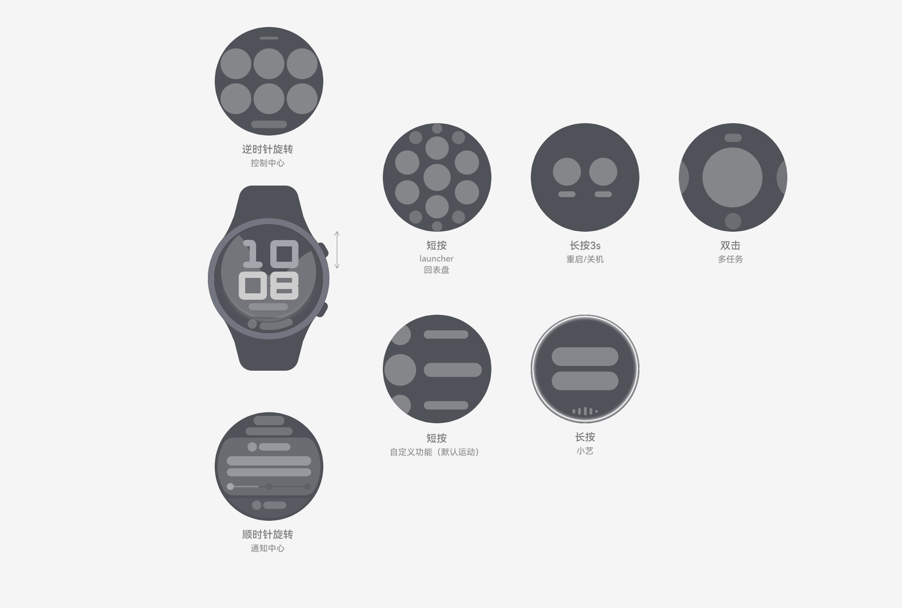
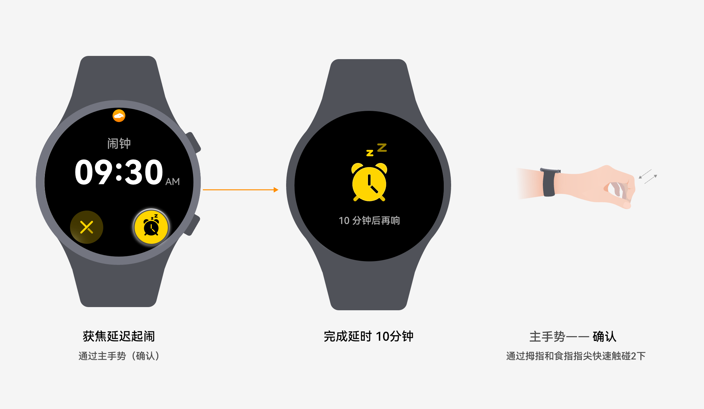
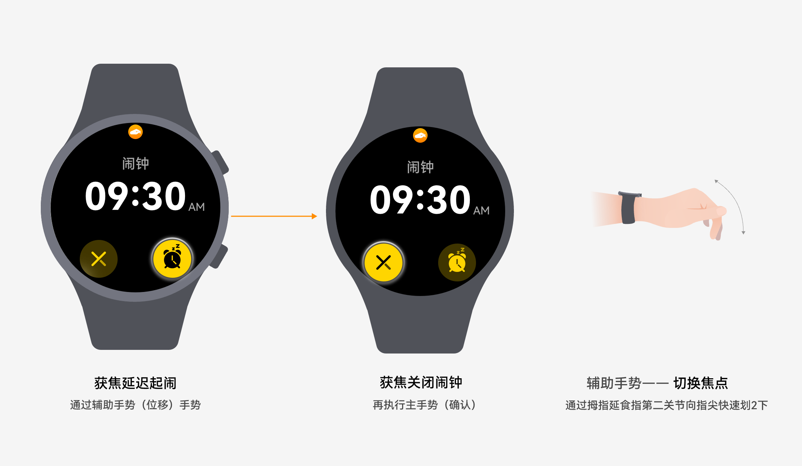

# 人机交互

更新时间：2026-03-03 09:51:30

来源：https://developer.huawei.com/consumer/cn/doc/design-guides/human-machine-interaction-0000002167648022

## 表冠

表冠作为智能穿戴设备特有的一种交互方式，又区分旋转、短按、双击和长按，建议规范操作方式以满足智能手表通用的、功能响应及时的使用场景。

### 原则

- 通用的：表冠交互的类型和方式应该具备广泛适用性，易于操作，且支持部分功能自定义。
- 响应及时的：表冠交互主要以表盘、语音提醒等方式进行反馈，及时性不仅体现在界面反馈的速率上，同时也要保证信息刷新的即时性。

### 类型

手表侧边对应有相应数量的表冠，以具有代表性的上下表冠说明短按和长按实现的功能交互。

- **上表冠**

短按

在表盘界面，短按上表冠调起 Launcher，显示应用程序列表。在非表盘界面，除个别例外场景外，单击上表冠均可返回表盘界面。

例外场景：

1. 使用运动功能时，单击上表冠，手表显示该运动功能的暂停/启动界面。
2. 来电时单击上表冠，来电静音，手表停留在电话界面；再次单击，返回来电前的界面。
3. 闹钟响铃时单击上表冠，闹钟延时，且手表返回表盘界面。
4. 若表盘有实况通知时，点击表冠会隐藏实况通知。

长按

长按上表冠 3s 执行“关机/重启”操作。

双击

双击上表冠调起多任务选择的界面，再次单击上表冠可直接返回表盘；

旋转

旋转上表冠，作为通用的输入方式，可对界面执行滚动，缩放以及调节数据的交互操作。

在未与上述交互出现冲突的前提下，允许应用定义其它的交互操作。

- **下表冠**

下表冠是功能按键，仅支持短按、长按和双击，不支持旋转。

短按

1. 在表盘界面下，短按下表冠默认调起锻炼 App；用户可在设置中更改为其他的应用或不设置任何应用。
2. 在应用内，短按下表冠可以执行对应的设定功能，开放给三方应用自行定义，比如秒表暂停/启动等用户明确的快捷操作。

双击

在表盘界面下，双击下表冠默认调起银行卡应用（仅支持NFC支付应用）；用户可在设置中更改为其他支付应用。

长按

任何界面下，长按下表冠 1s 可调起语音助手；用户可以在语音助手的设置中关闭此功能。

## 智慧手势

智慧手势是智能穿戴设备除屏幕交互、表冠交互和按键交互外的独特感知交互方式。在情景障碍，需要单手处理的场景，用户可以使用敲击手指和滑动指关节实现控制和切换选择诉求。

### 场景选择原则

便捷控制，而非“无障碍”的全量操作

1. 提醒场景，需及时处理的控制，如电话、闹钟等
2. 高频使用场景的便捷操控，如播控中心“下一首”
3. 不方便双手点击操作的场景，如遥控拍照

### 类型

- **主手势-确认：**用户通过拇指和食指指尖快速触碰2下以完成焦点确认交互

- **辅助手势-切换焦点：**用户通过拇指沿食指第二关节向指尖快划2下以完成切换焦点交互

### 如何使用

一般情况下，智慧手势适用于具有控制意图的应用，如闹钟、来电和遥控拍照等等。

1. 界面中有明显的圆形可点击控件
2. 应尽量避免非圆形控件，如智能穿戴中的弧形按钮
3. 按钮的数量不宜太多，尽量控制在3个及以内
