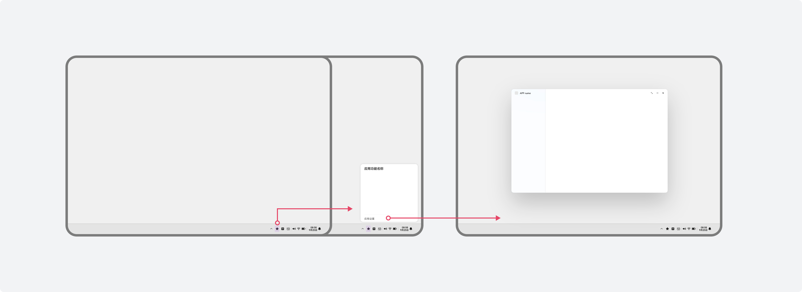
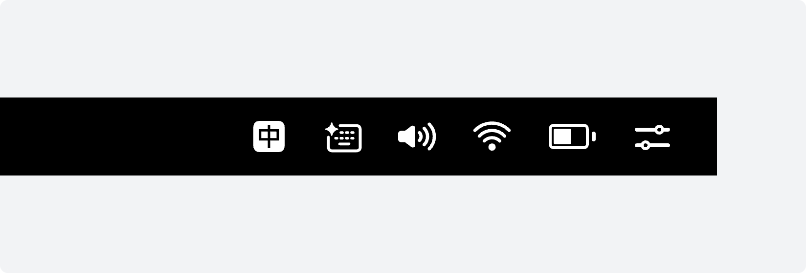

# 应用接入状态栏

更新时间：2026-05-27 02:05:30

来源：https://developer.huawei.com/consumer/cn/doc/design-guides/statusbar-0000002319710910

#### 状态栏

状态栏用于显示设备当前的状态信息，包括时间、WLAN、电量、音量等，也支持用户快捷使用应用功能和设置应用功能，如输入法、截屏等。状态栏默认显示在屏幕的底部区域。

#### 适用场景

 - 建议场景：应用长时间使用时，需提供部分重要应用功能，以便高频和快捷操作。
 - 不建议场景：应用短时间使用或在应用窗口内就能更加便捷操作的功能。

|  |

#### 交互规则

**鼠标左键**
1. 点击应用功能图标，直接触发相对应的功能操作，如截屏。
2. 点击应用功能图标，呼出快捷功能详情面板，适用于应用提供部分高频或重要功能，同时也可通过面板跳转至应用窗口。不推荐点击应用功能图标后，直接跳转至应用窗口。

|  |
| 推荐体验 |
|  |
| 不推荐体验 |

**鼠标右键**

鼠标右键点击应用功能图标，可呼出功能管理菜单。应用可提供“退出”等菜单项。

**鼠标悬停**

鼠标悬停在应用功能图标，可显示气泡提示。应用可根据场景提供当前状态或应用功能名称。

|  |  |
| 鼠标右键 | 鼠标悬停 |

#### 详情面板

#### 面板构成

功能详情面板结构：包含标题区、内容区和更多设置区，应用可根据场景按需组合。

 - 标题区：应用需定义功能名称。
 - 内容区：应用按需定义功能内容。
 - 更多设置区：应用按需提供相对应地应用窗口跳转入口，支持点击直接打开窗口。

|    |

#### 面板视觉规则

**标题文本**

文本大小：Title_S（Bold）

文本颜色：font_primary

**标题文本超长规则**

文本至多显示一行，逐级缩小字号至 16sp，仍然超长使用“…”截断。

**模糊材质**

状态栏菜单默认附带模糊和阴影材质，且支持深浅两套效果。

|    |

**面板最大高度**
1. 应用可根据内容配置高度。
2. 最大高度：桌面高度-dock栏高度-上下安全间距8vp*2。
3. 超过最大面板高度后，内容区增加滚动条，通过滚动条上下滑动查看内容。

|  |

#### 图标样式

状态栏是桌面重要的一部分，视觉效果需要和谐美观。不推荐直接使用色彩鲜艳的应用图标，推荐上传系统图标，具体样式请参阅[HarmonyOS Symbol](https://developer.huawei.com/consumer/cn/doc/design-guides/system-icons-0000001929854962)。

|  |  |
| 推荐样式 | 不推荐样式 |

**图标尺寸和颜色**

 - 图标尺寸：20*20vp
 - 热区大小：34*34vp
 - 资源格式推荐 Symbol 与 SVG 格式，其次为 PNG 格式。

|  |  |
| 浅色背景-图标颜色：#000000 90%不透明度 | 深色背景-图标颜色：#FFFFFF |

#### 开发文档

应用接入状态栏请参阅开发指导[Status Bar Extension Kit](https://developer.huawei.com/consumer/cn/doc/harmonyos-guides/status-bar-extension-kit-guide)。
