# 应用设计

更新时间：2025-07-01 03:19:34

来源：https://developer.huawei.com/consumer/cn/doc/design-guides/app-design-0000002353509845

应用窗口的内容区作为展示信息的空间，需要根据业务类型合理选择布局、控件元素和响应式布局。

## 应用布局

目前电脑端上常见的应用布局，可以分为以下三种。

| 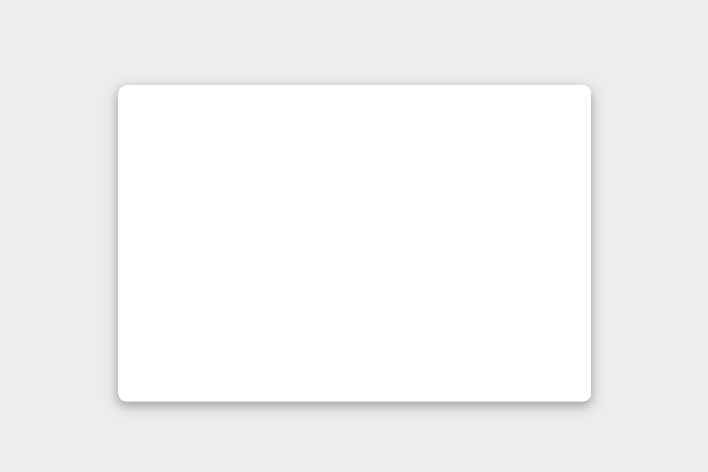 | 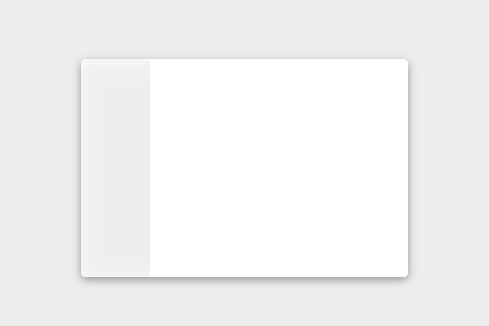 | 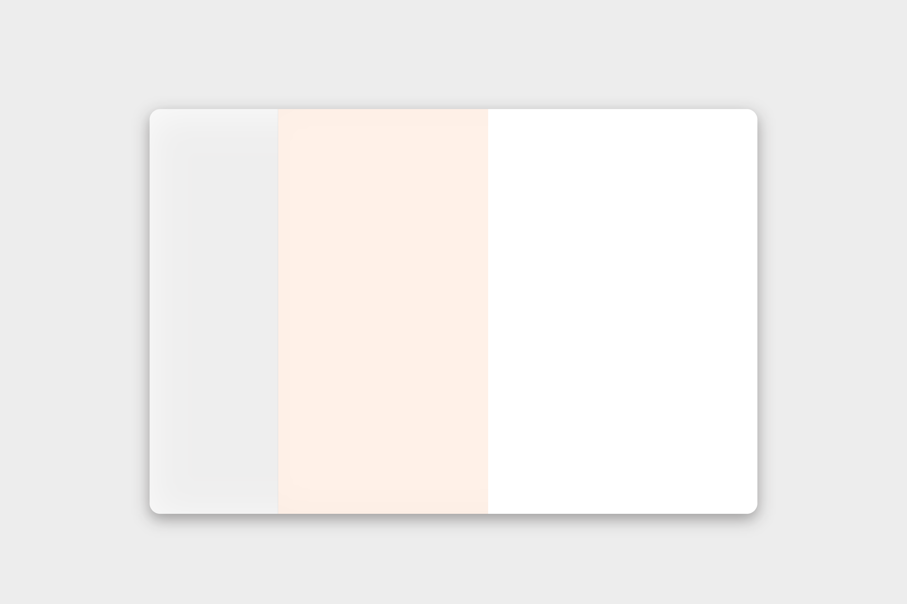 |
| --- | --- | --- |
| 通栏 | 双分栏 | 三分栏 |

### 通栏布局

通栏布局适用于层级关系简单，注重内容呈现效率的应用。应用可在窗口顶部区域添加菜单栏、工具栏，收纳复杂操作，使用户将注意力集中在更大的主要任务区上。

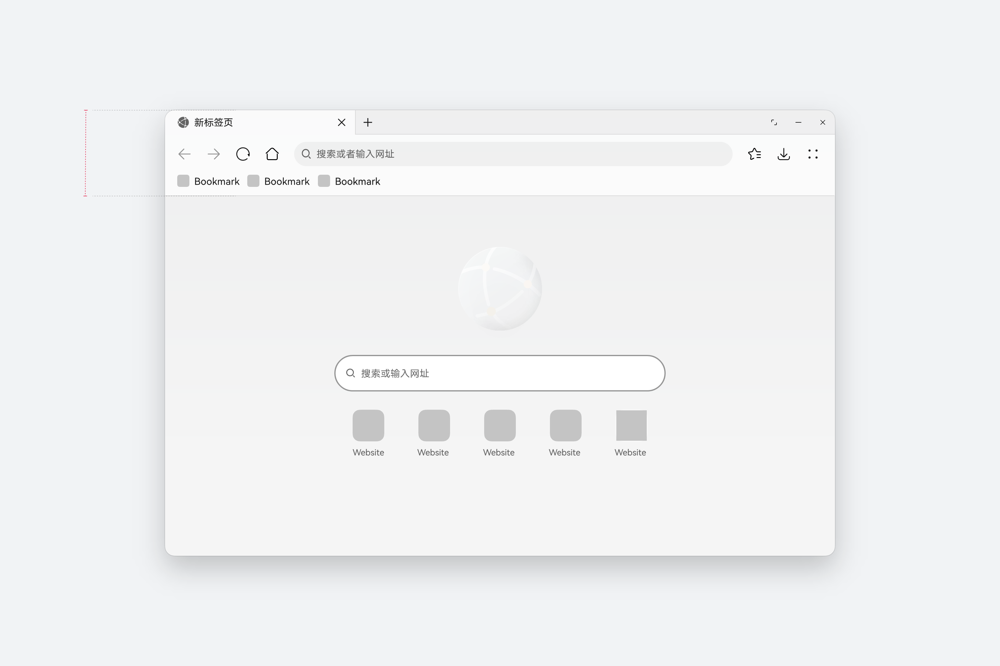

### 双分栏布局

适用于具备父子层级结构，以左侧列表 + 右侧内容的形式高效呈现信息。

|  | 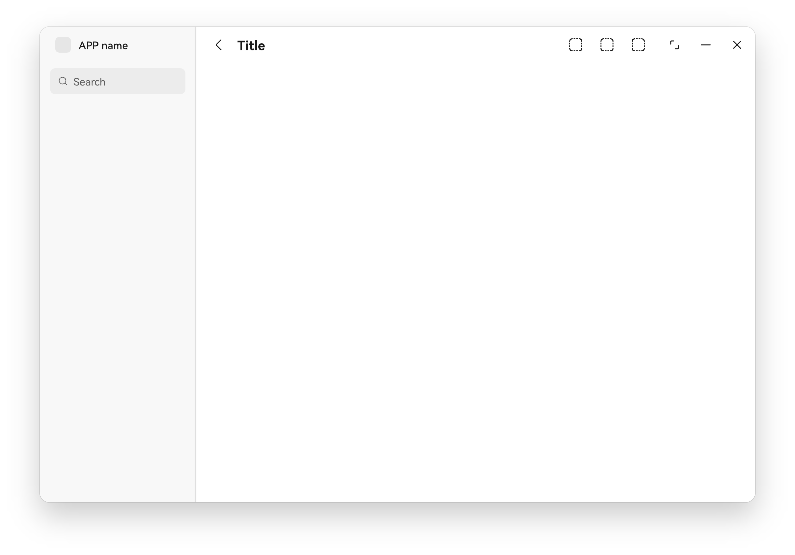 |
| --- | --- |
| 内容区为一级界面时，标题栏与通栏平级呈现 | 内容区为非一级界面时，返回按钮与标题栏结合呈现 |

双分栏结构也适用于大多数移动端适配到大屏设备上的应用，适配时通常将底部 tab 适配为侧边导航，右侧内容区占比较大，所承载的内容及控件元素更为丰富、自由。

| 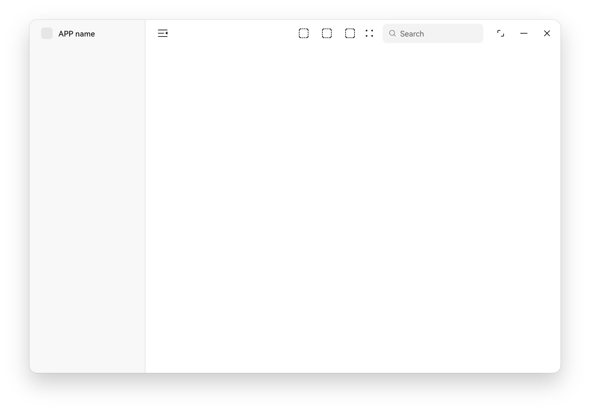 | 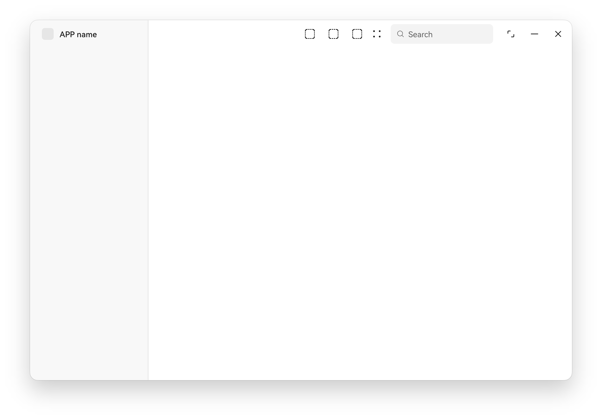 |  |
| --- | --- | --- |
| 示例: 左侧抽屉按钮 + 右侧工具栏 | 示例: 右侧工具栏 + 搜索框的复杂构成 | 示例: 内容区内居中呈现的分段按钮 |
| 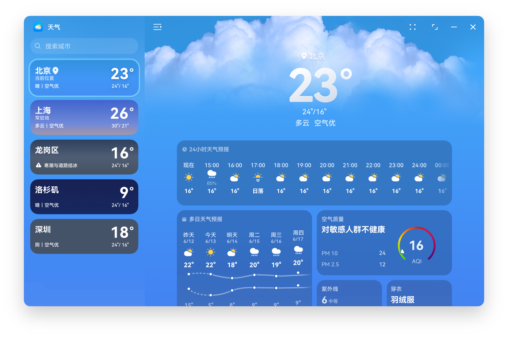 |  | 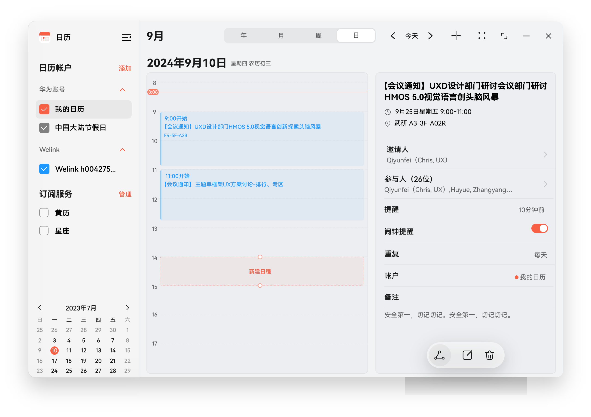 |
| 天气 | 应用市场 | 日历 |

当应用适配电脑端窗口时，建议优先选择侧边导航栏。导航栏可以承载更多的信息，提升信息呈现效率，更符合效率型设备的使用场景。

### 三分栏布局

适用于具备递进式导航的、层级结构较复杂的应用，常见于办公类应用及 IM 社交类应用。

构成

| 序号 | 元素名称 | 描述 | 显示区域 |
| --- | --- | --- | --- |
| 1 | 抽屉按钮 | 用于收起侧边导航栏，业务根据需要选配 | B 栏列表区 |
| 2 | 标题栏按钮 | 内容区默认不呈现左侧标题栏，仅呈现右侧图标按钮；          最多支持 3 个图标按钮，超出数量的图标收入最后 1 个[更多]图标里 | B 栏列表区 |
| 3 | 放大按钮 | 当非一级界面支持扩大至窗口整屏时，可配置此按钮 | C 栏内容区 |
| 4 | 工具栏 | 最多支持 6 个图标按钮，超出数量的图标收入最后 1 个[更多]图标里 | C 栏内容区 |

- 常规三分栏窗口，包含 A 栏侧边导航栏，B 栏列表区及 C 栏内容区。
- 窗口中的其他控件元素，从通栏下方开始，贴边往下排布。例如：

- B 栏的搜索入口，C 栏的标题栏等。

| 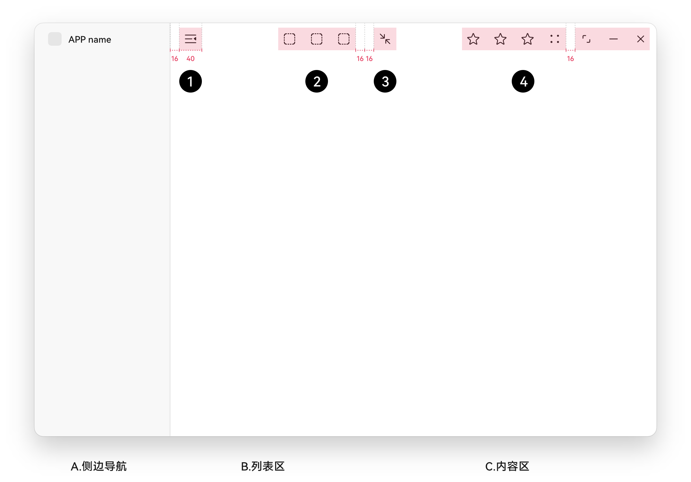 | 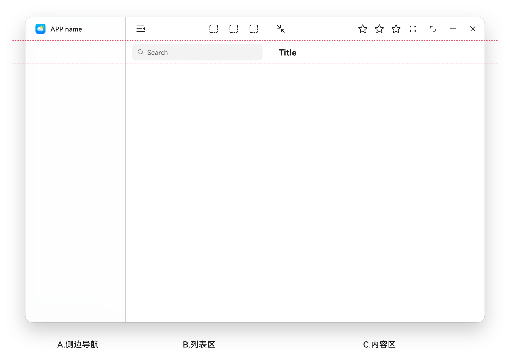 |
| --- | --- |
| 窗口通栏元素说明 | 其他窗口控件元素示例 |
| 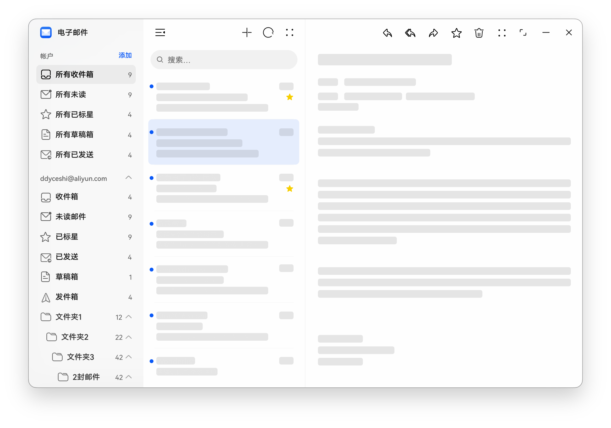 | 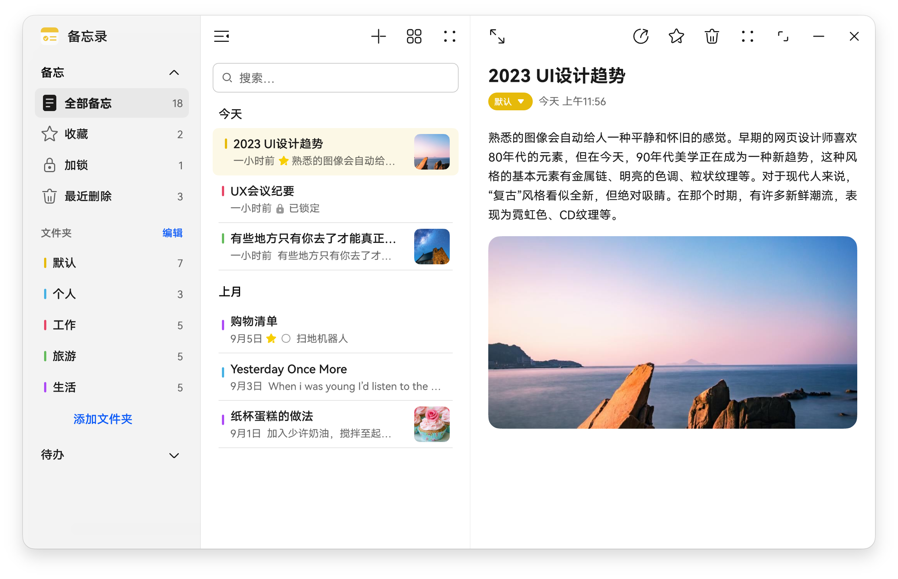 |
| 邮件 | 备忘录 |

### 布局转换

- 应用使用侧边导航栏时，可提供抽屉按钮，方便用户进行收起和展开，提供用户更灵活的任务操作区域。
- 为了清晰指引窗口收起后的界面层级，可在收起的 B 栏呈现标题栏，其内容与 A 栏中所属列表的名称保持一致。
- 应用也可直接拖拽分栏边缘，对布局进行切换，请参阅“[断点系统](https://developer.huawei.com/consumer/cn/doc/design-guides/design-layout-basics-0000001795579413#section525952492)”。

## 使用多态控件

电脑控件与手机控件为同一个控件，是对手机控件的继承和新增，针对键鼠与触控场景进行补充与改造，以满足多设备需求。例如，在电脑上，可考虑利用光标悬停态增加控件说明。具体控件使用，请参阅“控件”章节里对电脑控件的差异化介绍。

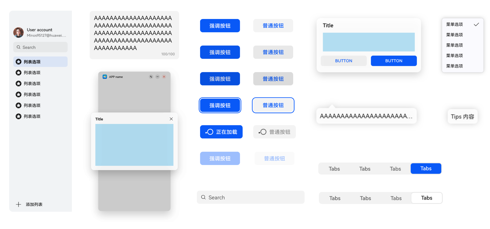

## 多窗口协同

电脑拥有更大的显示空间，更精准的交互操作。在设计过程中，可充分利用多窗口能力，增强应用并行任务能力。

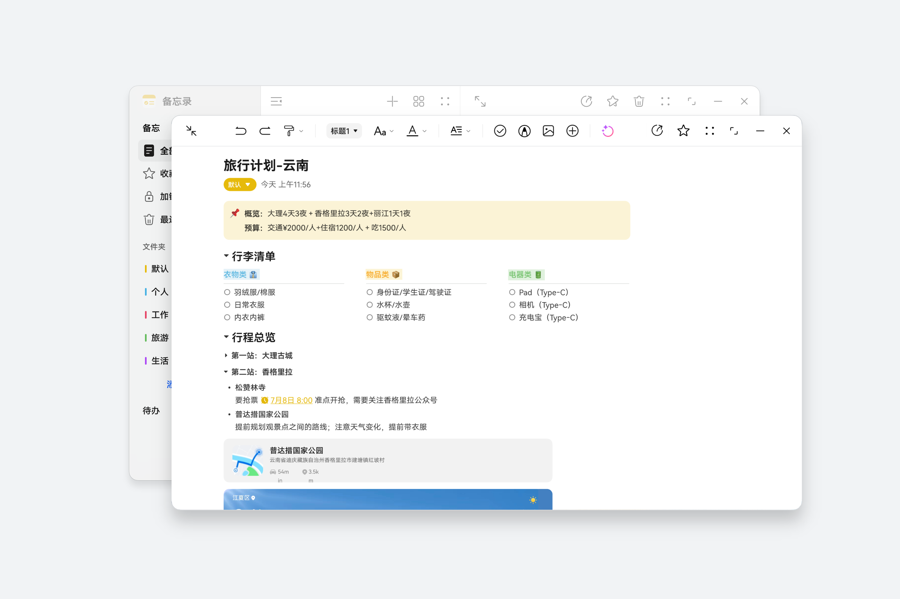
