# 折叠电脑

更新时间：2025-11-11 08:08:05

来源：https://developer.huawei.com/consumer/cn/doc/design-guides/foldable-pc-0000002322600098

## 设计概述

折叠电脑以“沉浸无界、灵动流畅、直觉自然”为核心设计理念，深度融合折叠屏的硬件特性与多模态交互需求，针对系统架构和桌面应用在多形态变换、应用适配、交互输入、系统动效表现等方面，为相关设计师和开发人员提供 UX 设计指南和规范，确保用户在任何场景下均能获得连贯且高效的使用体验。

## 设计原则

沉浸无界

充分利用屏幕可折展的优势，在展开态、折叠态为用户打造一种完整、连续和开放的交互体验，将更多的界面空间用于多维的内容呈现，从而让用户感受到技术与设计的无界融合。

一体一致

在兼顾折叠形态的个性化体验基础上，遵循电脑产品统一的设计逻辑，通过一致的交互方式和反馈机制，保障用户在不同设备上使用时能够获得相似的体验。

简洁高效

系统的视觉表现应该是简洁的、直观的，通过轻量化的交互流程、一致的设计语言和即时的操作反馈，兼顾折展和旋转变化场景的功能适配，帮助用户以最少的精力和时间完成任务。

灵动流畅

设备形态变化下的动效体验应该是自然流畅且富有情感的，桌面元素和窗口变化是有序自然的，为用户创造愉悦、无缝且生动的系统动效，让每一次操作都充满灵动之美。

直觉自然

不同设备形态下均需符合用户对应的心理模型和日常习惯，通过模拟真实世界、参考业界惯性规则、沿用全局设计规范，符合人因要求，以降低学习成本，提升使用愉悦感。

## 形态说明

折叠屏电脑的核心价值在于其多变的硬件形态，可以灵活适配不同使用场景，它兼具一体机、笔记本和平板三种使用模式，能满足用户在多种场景下的办公、创作、娱乐、休闲和展示等需求。

折叠电脑有四种主要的设备形态，分别为便携态、折叠态、横展态、竖展态，产品开发时需要兼顾以上多种形态的设计适配，保障在不同交互形态下均能给用户最佳的视觉观感和交互体验。同时形态间变化还需自然有序，主体任务仍居于视觉中心，遵循任何界面和场景下信息呈现的逻辑性和完整性，保障用户体验的连贯性。

形变响应时优先级遵循：覆盖键盘→旋转→折展，折叠态下不响应旋转，展开态下覆盖键盘变为便携态。

## 适配原则

### 体验连续

设备可随时变换形态，屏幕需要及时响应折展和旋转变化，在体验上需要保障用户体验的连续性，应用需要同时遵循设备形态的屏幕特征，也要保证应用内操作和体验的连贯。

- **屏幕兼容：**由于屏幕尺寸发生变化，应用应采用适当的手段对屏幕上内容布局进行优化调整。
- **应用连续：**应用在折叠与展开状态切换的过程中保持正常运行。

### 体验增值

多样化的设备形态将创造更丰富的用户体验场景，这会给用户体验带来某些方面的增值。

- **双屏协同：**折叠态上下双屏分区能给用户提供双屏协同的机会，满足更多的多任务并行或者主副任务协同的场景；
- **支持更多场景：**不同的设备形态满足用户在不同场景下的体验需求，无论是外出还是固定办公，都可以自由切换；

## 控件适配说明

### 弹出型控件

例如弹出框、半模态、Toast这种独立的弹出控件在显示和交互上尽量避免出现在中轴区域，避免由于设备双屏衔接处反光和不易操作导致的不便。在折叠态时，遵循双屏独立反馈原则，即从上下屏触发则从上下屏反馈，展开态时则同单屏无异，跟随通用电脑弹窗规则。

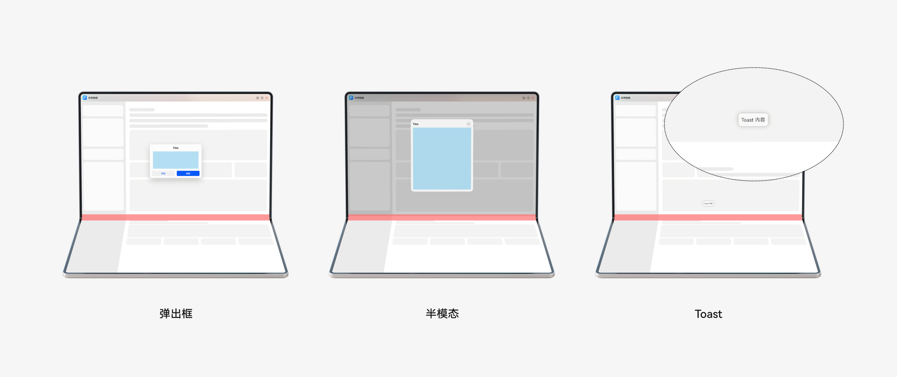

像Popover、菜单、文本选择菜单这类应用内的各种指向性弹窗在显示和交互上尽量避免出现在中轴区域，避免由于设备双屏衔接处反光和不易操作导致的不便。

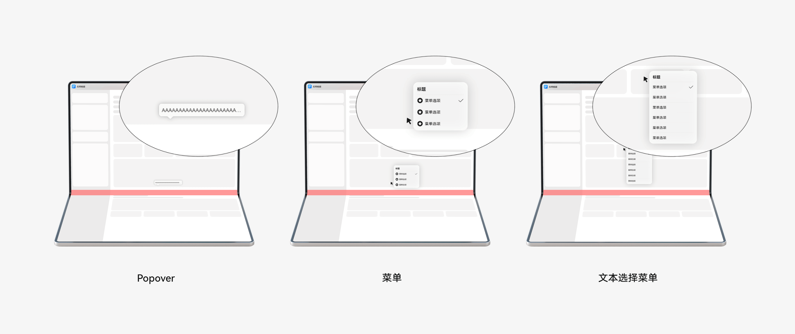

Popover 菜单 文本选择菜单

### 侧边导航栏

侧边导航栏

应用内的侧边导航栏主动避让中轴区域，避免显示在中轴区导致不易操作和查看。

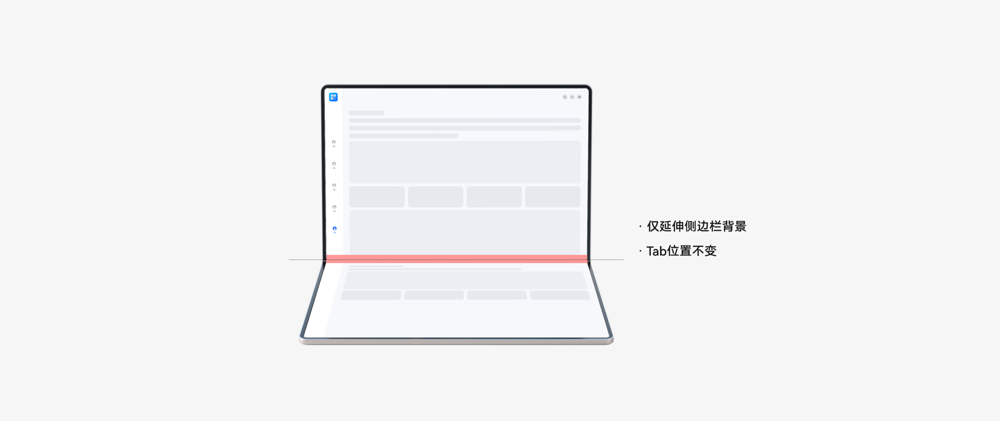

## 虚拟键盘

基于“形态追随行为”的设计理念，虚拟键盘设计不应局限于静态键盘的简单复制，而应成为能够自适应调整的智能化输入解决方案。折叠电脑拥有两种规格的键盘样式，当设备处于折叠态时，可唤出全尺寸键盘。

| 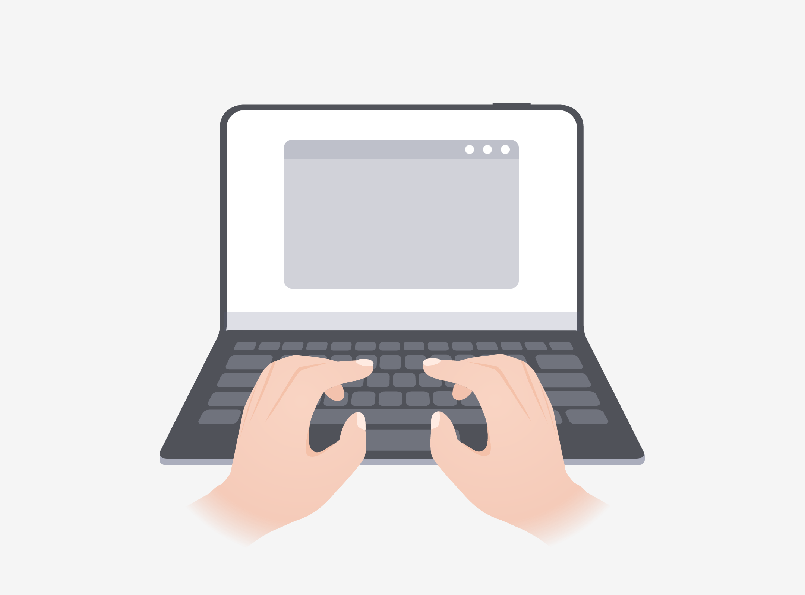 | 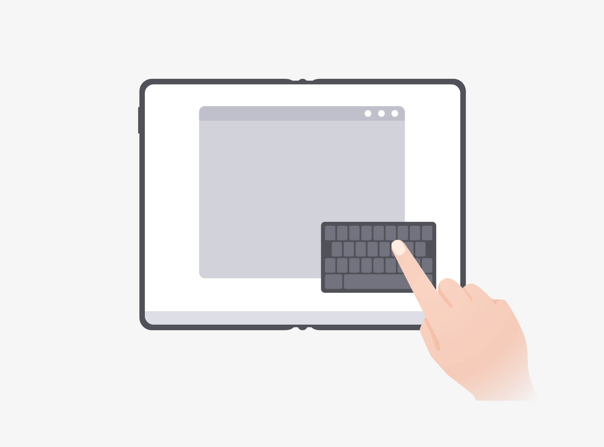 |
| --- | --- |
| 折叠态-全键盘 | 展开态-悬浮键盘 |

在全尺寸键盘当中，应用可以通过情境式的指令提示来降低用户的记忆成本，当长按 Shift、Ctrl、Alt 等辅助键时，主键盘区即时浮现对应快捷键指令的文本和图标 (如 Ctrl+C=复制) ，有效降低用户记忆快捷键的认知负担。

| 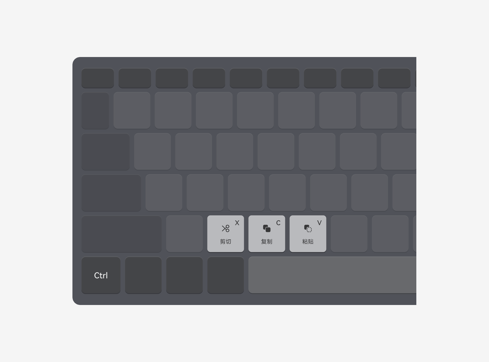 | 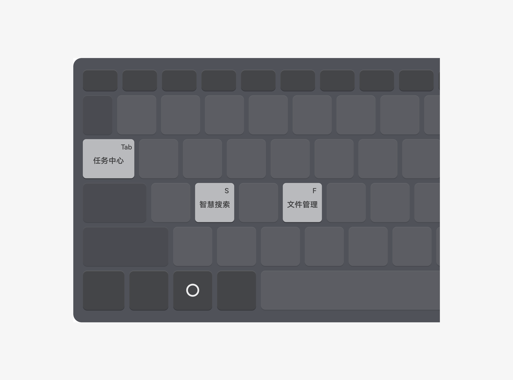 |
| --- | --- |
| 带图标 建议快捷指令优先显示符号＋指令，保留原有字母，便于用户快速识别对应功能。 | 纯文本 当指令文本过长或应用未设置指令图标，则支持纯文本显示快捷键，同时保留原有字母。 |

## 布局&交互创新

### 布局框架

- **内容延展：**该方式直接遵循多设备响应式设计的规范原则，基于设备的屏幕尺寸、屏幕方向进行响应式适配，进而呈现更多更完整的应用信息内容。
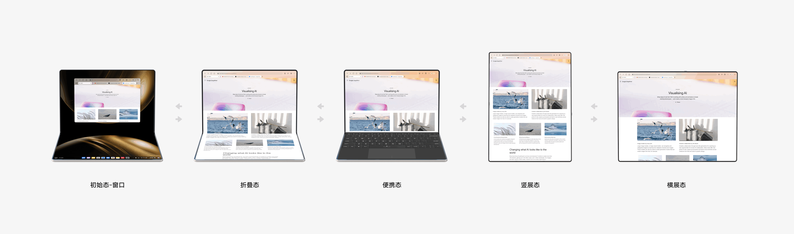
- **结构挪移：**应用的结构布局中的组成构件，可随屏幕形态的变化而调整，更改某一组成构件的位置和放置方式，使其获得更好的显示观感及交互空间，可以有助于提升用户的工作效率。
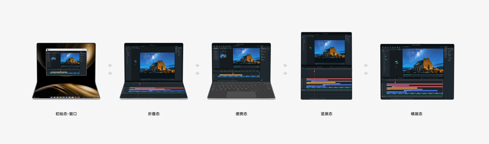

### 布局建议

- **双屏分区布局显示：**如应用界面所处层级较浅，可选择通屏瀑布流形式显示。当用户打开应用某一深层级模块时，原本需要独立窗口或单独全屏页面，建议上下分区显示当前应用内容。
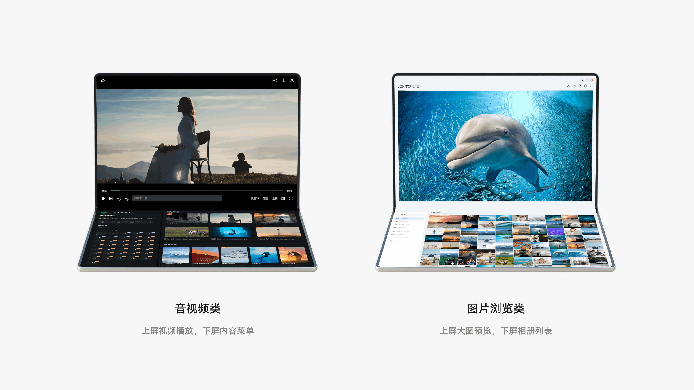
- **初始通屏，下钻分区：**某些情况下，若当前页面的内容无法覆盖上下屏，则在下屏显示强相关的信息。
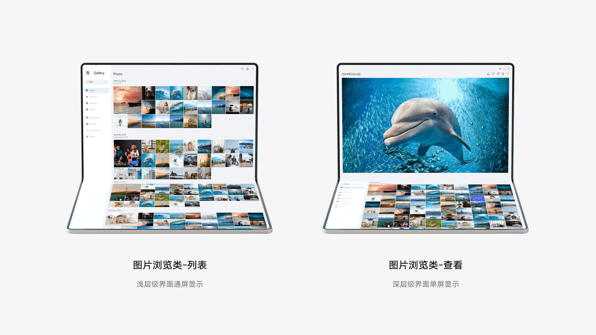
- **上屏主任务，下屏辅任务：**复杂交互场景下的应用，可能会涉及多任务执行，包括主线任务和辅线任务，结合用户使用笔记本电脑的使用场景和习惯偏好，对折叠态下双屏的定义为上屏显示主任务，下屏显示次任务；PPT 播放/音视频编辑-部分信息的拓展和信息重新分布 上屏更加沉浸，下面更方便操作。
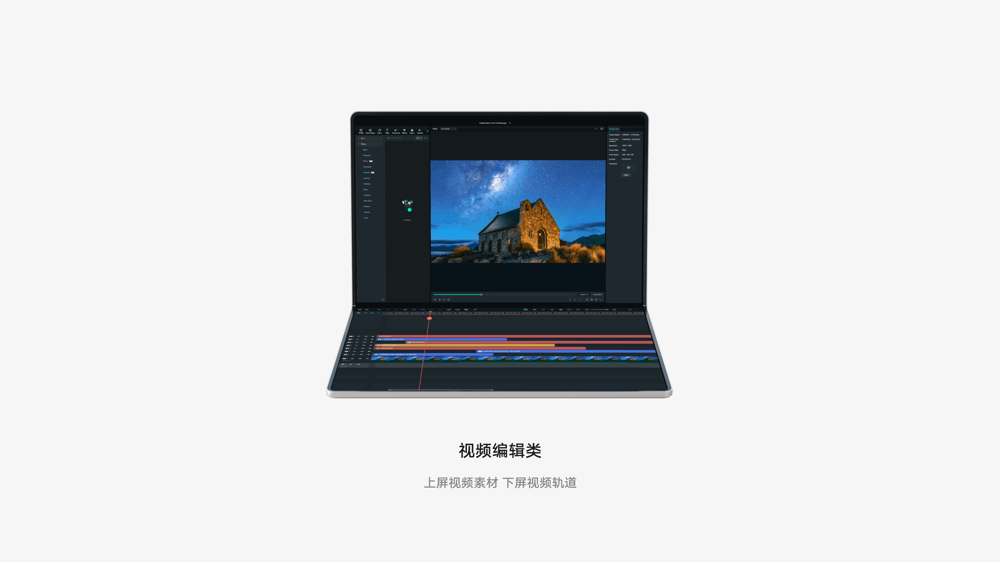

## 适配要求

### 中轴避让

折叠电脑的双屏衔接处会存在屏幕反光，屏幕本身也会相较于其他的屏幕更脆弱和不易操作，为同时兼顾 UX 设计需求和屏幕可靠性需求，轴区显示需要做非功能热区的避让设计。建议应用在轴区避让 46 vp 到 64 vp。

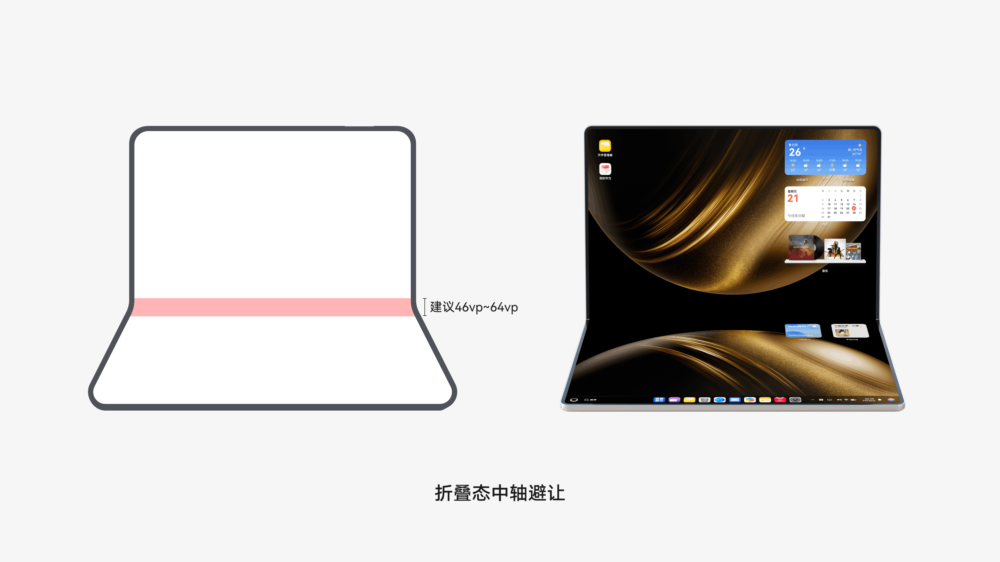

- **显示避让：**该区域尽量不放置高信息密度，显示内容小，信息层级多的内容；
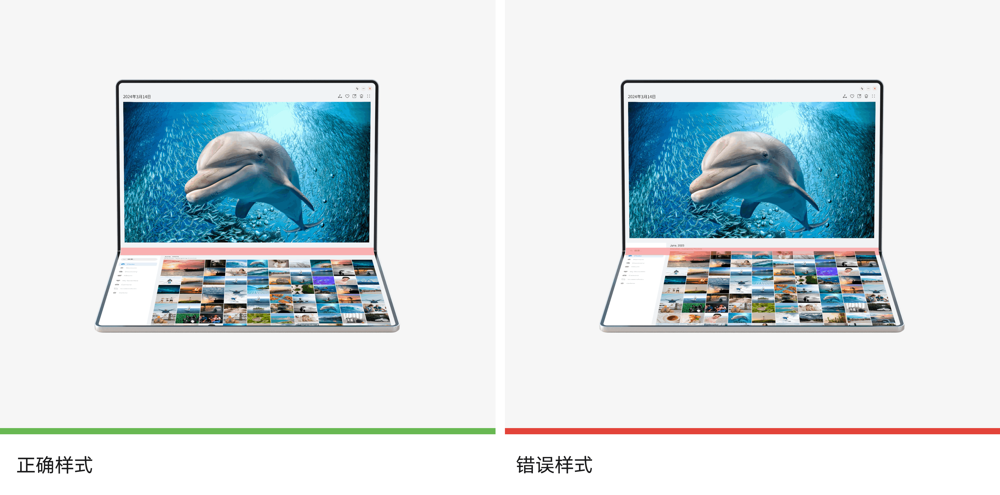
- **交互避让：**该区域尽量不设置指令复杂、高灵敏度、高操作精度的交互操作。

### 形变连续

折叠态与展开态相互转化时，界面布局结构保持整体稳定。应用旋转时保持结构稳定，若以窗口拓展/结构挪移方式进行适配的，则横屏状态退回到常规上屏全屏形态，反之亦然。覆盖键盘后，原全屏页退回上屏单面全屏状态，反之亦然。

以视频播放场景为例

## 典型应用案例

我们从一些常见的特征型场景入手，整理出比较适合于该场景的界面设计样式。应用开发者可以参考这些样例，结合自己应用的业务类型及具体的业务场景，进行折叠电脑上的最佳界面适配和创新设计。

### 社交通讯类

社交通讯类应用的主要场景一般来说是聊天窗口和消息列表，一般采用三分栏的结构，用户场景明确，建议采用上下拉通的形式适配，以便露出更多信息。

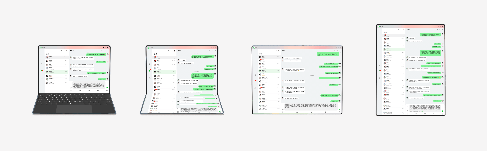

社交通讯类-内容延展

### 金融类

金融类应用的主要场景一般来说包括多个模块，比如数据趋势图、新闻消息模块、账户信息等内容，建议采用上下分区的方式，呈现更多差异化的内容。

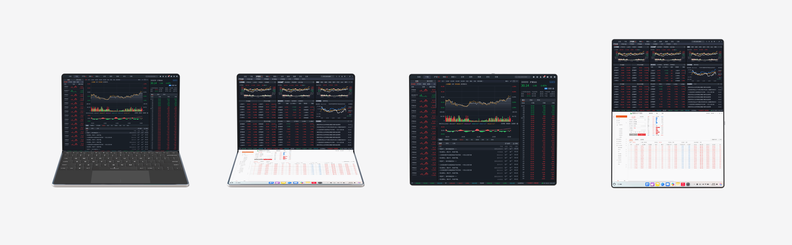

金融类-结构挪移

### 邮件类

邮件类应用的主要场景一般来说包括邮件列表和邮件的详细内容露出，一般为三分栏结构，采用上下拉通的方式可以展示出更多内容，增加阅读和查询效率。

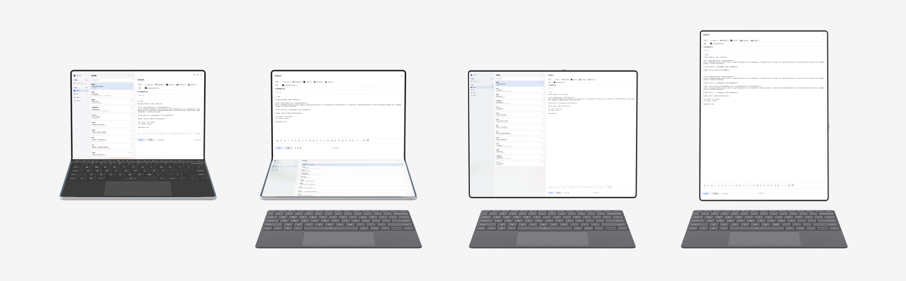

邮件类-结构挪移

### 影音娱乐类

影音娱乐类应用的主要场景包括沉浸式的媒体播放界面和相关的评论、菜单、列表等信息，采用上下分区的形式，能展示更多信息，保证用户沉浸式观看体验。

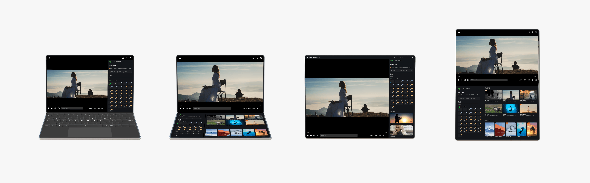

影音娱乐类-结构挪移

### 文稿编辑类

文稿类型的办公编辑应用，一般采用上下拉通的形式，展示更多的内容，便于用户查看更多信息，对比和查看上下文。

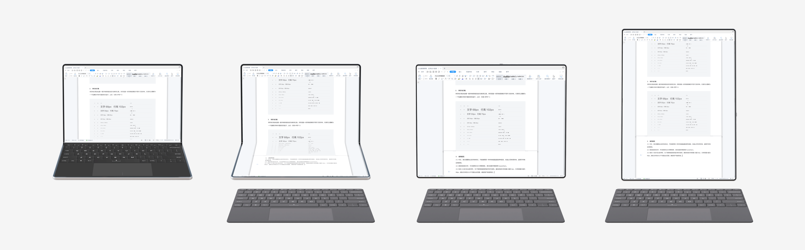

文稿类-内容延展

### 视频编辑类

视频编辑类应用一般会包括多个模块的工具、视频预览窗、轨道等复杂的功能场景，可以采用上下分区的方式摆放更多的内容，给视频播放区更大的显示空间。

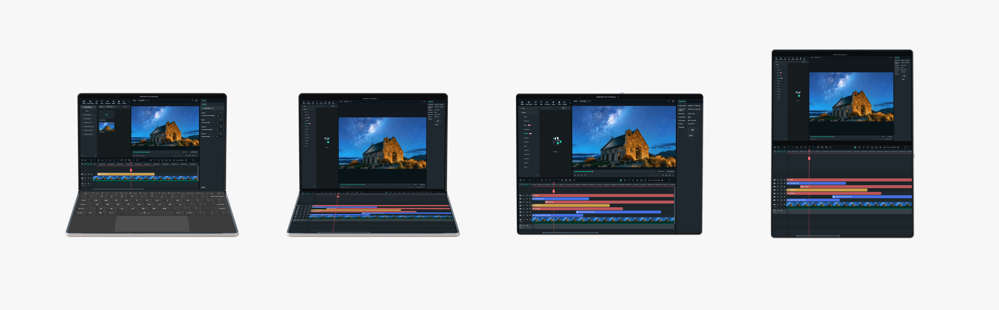

视频编辑类-结构挪移

### 图像编辑类

图像编辑类应用一般会包括多个模块的工具、画板、操作空间等复杂的功能场景，可以采用上下分区的方式摆放更多的内容，给画布更大的显示空间。

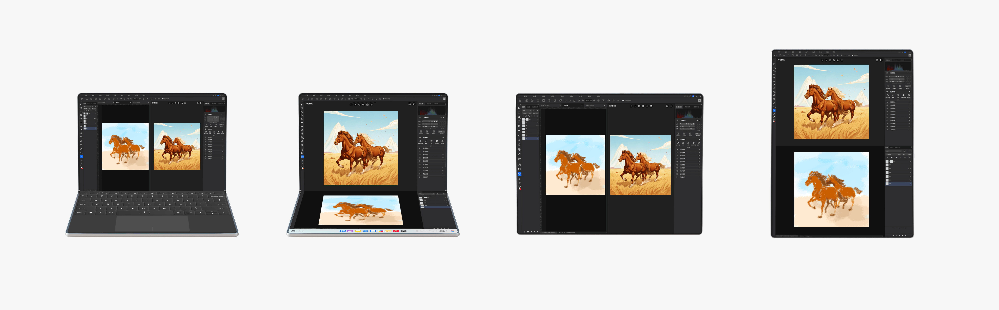

图像编辑类-结构挪移

### PPT编辑类

PPT 类型的办公编辑应用存在幻灯片播放的场景，可以将播放控制和工具模块下移到下屏，上屏沉浸式播放幻灯片内容。

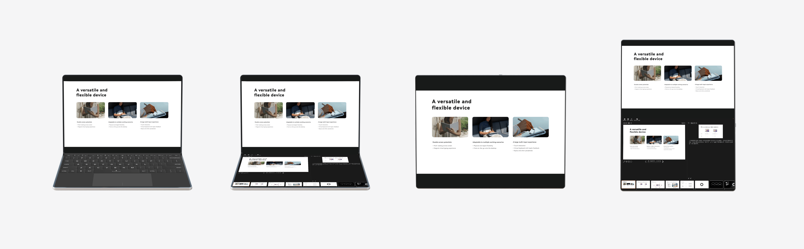

PPT 编辑类-结构挪移

### 网页浏览类

网页浏览类的应用，一般采用上下拉通的形式，露出更多的信息内容，提高用户翻阅查找资料和阅读新闻和数据的效率。

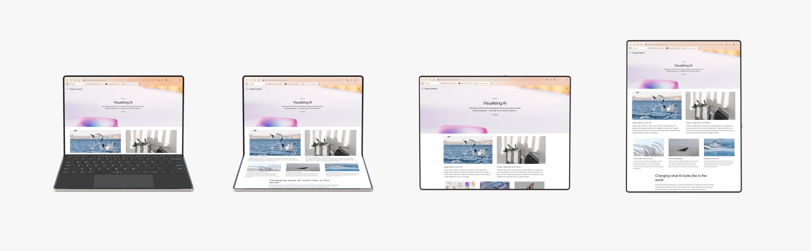

网页浏览类-内容延展

### 游戏类

游戏类场景的应用界面样式较多，游戏可以根据游戏本身的场景和玩法在折叠电脑上进行适配，比如，棋牌类对抗游戏，如象棋，可以在双屏适配。

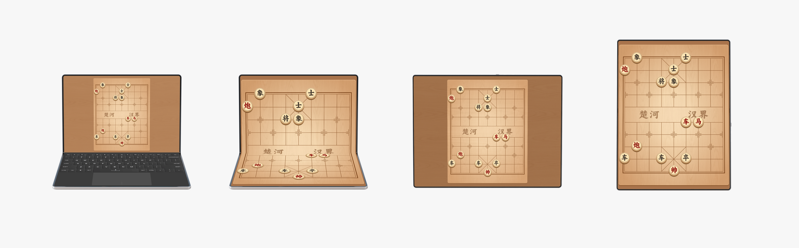

游戏类-应用定制

### 图书阅读类

图书阅读类场景在横向展开态，可以模拟真实书本的阅读场景，建议采用左右分开布局的方式。

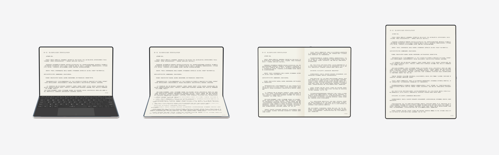

图书阅读类-结构挪移

### 双人视频通话页

视频通话需要适配折叠态，避免在中间折痕区域显示画面或操作按钮。上半屏显示视频画面，下半屏显示操作。需要避免视频通话在折叠状态下导致画面方向异常。

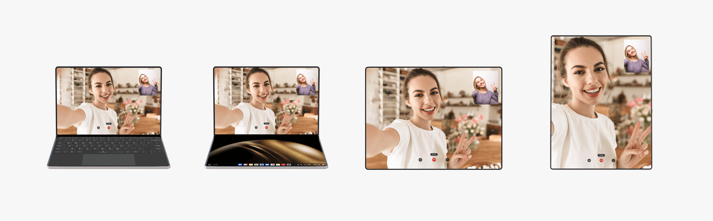

双人视频通话页-应用定制

### 沉浸全屏播放页

折叠电脑全屏播放视频时，点击选集、倍数等操作，通过侧边或底部面板的方式来呈现临时的操作内容。 从屏幕右侧触发侧边面板；在展开态从屏幕底部触发底部面板。

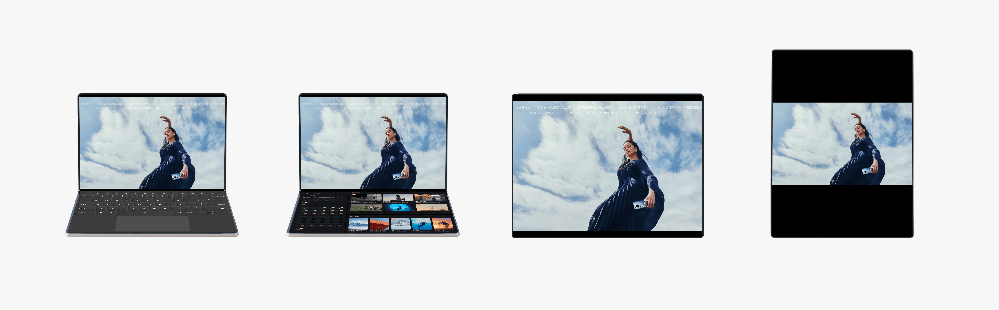

沉浸全屏播放页-多设备响应布局

### 图片浏览页

查找图片的界面，建议提供侧边栏，便于进行分类筛选和搜索等。

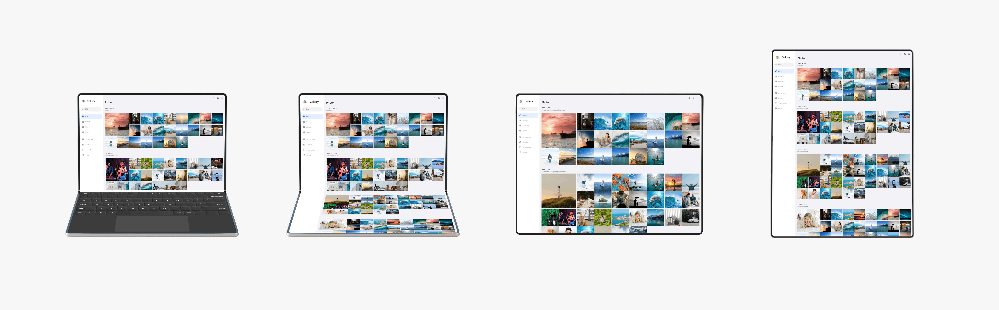

图片浏览页-多设备响应布局
