# 窗口框架

更新时间：2026-04-28 12:59:00

来源：https://developer.huawei.com/consumer/cn/doc/design-guides/window-0000002321868010

窗口是系统中各个应用的载体，用户通过窗口对应用内容进行查看和交互。在电脑上，窗口可作为一个单独对象进行查看和操作，通常支持打开、关闭、调整尺寸，支持最小化、最大化和分屏显示。

主窗口

用于显示当前使用的应用，不同应用窗口间可层叠，一般情况下，桌面上有且只有一个主窗口处于激活状态。

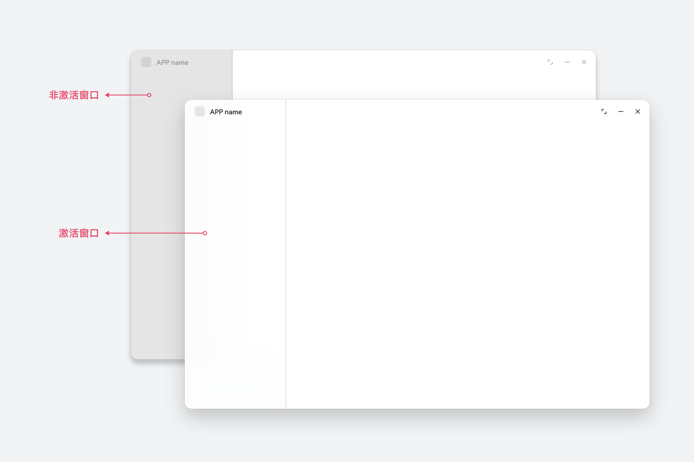

子窗口

从主窗口启动并且依赖主窗口而存在，按使用场景可分为模态、非模态两种类型，主窗口被关闭，子窗口也跟随关闭。根据应用需要，子窗口也可支持移动、响应拉伸改变尺寸。

| 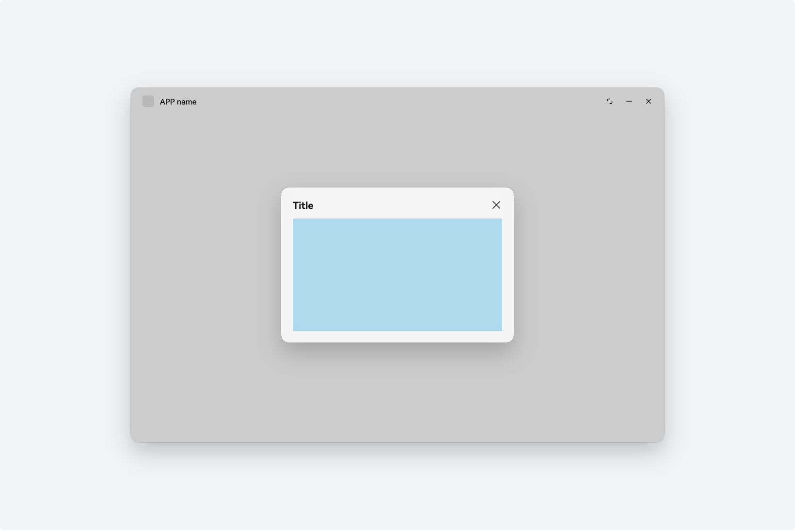 | 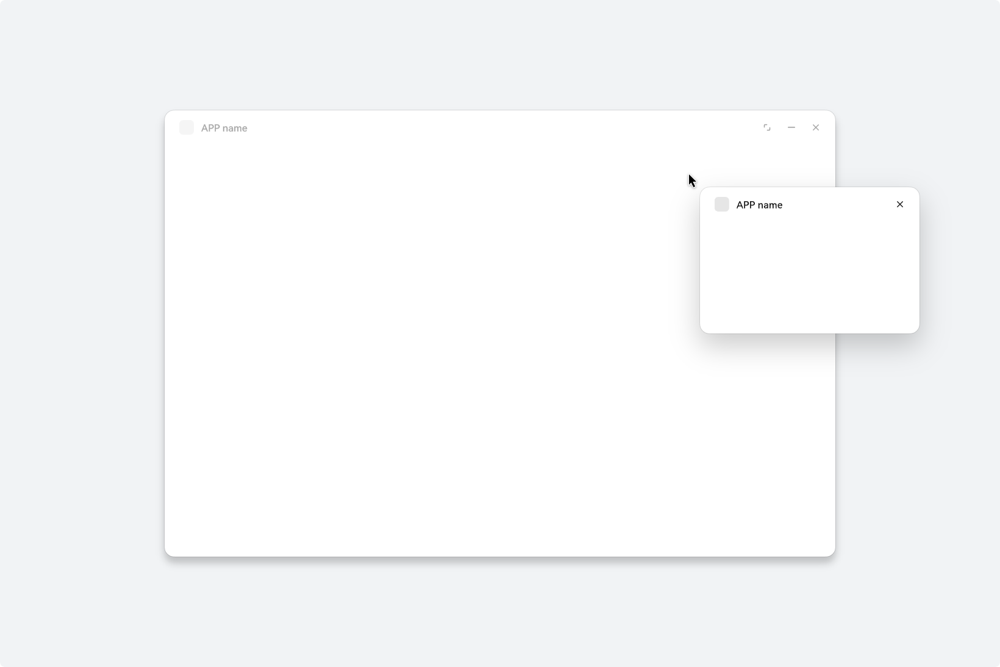 |
| --- | --- |
| 模态窗口         模态子窗消失之前，无法对下方应用进行操作。         模态子窗建议在窗口居中出现，出现时，下方主窗口有黑色蒙层。         模态子窗跟随主窗口的移动而相对移动，最小化主窗口时也跟随最小化。 | 非模态窗口         更为独立的子窗，可和主窗口应用协同操作。         非模态子窗建议在操作处跟手出现，出现时，下方主窗口无黑色蒙层。         非模态子窗不跟随主窗口移动和最小化。 |

## 窗口构成

窗口由容器层和内容区构成。

容器层用于展示应用品牌和控制整体窗口，通常包含标题、最小化、最大化、关闭等按钮，支持窗口操作；

内容区是用于用户与应用内容交互的部分。

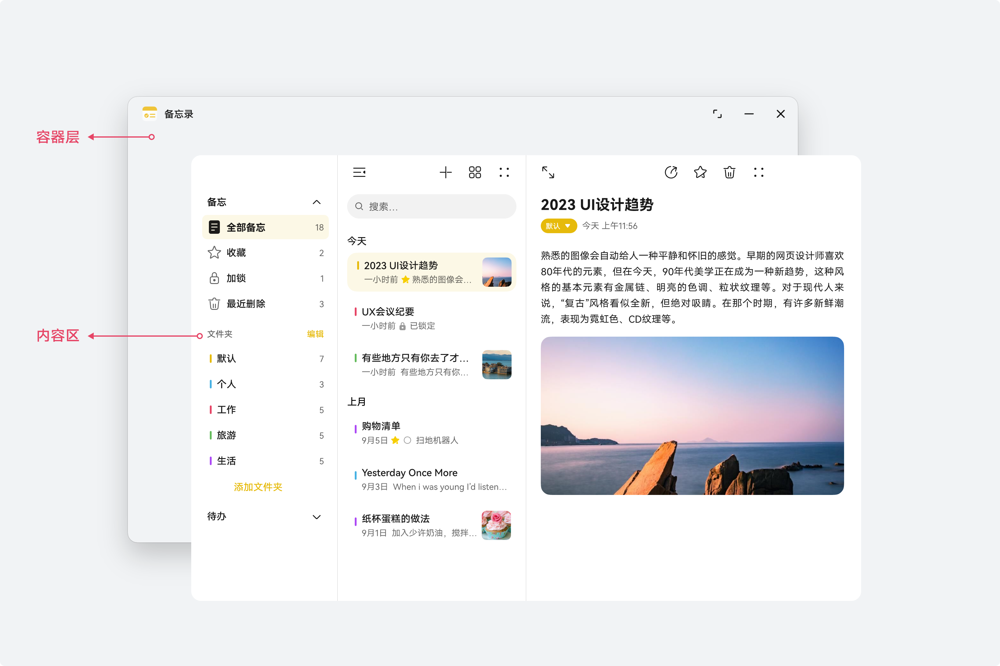

### 容器层

必选元素：窗口控制 (最大化、最小化、关闭)

可选元素：应用图标、窗口名称

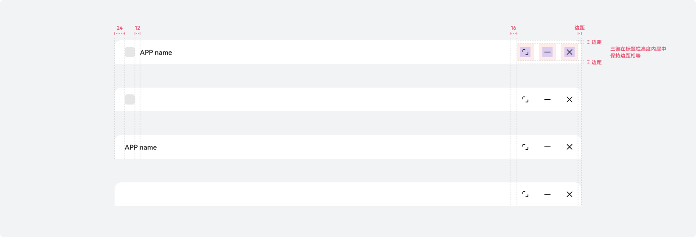

窗口标题栏高度支持应用自定义。推荐在设计电脑应用时，将应用工具栏与窗口标题栏结合，减少窗口顶部层级，从而让内容区可以更高效地容纳和呈现信息。

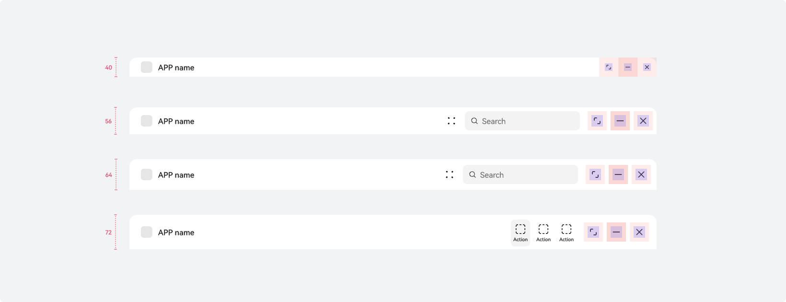

Compact 40vp：无需工具栏、搜索等控件时，应用自定义内容

Default 56vp：适用于标题栏、工具栏、搜索栏等通用控件

Medium 64vp：适用于图标 + 文字呈现的工具栏。当用户切换工具栏显示类型时，通栏高度跟随切换

Large 72vp：应用有需求时，可扩展到最大值

应用示例：

| 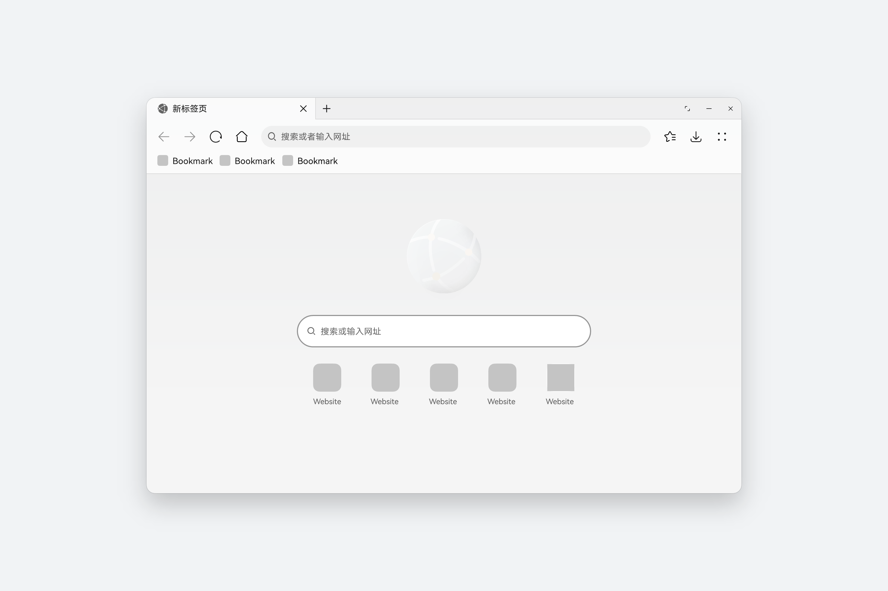 | 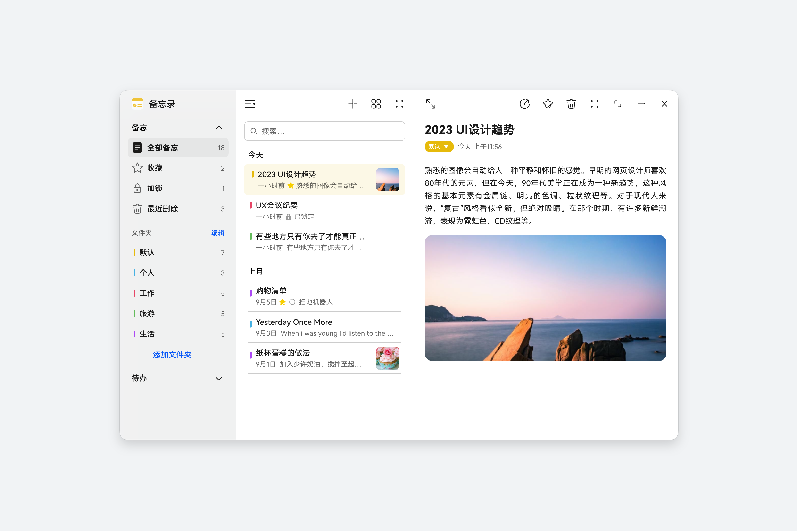 | 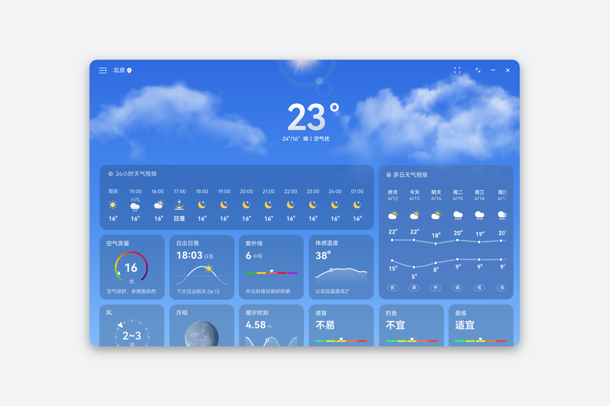 |
| --- | --- | --- |
| 浏览器：使用 Compact 标题栏，节省顶部空间 | 备忘录：使用 Default 标题栏，容纳常用编辑工具 | 天气：应用背景铺满窗口，沉浸感更强 |

当应用未做适配时，窗口提供默认的标题区背景、应用图标、应用名称以及窗口控制按钮。请结合应用场景设计顶部区域，避免仅使用基础标题栏。

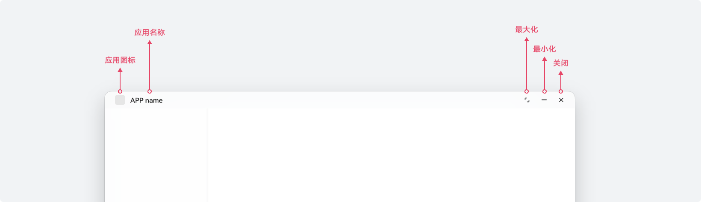

### 内容区

内容区是应用展示信息的空间，应用需重点关注窗口大小改变带来的布局变化，合理利用响应式规则，确保以最佳的布局来显示内容。

应用常见的内容区布局包括通栏、双分栏和三分栏结构。详细的布局适配和响应式规则，请参阅应用布局。

## 交互规则

### 窗口最大化、最小化和关闭

窗口标题栏提供了最大化、最小化和关闭按钮，用户也可通过双击标题栏进行最大化，或还原窗口尺寸。

窗口最大化时，默认保留状态栏和快捷栏，用户可在设置中修改为自动隐藏。应用如有需要，如视频、游戏类应用，也可配置进入沉浸式全屏。

| 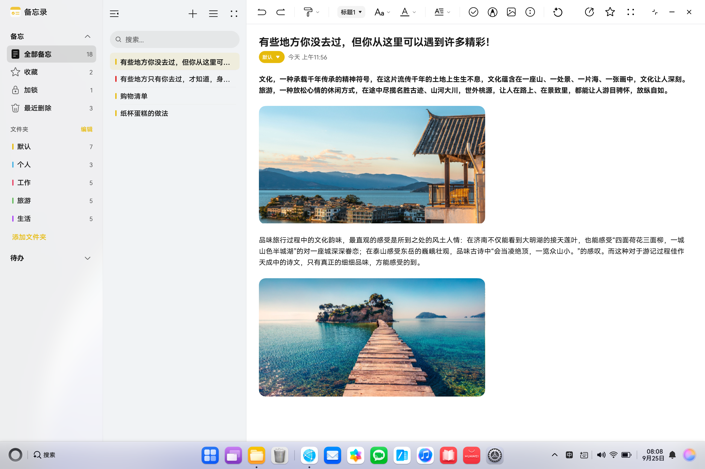 |  |
| --- | --- |
| 默认最大化 | 全屏 |

### 窗口回弹规格

移动窗口至屏幕外时，会触发回弹效果，以确保窗口易于再次拖动。兼容性应用窗口与非兼容性应用窗口保持一致。窗口大小、系统显示大小变化导致三键宽度变化时，回弹宽度跟随变化。不同窗口若三键宽度不同，则回弹宽度不同。

### 窗口分屏准入原则

在大屏设备中，用户普遍存在跨应用协同与多任务并行的核心诉求。为此，系统提供了灵活的分屏交互体验。为了确保应用能支持二分屏、三分屏的体验，推荐应用优先采用响应式布局设计（具体可参考 窗口断点），基于系统断点构建能够随容器宽度动态演进的界面逻辑。

窗口二分屏准入原则

在未支持相应布局之前，应用窗口的最小宽度应处于【 360vp, 512vp 】内，以保证二分屏的正常使用。

## 视觉规则

### 窗口尺寸

每个窗口初次启动时按默认尺寸显示，支持拉伸为任意尺寸的窗口，支持最大化、分屏。在设计过程中，除了默认尺寸，还应结合响应式规则，兼顾最大化、分屏、最小尺寸时的窗口显示。

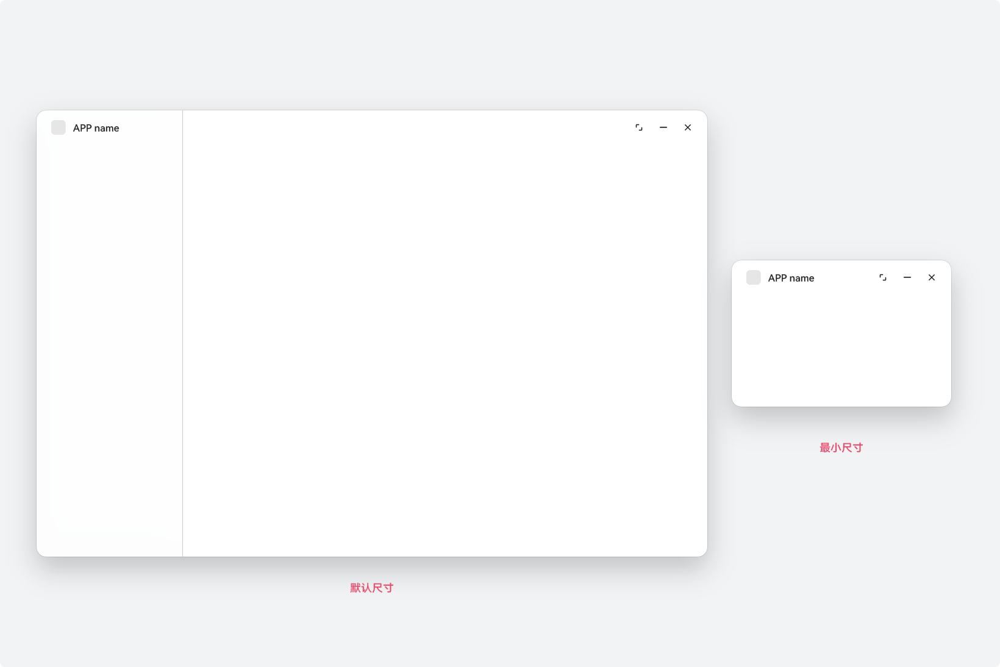

默认尺寸：参考值为 1200*800vp

最小尺寸：360*240vp，应用可根据情况设定大于此尺寸的最小数值

### 窗口三键

窗口三键按照最大化、最小化、关闭的顺序，从左至右排列。

| 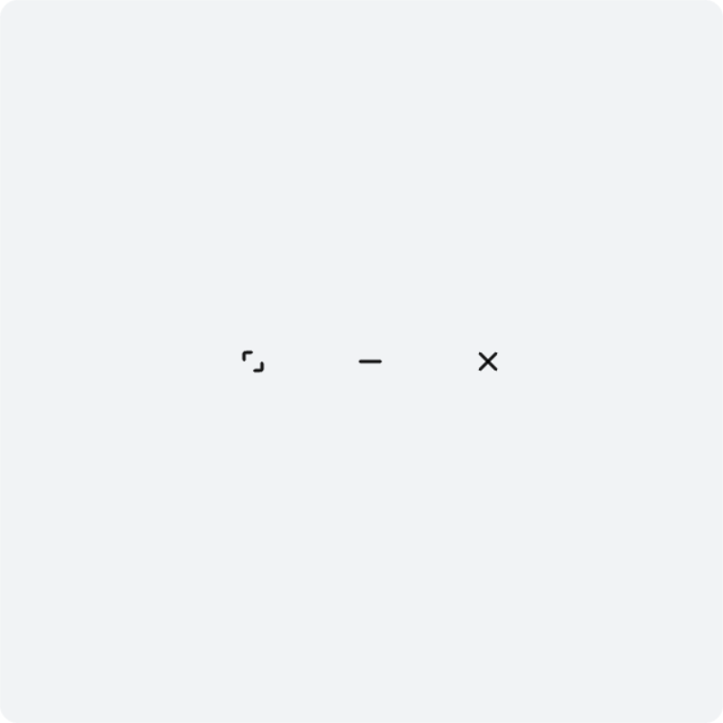 | 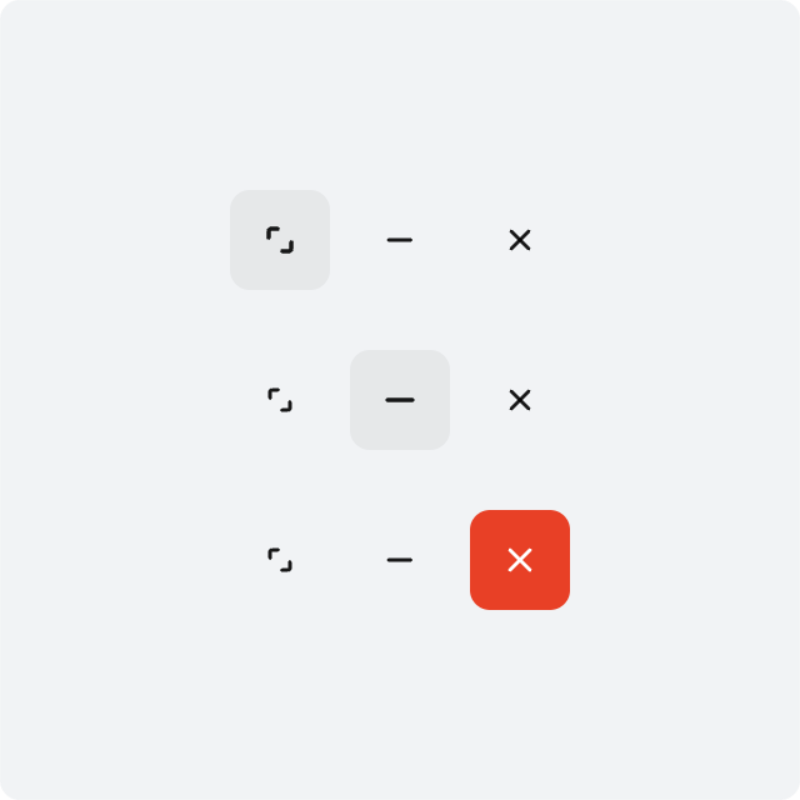 | 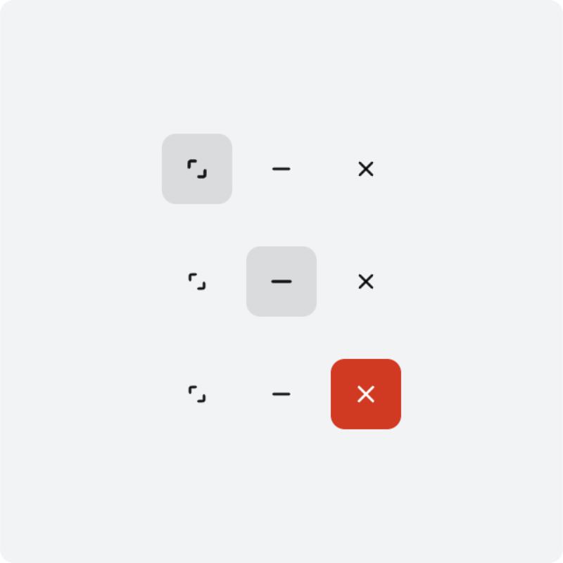 |
| --- | --- | --- |
| 默认状态 | Hover | Click |
|  | 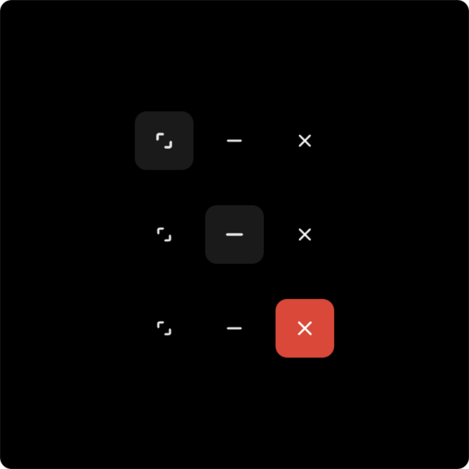 | 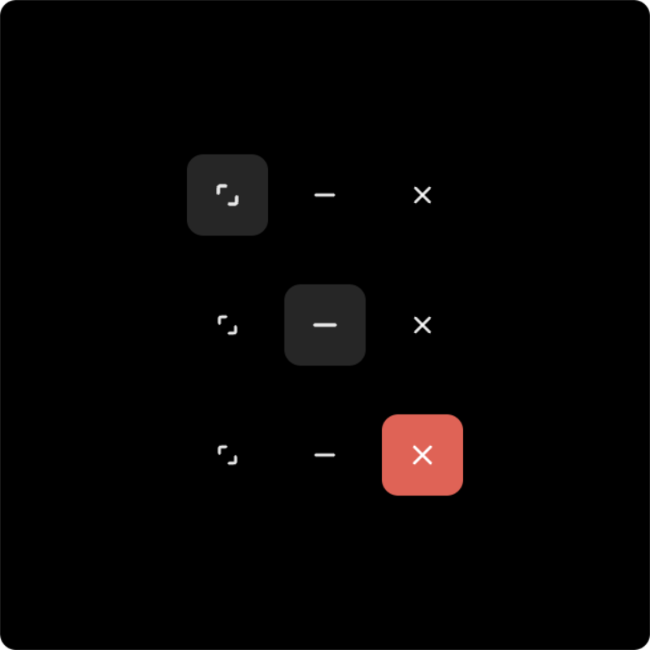 |
| 默认状态 | Hover | Click |

### 深浅模式

应用需随系统深浅模式，适配对应效果。

|  | 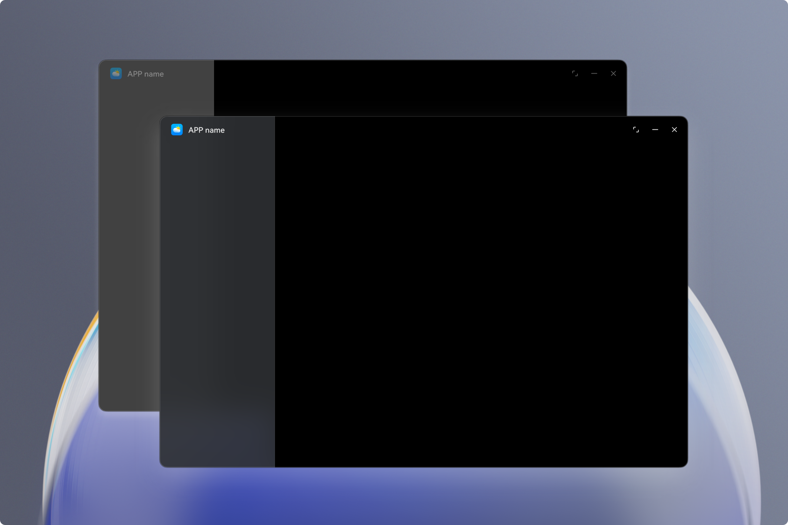 |
| --- | --- |
| 浅色模式 | 深色模式 |
