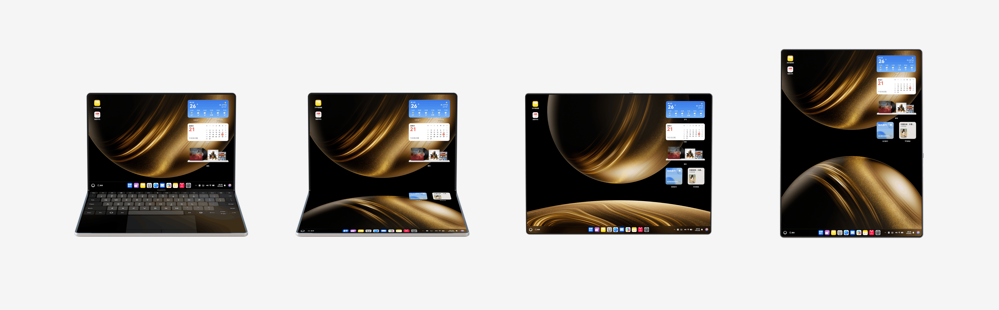

# 设计概述

更新时间：

来源：https://developer.huawei.com/consumer/cn/doc/design-guides/concept-0000002353669657

电脑融合了屏幕触摸和键鼠的交互手段，保持便携性的同时能充分发挥设备生产力，帮助用户高效完成任务。

如果要设计出优秀的电脑应用或服务，需要熟悉并充分利用电脑特性，这些特性包括硬件特征、使用方式、交互方式、使用场景等。

| 硬件特性 | 屏幕：中等至高等分辨率的大屏幕，且尺寸、比例的跨度较大。 摄像头：一般配备较好的前置摄像头。 音频：较好的音频输入输出能力。 生物认证识别：一般配备指纹、人脸等。 其他：陀螺仪等，可获得设备运动状态的信息。 |
| 使用方式 | 通常用户会在相对稳定、有工作台的工作场所下使用电脑设备，将该设备置于桌面上，使用距离为 500mm～600mm 间。 对于电脑触控态时，操作热区与平板支架态接近；对于键鼠操作态时，无明显操作盲区。 |
| 交互方式 | 电脑具有丰富的交互手段，其中键鼠、触控板是最优先的交互手段。 |
| 使用场景 | 电脑的使用场景非常广泛，从办公场景到娱乐场景均可覆盖；适合长时间、聚精会神使用，并且高频度地操作文件，电脑常常与其他设备协同使用。 |

#### 体验设计点

在设计电脑应用和服务时，请考虑以下方法，这将帮助您提供优秀的用户体验。

#### 保证基础体验

在应用/服务设计中需要遵守一些基础体验要求，如果不满足这些基础要求，则会极大损害用户的使用体验。例如，如果界面元素的响应热区太小会导致用户很难操作成功，从而无法完成要操作的任务。具体要求请参阅[应用 UX 体验标准](https://developer.huawei.com/consumer/cn/doc/design-guides/ux-guidelines-overview-0000001760867048)。

#### 设计应用和服务体验

 - **使用系统控件：**利用系统提供的菜单、标题栏、弹出框等标准控件，在保证良好基础体验的同时，减少设计和开发的工作量。必要时自定义控件的样式和大小以体现自己的品牌特征。
 - **使用合适的应用架构：**根据业务的特点采用合适的架构。例如，内容类应用通常采用侧边页签的应用架构，以达到快速在不同类别的内容间切换的作用；效率类应用通常采用二分栏以及三分栏的应用架构，以达到快速高效浏览的作用。
 - **考虑更多内容合理布局：**考虑充分利用电脑屏幕大尺寸的优势，利用响应式布局实时响应尺寸变化，确保以最佳的布局来显示内容。关于应用布局的更多详细指导，请参阅[应用布局](https://developer.huawei.com/consumer/cn/doc/design-guides/app-design-0000002353509845#section195431623181117)。
 - **考虑多任务交互：**利用大屏幕的优势来同时完成多种任务，并且结合窗口来聚焦当前任务，提高生产力效率。
 - **支持更多交互方式：**在合适的场景下，电脑可以连接一些配件来提升交互的效率，带来更好的体验。例如键盘、鼠标。关于电脑支持的交互方式，请参阅[人机交互](https://developer.huawei.com/consumer/cn/doc/design-guides/hmi-overview-0000001795410269)。

#### 兼顾多设备形态体验

电脑屏幕尺寸多样，在体验上需要保障用户体验的连续性，应用需要同时遵循设备形态的屏幕特征，也要保证应用内操作和体验的连贯。

 - **屏幕兼容：**由于屏幕尺寸发生变化，应用应采用适当的手段对屏幕上内容布局进行优化调整。
 - **应用连续：**应用在折叠与展开状态切换的过程中保持正常运行。
 - **双屏协同：**折叠态上下双屏分区可以给用户提供双屏协同的机会，满足更多的多任务并行或者主副任务协同的场景。
 - **支持更多场景：**不同的设备形态满足用户在不同场景下的体验需求，无论是外出还是固定办公，都可以自由切换。

更多折叠电脑的适配介绍，请参阅[折叠电脑](https://developer.huawei.com/consumer/cn/doc/design-guides/foldable-pc-0000002322600098)。

#### 支持系统特性

 - **遵循系统特性的体验要求：**在接入系统特性时，应该要遵循系统特性的体验要求。部分系统特性是为了满足了用户对系统整体的某项诉求，应用/服务也应当遵循系统特性的规则进行接入。例如，当用户切换至深色模式时，希望系统中的所有应用/服务都能进行切换，应用/服务应跟随系统的设置，实时切换至深色显示。例如分屏或者分栏时，应用/服务应支持响应式布局拉伸。

#### 系统特性

 - [通知](https://developer.huawei.com/consumer/cn/doc/design-guides/system-features-notification-0000001793074217)
 - [深色模式](https://developer.huawei.com/consumer/cn/doc/design-guides/dark-mode-0000001823255497)
 - [画中画](https://developer.huawei.com/consumer/cn/doc/design-guides/pip-0000001927422624)
 - [播控中心](https://developer.huawei.com/consumer/cn/doc/design-guides/broadcasting-control-0000001957017133)

#### 系统能力

 - [分享](https://developer.huawei.com/consumer/cn/doc/design-guides/share-0000001957076313)
 - [华为账号开放登录](https://developer.huawei.com/consumer/cn/doc/design-guides/id-0000001880001344)
 - [预览](https://developer.huawei.com/consumer/cn/doc/design-guides/preview-0000001957112409)
